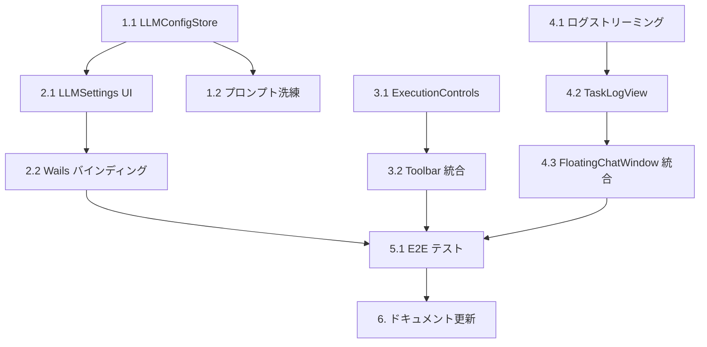

# TODO: multiverse v3.0 - Phase 4 Implementation

Based on PRD v3.0 - LLM 本番接続と実タスク実行

---

## 現在のステータス

| フェーズ    | 内容                           | ステータス |
| ----------- | ------------------------------ | ---------- |
| Phase 1     | チャット → タスク生成          | ✅ 完了    |
| Phase 2     | 依存関係グラフ・WBS 表示       | ✅ 完了    |
| Phase 3     | 自律実行ループ                 | ✅ 完了    |
| **Phase 4** | **LLM 本番接続と実タスク実行** | 🚧 進行中  |

---

## Phase 4 タスク一覧

### 1. バックエンド: LLM 接続の本番化

#### 1.1 LLM 設定管理

- [ ] **LLMConfigStore の実装**
  - 場所: `internal/ide/llm_config.go`
  - 内容:
    - LLM 設定の JSON 永続化（`~/.multiverse/config/llm.json`）
    - API キーの暗号化保存（OS keychain 連携検討）
    - 設定のリロード機能

```go
type LLMConfig struct {
    Kind         string `json:"kind"`
    Model        string `json:"model"`
    BaseURL      string `json:"baseUrl,omitempty"`
    SystemPrompt string `json:"systemPrompt,omitempty"`
    // APIKey は keychain または環境変数から取得
}
```

- [ ] **環境変数検証の強化**

  - 場所: `app.go:newMetaClientFromEnv()`
  - 内容:
    - `OPENAI_API_KEY` が空の場合のエラーメッセージ改善
    - 設定ファイルからの読み込みフォールバック

- [ ] **LLM 接続テスト API**
  - 場所: `app.go`
  - 内容:
    - `TestLLMConnection()` メソッド追加
    - タイムアウト付きテストリクエスト

#### 1.2 プロンプトエンジニアリング

- [ ] **Decompose プロンプトの洗練**

  - 場所: `internal/meta/client.go:decomposeSystemPrompt`
  - 内容:
    - 日本語/英語のプロジェクト判定
    - より具体的なタスク分解指示
    - 出力フォーマットの厳格化

- [ ] **エラーハンドリングの改善**
  - 場所: `internal/meta/client.go:Decompose()`
  - 内容:
    - YAML パースエラー時のリカバリ
    - 不完全なレスポンスの検出

---

### 2. フロントエンド: 設定 UI

#### 2.1 LLM 設定画面

- [ ] **LLMSettings コンポーネント**

  - 場所: `frontend/ide/src/lib/settings/LLMSettings.svelte`
  - 内容:
    - プロバイダ選択（mock / openai-chat）
    - API キー入力（マスク表示）
    - モデル選択
    - 接続テストボタン

- [ ] **設定画面の統合**
  - 場所: `frontend/ide/src/App.svelte` またはツールバー
  - 内容:
    - 設定画面へのナビゲーション
    - モーダルまたはサイドパネル

#### 2.2 Wails バインディング

- [ ] **App API の追加**

  - 場所: `app.go`
  - 内容:
    ```go
    func (a *App) GetLLMConfig() LLMConfig
    func (a *App) SetLLMConfig(config LLMConfig) error
    func (a *App) TestLLMConnection() (string, error)
    ```

- [ ] **wailsjs 再生成**
  - 場所: `frontend/ide/wailsjs/`
  - コマンド: `wails generate module`

---

### 3. フロントエンド: 実行制御 UI

#### 3.1 ExecutionControls コンポーネント

- [ ] **ExecutionControls の完成**

  - 場所: `frontend/ide/src/lib/toolbar/ExecutionControls.svelte`
  - 内容:
    - 開始/一時停止/再開/停止ボタン
    - 実行状態インジケーター
    - ツールチップ表示

- [ ] **executionStore の改善**
  - 場所: `frontend/ide/src/stores/executionStore.ts`
  - 内容:
    - エラーハンドリング
    - トースト通知連携

#### 3.2 Toolbar への統合

- [ ] **Toolbar レイアウト更新**
  - 場所: `frontend/ide/src/lib/toolbar/Toolbar.svelte`
  - 内容:
    - ExecutionControls の配置
    - レスポンシブ対応

---

### 4. タスク実行ログのリアルタイム表示

#### 4.1 バックエンド: ログストリーミング

- [ ] **StreamingExecuteTask の実装**

  - 場所: `internal/orchestrator/executor.go`
  - 内容:
    - stdout/stderr のリアルタイム送信
    - EventEmitter 経由でフロントエンドに転送

- [ ] **TaskLogEvent の定義**
  - 場所: `internal/orchestrator/events.go`
  - 内容:

    ```go
    const EventTaskLog = "task:log"

    type TaskLogEvent struct {
        TaskID    string    `json:"taskId"`
        AttemptID string    `json:"attemptId"`
        Stream    string    `json:"stream"` // stdout / stderr
        Line      string    `json:"line"`
        Timestamp time.Time `json:"timestamp"`
    }
    ```

#### 4.2 フロントエンド: ログビューワー

- [ ] **taskLogStore の実装**

  - 場所: `frontend/ide/src/stores/taskLogStore.ts`
  - 内容:
    - タスク ID ごとのログ管理
    - 最大行数制限
    - クリア機能

- [ ] **TaskLogView コンポーネント**

  - 場所: `frontend/ide/src/lib/components/TaskLogView.svelte`
  - 内容:
    - ログ行の表示
    - 自動スクロール
    - ストリーム別の色分け

- [ ] **FloatingChatWindow への統合**
  - 場所: `frontend/ide/src/lib/components/chat/FloatingChatWindow.svelte`
  - 内容:
    - Log タブでタスクログを表示
    - タスク選択で対象を切り替え

---

### 5. 統合テスト

#### 5.1 E2E テスト

- [ ] **LLM 設定テスト**

  - 場所: `frontend/ide/tests/llm_settings.spec.ts`
  - 内容:
    - 設定画面の表示
    - 設定の保存・読み込み
    - 接続テスト（モック）

- [ ] **実行制御テスト**

  - 場所: `frontend/ide/tests/execution_controls.spec.ts`
  - 内容:
    - 開始/一時停止/再開/停止の操作
    - 状態表示の更新

- [ ] **ログ表示テスト**
  - 場所: `frontend/ide/tests/task_log.spec.ts`
  - 内容:
    - ログイベントの受信
    - 表示の更新

#### 5.2 バックエンド統合テスト

- [ ] **LLM 接続テスト**
  - 場所: `test/integration/llm_connection_test.go`
  - 内容:
    - モック LLM でのパイプライン検証
    - 本番 LLM でのドライラン（CI スキップ）

---

### 6. ドキュメント更新

- [x] **PRD.md の更新**

  - Phase 4 の追加
  - Phase 1-3 を「完了済み」としてマーク

- [x] **TODO.md の更新**

  - Phase 4 タスクの詳細化

- [ ] **GEMINI.md の更新**

  - 新規コンポーネントの追加

- [ ] **CLAUDE.md の更新**
  - 開発ガイドラインの更新

---

## 完了条件

| ID       | 条件                                                  | ステータス |
| -------- | ----------------------------------------------------- | ---------- |
| AC-P4-01 | OpenAI API キーを設定画面から入力・保存できる         | ⬜         |
| AC-P4-02 | 設定画面から LLM 接続テストを実行できる               | ⬜         |
| AC-P4-03 | チャットメッセージが本番 LLM で処理される             | ⬜         |
| AC-P4-04 | 生成されたタスクが実際に agent-runner で実行される    | ⬜         |
| AC-P4-05 | タスク実行ログがリアルタイムで表示される              | ⬜         |
| AC-P4-06 | 実行コントロール（開始/一時停止/再開/停止）が機能する | ⬜         |

---

## 依存関係



---

## 実装優先順位

1. **高優先度（Week 1）**

   - 1.1 LLMConfigStore の実装
   - 2.1 LLMSettings コンポーネント
   - 2.2 Wails バインディング
   - 3.1 ExecutionControls の完成

2. **中優先度（Week 2）**

   - 1.2 プロンプトエンジニアリング
   - 4.1 ログストリーミング
   - 4.2 TaskLogView コンポーネント
   - 5.1 E2E テスト

3. **低優先度（継続）**
   - 6. ドキュメント更新
   - 細かい UI 調整
