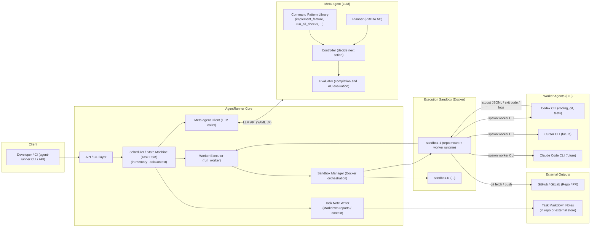

# AgentRunner アーキテクチャ仕様（Meta-agent / Worker 構成）

バージョン: 0.1  
ステータス: 設計ドラフト（ここまでの議論内容を統合）

---

## 0. ゴールと前提

### 0.1 ゴール

AgentRunner は以下を目指す実行管理レイヤ／メタエージェント基盤である。

- **人間の入力を最小限にしつつ、タスクを自走完了させる**
- **Worker エージェント（例: Codex CLI）を安全かつ再現性高く実行管理する**
- **タスク完了後に必要な「記憶」を Markdown として残し、他のエージェント／人間に引き継ぐ**

### 0.2 主要な設計前提

- Worker エージェントとして **CLI ベースの AI コーディングツール**（例: Codex CLI）を利用する。
- **Meta-agent（メタエージェント）** が「オーケストレータ（頭脳）」の役割を担い、
  - PRD から Acceptance Criteria（AC）を設計
  - Worker をいつどう動かすかを決定
  - 完了判定を行う
- **AgentRunner Core** は Meta の「手足」として、
  - Worker CLI の実行（プロセス起動）
  - Docker サンドボックス管理
  - タスク状態（TaskContext）の管理
  - Markdown ノートの生成
  を行う。
- **Git やテスト (`npm test` / `go test` / lint などの CLI)** はすべて **Worker の責務**。
  - Core からテストを直接叩く専用ツールは基本持たない。
- タスク完了後は Core 内部の状態（コンテキスト）はクリアされる。
  - 残すべき情報は **Markdown ノート**として書き出し、リポジトリや外部ストアへ転送する。
- 構造化された指示・プロトコルは **YAML** で表現する。
  - ただし「記憶」として残すのは Markdown。

---

## 1. コンポーネント構成

### 1.1 コンポーネント一覧

- **Client**
  - Developer / CI / 他のエージェント
  - `agent-runner CLI` / HTTP API などで AgentRunner を呼び出す。

- **AgentRunner Core**
  - `API / CLI layer`  
    - 外部インターフェース（CLI, API）を提供。
  - `Scheduler / State Machine (Task FSM)`  
    - タスク状態を管理する FSM。
    - **TaskContext**（メモリ上のタスクコンテキスト）を持つ。
  - `Meta-agent Client`  
    - Meta-agent（LLM）との通信。  
    - YAML でプロトコルをやり取りする。
  - `Worker Executor (run_worker)`  
    - Meta からの指示に基づき、Worker CLI を実際に起動する。
  - `Sandbox Manager (Docker orchestration)`  
    - Docker サンドボックス（1 Task = 1 sandbox 原則）を管理。
  - `Task Note Writer`  
    - タスク完了時に Markdown ノートを生成・出力する。

- **Meta-agent (LLM)**
  - `Planner`  
    - PRD から Acceptance Criteria (AC) を設計。
  - `Controller`  
    - 次のアクション（run_worker / mark_complete / ask_human / abort …）を決定。
  - `Evaluator`  
    - Worker の結果と AC を比較して、完了可否を判断。
  - `Command Pattern Library`  
    - Worker に対する作業命令のパターン（implement_feature / run_all_checks / ensure_git_clean など）を持つ。

- **Execution Sandbox (Docker)**
  - タスク単位の隔離環境。
  - リポジトリと Worker CLI 実行環境をマウント／構築。

- **Worker Agents (CLI)**
  - `Codex CLI`（現状のメイン Worker）  
    - coding / git / tests など開発作業全般を担当。
  - `Cursor CLI` / `Claude Code CLI` など（将来拡張）。

- **External Outputs**
  - GitHub / GitLab などのリモートリポジトリ（PR 作成など）。
  - Task Markdown Notes（`.agent-runner/task-*.md` など）。  

---

## 2. アーキテクチャ図

### 2.1 コンポーネント構成図



---

## 3. 役割分担の整理

### 3.1 Meta-agent と Core と Worker の関係

- **Meta-agent（オーケストレータ / 頭脳）**
  - 「どのタイミングで Worker を動かすか」
  - 「どんなプロンプトで何をさせるか」
  - 「完了したとみなしてよいか」
  を決める。

- **AgentRunner Core（実行基盤 / 手足）**
  - Meta からの意思決定結果を受けて、
    - Docker サンドボックスを準備し
    - Worker CLI を spawn し
    - ログと終了コードを取得し
    - TaskContext を更新し
    - タスク完了時に Markdown ノートを生成する。

- **Worker（Codex CLI など）**
  - 実際の開発作業（coding, git, tests, build, etc.）を sandbox 内で行う。

### 3.2 ツール I/F の簡略化

Meta-agent から見える「ツール」は基本的に **`run_worker` 一つだけ**に絞る。

- `run_worker(worker_type, mode, prompt)`
  - `worker_type`: `"codex"` など
  - `mode`: `"exec"` / `"resume"` など Worker 側のモード指定
  - `prompt`: Worker に渡す自然言語指示（YAML のブロックスカラ）

Git, テスト (`npm test` など) はすべて **Worker がプロンプトの一部として実行**する。

---

## 4. データフォーマット方針

### 4.1 YAML: プロトコル／指示用

Meta-agent ↔ Core ↔ Worker の「機械可読な指示」は YAML を使う。

制約付き YAML として運用する：

- 単一ドキュメント（`---` はあっても 1 つまで）
- インデントは半角スペース 2 個
- 使用する構文:
  - スカラー（string, number, bool, null）
  - マップ（オブジェクト）
  - シーケンス（配列）
  - ブロックスカラ（`|` / `>`）
- 使わない構文:
  - アンカー／エイリアス（`&foo` / `*foo`）
  - タグ (`!!str` など)
  - 複数ドキュメント (`---` 複数、`...`)

共通トップレベル構造:

```yaml
type: <message_type>   # plan_task | next_action | completion_assessment など
version: 1
payload:
  # 実データ
```

### 4.2 Markdown: 記憶・タスク管理・コンテキスト

- タスクやコンテキストを「後から読む・再利用する」ための記録はすべて Markdown。
- 各タスクにつき 1 ファイルの Task Note を作成する:
  - 例: `.agent-runner/task-TASK-123.md`
- 別エージェントや人間にタスクを引き継ぐときには、この Markdown を渡す。

---

## 5. Meta-agent プロトコル（YAML）

### 5.1 `plan_task` 出力例（PRD → AC）

```yaml
type: plan_task
version: 1
payload:
  task_id: "TASK-123"
  acceptance_criteria:
    - id: "AC-1"
      description: "ユーザーは /login からメールアドレスとパスワードでログインできること"
      type: "e2e"
      critical: true
      check:
        kind: "playwright"
        file: "tests/e2e/login.spec.ts"
        test_name: "login_with_email_password"

    - id: "AC-2"
      description: "ログイン失敗時にエラーメッセージが表示されること"
      type: "e2e"
      critical: false
      check:
        kind: "playwright"
        file: "tests/e2e/login.spec.ts"
        test_name: "login_with_invalid_password"
```

### 5.2 `next_action` 出力例（run_worker 指示）

```yaml
type: next_action
version: 1
payload:
  decision:
    action: "run_worker"   # run_worker | mark_complete | ask_human | abort ...
    reason: >
      AC-1, AC-2 を満たすためのログイン機能実装とテスト実行が必要。

  used_patterns:
    - "implement_feature"
    - "run_all_checks"
    - "ensure_git_clean"
    - "summarize_work_as_json"

  worker_call:
    worker_type: "codex"
    mode: "exec"
    prompt: |
      あなたはこのリポジトリの実装担当エンジニアです。

      以下の命令パターンに従って作業してください:
      1. implement_feature
      2. run_all_checks
      3. ensure_git_clean
      4. summarize_work_as_json

      # タスク概要
      - 対象機能: ログイン画面 (/login) と API (/api/auth/login)
      - Acceptance Criteria:
        - AC-1: 正しいメールアドレスとパスワードでログインできること
        - AC-2: 失敗時に規定のエラーメッセージを表示すること

      # 命令パターンの内容

      ## implement_feature
      - 仕様 (PRD) と Acceptance Criteria を読み、必要なファイルを特定する
      - 変更は小さなコミット単位で進めるつもりで実装する
      - 既存コードスタイルに合わせること

      ## run_all_checks
      - package.json の scripts を確認し、以下を優先して実行する
        - npm test / pnpm test / yarn test
        - lint / typecheck / build など
      - 失敗したチェックがあればログを確認し、コードを修正した上で再実行する

      ## ensure_git_clean
      - git status を確認し、意図しない変更・生成物があれば除外する
      - 必要な変更のみが working tree に残っている状態に整える

      ## summarize_work_as_json
      - 最後に、実行した主要コマンドとその結果を JSON 形式で出力する
```

### 5.3 `completion_assessment` 出力例（完了判定）

```yaml
type: completion_assessment
version: 1
payload:
  all_criteria_satisfied: false
  summary: >
    AC-1 は満たされているが、AC-2 のエラーメッセージ文言が PRD と異なるため、
    現時点では完了とは判断しない。
  by_criterion:
    - id: "AC-1"
      status: "passed"
      comment: "正常系ログインフローは e2e テストを含めて成功している。"
    - id: "AC-2"
      status: "failed"
      comment: >
        エラーメッセージが 'Login failed' となっており、
        PRD 上は 'メールアドレスまたはパスワードが違います' となっている。
        文言差異の影響度は中程度と判断する。
```

---

## 6. Command Pattern Library（命令パターン）

Meta-agent 内部で参照する「作業の型」。  
Meta はこのパターンを組み合わせて Worker プロンプトを構成する。

### 6.1 パターンカタログ例

```yaml
version: 1
patterns:
  implement_feature:
    summary: "PRD / AC に基づいて機能を実装する"
    instructions: |
      - 仕様 (PRD) と Acceptance Criteria を読み、必要なファイルを特定する
      - 変更は小さなコミット単位で進めるつもりで実装する
      - 既存コードスタイルに合わせること

  run_all_checks:
    summary: "プロジェクトの標準チェックをすべて実行する"
    instructions: |
      - package.json の scripts を確認し、以下を優先して実行する
        - npm test / pnpm test / yarn test
        - lint / typecheck / build など
      - 失敗したチェックがあればログを確認し、コードを修正した上で再実行する

  ensure_git_clean:
    summary: "作業完了時に git 状態をクリーンにする"
    instructions: |
      - git status を確認し、意図しない変更・生成物があれば除外する
      - 必要な変更のみが working tree に残っている状態に整える
      - ここでは commit は行わず、最終的な差分がレビューしやすい状態にする

  summarize_work_as_json:
    summary: "実行したコマンドと結果を JSON で要約する"
    instructions: |
      - 最後に、実行した主要コマンドとその結果を JSON で出力する
      - 例:
        { "commands": [ { "cmd": "npm test", "status": "passed" } ] }
```

---

## 7. Task Markdown Note テンプレート

タスクが完了した時、AgentRunner Core は TaskContext を使って Markdown ノートを生成する。

### 7.1 ファイルパス例

- リポジトリ直下、または `.agent-runner/` ディレクトリ配下など：
  - `.agent-runner/task-TASK-123.md`

### 7.2 テンプレート案

```markdown
# Task {{task_id}}: {{task_title}}

## 概要
- リポジトリ: {{repo_path_or_url}}
- 状態: {{final_state}}   <!-- COMPLETE / FAILED / NEEDS_REVIEW -->
- Worker: {{worker_type}} <!-- codex / cursor / ... -->
- Meta calls: {{meta_call_count}}
- Worker runs: {{worker_run_count}}

## PRD サマリ
{{prd_summary_markdown}}

## Acceptance Criteria

| ID   | Status | 説明 |
| ---- | ------ | ---- |
{{#each acceptance_criteria}}
| {{id}} | {{status}} | {{description}} |
{{/each}}

## 実行タイムライン

{{#each worker_runs}}
### Run #{{index}}
- Meta decision: {{meta_decision_summary}}
- Worker 概要: {{worker_summary}}
- 主なコマンド:
{{#each commands}}
  - `{{this.cmd}}` → {{this.status}}  <!-- passed / failed -->
{{/each}}

{{/each}}

## 振り返りメモ / 次に活かす情報

{{retrospective_notes}}
```

> 実装上は Mustache 風の記法ではなく、Core 内のテンプレートエンジン（Go の `text/template` 等）で展開する。

---

## 8. タスクライフサイクル（概略）

状態遷移イメージ（FSM）は概ね以下のようになる：

- `PENDING` → `PLANNING` → `RUNNING` → `VALIDATING` → `COMPLETE`
- 途中で失敗や不足があれば `FIXING` に戻し、Meta/Worker サイクルを繰り返す。
- 致命的エラーなどは `FAILED` / `NEEDS_REVIEW`。

（詳細な状態図はここでは省略）

---

## 9. 将来拡張の余地（簡単なメモ）

- 複数ノードでの AgentRunner 運用が必要になった場合:
  - 現在「メモリ TaskContext + Markdown ノート」の構成を、
  - コントロールプレーン用 DB（例: PostgreSQL）＋共有ストレージに昇格させる選択肢は残しておく。
- Worker の多様化:
  - `worker_type` を `"codex"` から `"cursor"`, `"claude_code"` などに広げる。
  - Meta の `next_action` で Worker の選択ロジックを持たせる。
- Task Markdown ノートの集約:
  - リポジトリ内ではなく、Notion / S3 / R2 などに集約する運用も可能。
  - その場合もフォーマットは Markdown のままにしておく。

---

以上が、ここまでの議論内容を統合した AgentRunner のアーキテクチャ／データフォーマット仕様のまとめです。
このまま `AgentRunner-architecture.md` として保存して利用できます。
