# Complete Documentation

Generated: 2025-12-20 00:45:53

This document consolidates all documentation from the docs/ directory for LLM context.

---

## Table of Contents


### Overview

- [README](#README)

### Specifications

- [README](#specifications-README)
- [Core Specification](#specifications-core-specification)
- [Meta Protocol](#specifications-meta-protocol)
- [Worker Interface](#specifications-worker-interface)
- [Orchestrator Spec](#specifications-orchestrator-spec)
- [Logging Specification](#specifications-logging-specification)
- [Testing Strategy](#specifications-testing-strategy)

### Design

- [README](#design-README)
- [Architecture](#design-architecture)
- [Ide Architecture](#design-ide-architecture)
- [Orchestrator Persistence V2](#design-orchestrator-persistence-v2)
- [Chat Autopilot](#design-chat-autopilot)
- [Task Execution And Visual Grouping](#design-task-execution-and-visual-grouping)
- [Data Flow](#design-data-flow)
- [Implementation Guide](#design-implementation-guide)
- [Sandbox Policy](#design-sandbox-policy)

### Overview

- [Task Builder And Golden Test Design](#task-builder-and-golden-test-design)

### cli-agents

- [README](#cli-agents-README)

### cli-agents/codex

- [Version 0.65.0](#cli-agents-codex-version-0.65.0)

### Guides

- [README](#guides-README)
- [Testing](#guides-testing)
- [Codex Integration](#guides-codex-integration)
- [Cli Subscription](#guides-cli-subscription)
- [Gemini Cli](#guides-gemini-cli)

---


# Overview

<a id="README"></a>

## README

**Source**: `README.md`


このディレクトリには AgentRunner プロジェクトの設計・仕様・開発ガイドが含まれています。

### ドキュメント構成

#### 📋 [specifications/](specifications-) - 仕様ドキュメント

確定した仕様を定義するドキュメント群です。実装の基準となります。

- [core-specification.md](specifications/core-specification.md) - コア仕様（YAML、TaskContext、FSM、Task Note）
- [meta-protocol.md](specifications/meta-protocol.md) - Meta-agent プロトコル仕様
- [worker-interface.md](specifications/worker-interface.md) - Worker 実行仕様
- [orchestrator-spec.md](specifications/orchestrator-spec.md) - Orchestrator 仕様（Task 永続化・スケジューリング・IPC）
- [logging-specification.md](specifications/logging-specification.md) - ロギング仕様（Trace ID・構造化ログ）
- [testing-strategy.md](specifications/testing-strategy.md) - テスト戦略（Backend/Frontend E2E）

#### 🏗️ [design/](design-) - 設計ドキュメント

システムの設計思想と実装方針を説明するドキュメント群です。

- [architecture.md](design/architecture.md) - システムアーキテクチャ
- [implementation-guide.md](design/implementation-guide.md) - 実装ガイド（Go 固有）
- [data-flow.md](design/data-flow.md) - データフロー設計

#### 📖 [guides/](guides-) - 開発ガイド

開発者向けの実践的なガイドです。

- [testing.md](guides/testing.md) - テスト戦略とベストプラクティス
- [codex-integration.md](guides/codex-integration.md) - Codex 統合テスト実行ガイド

#### 🔧 その他

- [CLAUDE.md](CLAUDE.md) - ドキュメント整理ルールと管理方針

### ドキュメントの読み方

#### 初めての方

1. [design/architecture.md](design/architecture.md) でシステム全体像を把握
2. [specifications/core-specification.md](specifications/core-specification.md) でコア仕様を理解
3. [design/implementation-guide.md](design/implementation-guide.md) で実装方針を確認

#### 実装者向け

1. [specifications/](specifications/) で仕様を確認
2. [design/implementation-guide.md](design/implementation-guide.md) で実装パターンを学習
3. [guides/testing.md](guides/testing.md) でテスト方法を確認

#### アーキテクト向け

1. [design/architecture.md](design/architecture.md) でシステム設計を確認
2. [design/data-flow.md](design/data-flow.md) でデータフローを理解
3. [specifications/](specifications/) で仕様詳細を確認

### ドキュメント管理

ドキュメントの整理ルールと更新方針については [CLAUDE.md](CLAUDE.md) を参照してください。


# Specifications

<a id="specifications-README"></a>

## README

**Source**: `specifications/README.md`


このディレクトリには AgentRunner の確定仕様が含まれています。

### ドキュメント一覧

#### [core-specification.md](core-specification.md)

AgentRunner のコア仕様を定義します。

- **対象読者**: 実装者、レビュアー
- **内容**:
  - Task YAML スキーマ
  - TaskContext 構造
  - タスク状態機械（FSM）
  - Task Note フォーマット
  - CLI インターフェース

#### [meta-protocol.md](meta-protocol.md)

Meta-agent との通信プロトコル仕様を定義します。

- **対象読者**: Meta-agent 実装者、プロトコル設計者
- **内容**:
  - `plan_task` プロトコル
  - `next_action` プロトコル
  - `completion_assessment` プロトコル
  - YAML メッセージフォーマット
  - エラーハンドリング

#### [worker-interface.md](worker-interface.md)

Worker 実行とサンドボックス環境の仕様を定義します。

- **対象読者**: Worker 実装者、インフラ担当者
- **内容**:
  - Worker 実行インターフェース
  - Docker サンドボックス仕様
  - 環境変数とマウント仕様
  - 実行結果フォーマット
  - タイムアウトとエラーハンドリング

#### [orchestrator-spec.md](orchestrator-spec.md)

Orchestrator のタスク管理・永続化・IPC 仕様を定義します。

- **対象読者**: Orchestrator 実装者、IDE バックエンド開発者
- **内容**:
  - Task Scheduler / Executor / Store
  - IPC（ファイルベースキュー・結果）
  - データモデル（Task, Attempt）
  - 拡張計画

#### [logging-specification.md](logging-specification.md)

統一ロギングシステムの仕様を定義します。

- **対象読者**: 開発者、インフラ担当者
- **内容**:
  - Trace ID 伝播
  - 構造化ログ（log/slog）
  - ログレベル定義
  - JSON/Text フォーマット

#### [testing-strategy.md](testing-strategy.md)

Backend/Frontend のテスト戦略を定義します。

- **対象読者**: テスター、開発者
- **内容**:
  - テスト配置とディレクトリ構成
  - テスト実行方法
  - 検証範囲と受け入れ基準

### 仕様の読み方

1. まず [core-specification.md](core-specification.md) でシステムの基本仕様を理解
2. Meta-agent を実装する場合は [meta-protocol.md](meta-protocol.md) を参照
3. Worker を実装する場合は [worker-interface.md](worker-interface.md) を参照

### 仕様の更新ルール

- 仕様変更は必ず設計レビューを経てから反映
- バージョン管理は Git のタグで管理
- 後方互換性を破る変更は明示的にマーク

<a id="specifications-core-specification"></a>

## Core Specification

**Source**: `specifications/core-specification.md`


最終更新: 2025-11-22

### 概要

本ドキュメントは AgentRunner のコア仕様を定義します。CLI インターフェース、YAML スキーマ、TaskContext、タスク状態機械（FSM）、Task Note フォーマットを含みます。

### 1. CLI インターフェース

#### 1.1 コマンド

```bash
agent-runner < task.yaml
```

#### 1.2 入力

- **stdin**: Task YAML ファイル（1 枚）
- **stdin**: Task YAML ファイル（1 枚）
- **コマンドラインオプション**:
  - `--meta-model=<model_id>`: Meta 用 LLM モデル ID を指定 (v1)

#### 1.3 モデル決定の優先順位

Meta 用 LLM モデル ID は以下の優先順位で決定されます：

1. **CLI オプション**: `--meta-model` で指定された値
2. **Task YAML**: `runner.meta.model` で指定された値
3. **ビルトインデフォルト**: `gpt-5.2`

**参照 URL（OpenAI/Codex: モデル/価格）**:

- https://platform.openai.com/docs/pricing

**認証について (v3.0 以降)**:
AgentRunner Core は、各プロバイダ（OpenAI, Anthropic 等）の **CLI ツールが保持する認証セッション** を利用することを推奨します。
環境変数 `OPENAI_API_KEY` 等は、CLI セッションが利用できない場合のフォールバック、または `openai-chat` (HTTP) プロバイダを明示的に使用する場合のみ必要となります。

#### 1.4 出力

- **stdout**: 実行ログ（人間が読む用の簡易ログ）
- **ファイル**: Task Note (`<repo>/.agent-runner/task-<task_id>.md`)
- **exit code**:
  - `0`: 成功
  - `1`: 失敗

### 2. Task YAML スキーマ

#### 2.1 全体構造

```yaml
version: 1

task:
  id: "TASK-123" # 任意。未指定なら自動採番
  title: "ユーザ登録 API の実装" # 任意
  repo: "." # 任意。作業対象リポジトリのパス

  # v2.0 拡張フィールド
  description: "詳細な説明..."
  dependencies: ["TASK-001"] # 依存タスクID
  wbs_level: 2 # 1=概念, 2=設計, 3=実装
  phase_name: "実装"

  suggested_impl:
    language: "typescript"
    file_paths: ["src/components/Form.svelte"]
    constraints: ["Use Zod for validation"]

  prd:
    path: "./docs/TASK-123.md" # PRD をファイルから読む場合
    # text: |                       # または PRD 本文を直接埋め込む場合
    #   ここに PRD 本文...

  test:
    command: "npm test" # 任意。自動テストコマンド
    # cwd: ".-"                     # 任意。テスト実行ディレクトリ

runner:
  max_loops: 10 # 任意。最大ループ回数（未指定時のデフォルト: 10）

  meta:
    kind: "openai-chat" # v1 は固定想定
    model: "gpt-5.2" # 任意。プロバイダのモデルIDを直接指定
    # system_prompt: |              # 任意。Meta 用 system prompt を上書き

  worker:
    kind: "codex-cli" # v1 は "codex-cli" 固定
    # docker_image: ...             # 任意。デフォルトイメージを上書き
    # max_run_time_sec: 1800        # 任意。1 回の Worker 実行タイムアウト
    # env:
    #   CODEX_API_KEY: "env:CODEX_API_KEY"  # "env:" 接頭辞でホスト環境変数を参照
```

#### 2.2 必須フィールド

- `version`: 値は `1`
- `task.prd`: `path` または `text` のいずれか

#### 2.3 デフォルト補完ルール

| フィールド                       | デフォルト値                      |
| -------------------------------- | --------------------------------- |
| `task.id`                        | UUID 自動生成                     |
| `task.title`                     | 未設定（空文字）。上位システムが補完する場合あり |
| `task.repo`                      | `"."` (カレントディレクトリ)      |
| `task.test`                      | 未設定（テスト自動実行なし）      |
| `task.wbs_level`                 | 0 (未定義)                        |
| `task.dependencies`              | [] (なし)                         |
| `runner.meta.kind`               | `"openai-chat"`                   |
| `runner.meta.model`              | `gpt-5.2` (プロバイダのモデル ID) |
| `runner.max_loops`              | `10`                              |
| `runner.worker.kind`             | `"codex-cli"`                     |
| `runner.worker.docker_image`     | デフォルトイメージ                |
| `runner.worker.max_run_time_sec` | `1800` (30 分)                    |

#### 2.4 環境変数参照

`env:` プレフィックスを使用してホスト環境変数を参照できます。

```yaml
runner:
  worker:
    env:
      CODEX_API_KEY: "env:CODEX_API_KEY" # ホストの $CODEX_API_KEY を参照
      CUSTOM_VAR: "literal-value" # リテラル値
```

### 3. TaskContext

#### 3.1 構造

TaskContext は実行中のタスク状態を保持します。v2.0 で拡張されました。

```go
type TaskContext struct {
    ID        string        // task.id
    Title     string        // task.title
    RepoPath  string        // task.repo の絶対パス
    State     TaskState     // FSM の現状態

    // v2.0 Extensions
    Description   string
    Dependencies  []string
    WBSLevel      int
    PhaseName     string
    SuggestedImpl *SuggestedImpl
    Artifacts     *Artifacts    // v2.1 Extension

    PRDText   string        // PRD 本文

    AcceptanceCriteria []AcceptanceCriterion // Meta plan_task の結果
    MetaCalls          []MetaCallLog         // Meta 呼び出し履歴
    WorkerRuns         []WorkerRunResult     // Worker 実行履歴

    TestConfig *TestSpec   // task.test
    TestResult *TestResult // 実行した場合

    StartedAt  time.Time
    FinishedAt time.Time
}

type SuggestedImpl struct {
    Language    string
    FilePaths   []string
    Constraints []string
}

type Artifacts struct {
    Files []string
    Logs  []string
}
```

#### 3.2 AcceptanceCriterion

```go
type AcceptanceCriterion struct {
    ID          string
    Description string
    Passed      bool
}
```

#### 3.3 WorkerRunResult

```go
type WorkerRunResult struct {
    ID          string
    StartedAt   time.Time
    FinishedAt  time.Time
    ExitCode    int
    RawOutput   string
    Summary     string
    Error       error
}
```

### 4. タスク状態機械（FSM）

#### 4.1 状態定義

```go
type TaskState string

const (
    StatePending    TaskState = "PENDING"
    StatePlanning   TaskState = "PLANNING"
    StateRunning    TaskState = "RUNNING"
    StateValidating TaskState = "VALIDATING"
    StateComplete   TaskState = "COMPLETE"
    StateFailed     TaskState = "FAILED"
)
```

#### 4.2 状態遷移

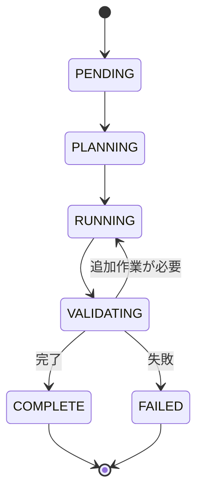

#### 4.3 遷移ルール

| 現在の状態 | 次の状態   | 条件                              |
| ---------- | ---------- | --------------------------------- |
| PENDING    | PLANNING   | タスク開始                        |
| PLANNING   | RUNNING    | Meta が plan_task を完了          |
| RUNNING    | VALIDATING | Worker 実行完了                   |
| VALIDATING | RUNNING    | Meta が追加作業を指示             |
| VALIDATING | COMPLETE   | Meta が完了を判定                 |
| VALIDATING | FAILED     | 致命的エラーまたは max_loops 到達 |

#### 4.4 ループ制御

`runner.max_loops` で最大ループ回数を制御します。

- デフォルト: 10 回
- VALIDATING → RUNNING の遷移回数がこの値を超えると FAILED に遷移

### 5. Task Note フォーマット

#### 5.1 出力パス

```
<repo>/.agent-runner/task-<task_id>.md
```

#### 5.2 テンプレート

```markdown
# Task Note - {{ .ID }} {{ if .Title }}- {{ .Title }}{{ end }}

- Task ID: {{ .ID }}
- Title: {{ .Title }}
- Started At: {{ .StartedAt }}
- Finished At: {{ .FinishedAt }}
- State: {{ .State }}

---

## 1. 概要

{{ .Summary }}

---

## 2. PRD 概要

{{ .PRDSummary }}

<details>
<summary>PRD 原文</summary>

\`\`\`text
{{ .PRDText }}
\`\`\`

</details>

---

## 3. 受け入れ条件 (Acceptance Criteria)

{{ range .AcceptanceCriteria }}

- [{{ if .Passed }}x{{ else }} {{ end }}] {{ .ID }}: {{ .Description }}
  {{ end }}

---

## 4. 実行ログ (Meta - Worker)

### 4.1 Meta Calls

{{ range .MetaCalls }}

#### {{ .Type }} at {{ .Timestamp }}

\`\`\`yaml
{{ .RequestYAML }}
\`\`\`

\`\`\`yaml
{{ .ResponseYAML }}
\`\`\`
{{ end }}

### 4.2 Worker Runs

{{ range .WorkerRuns }}

#### Run {{ .ID }} (ExitCode={{ .ExitCode }}) at {{ .StartedAt }} - {{ .FinishedAt }}

\`\`\`text
{{ .RawOutput }}
\`\`\`
{{ end }}

---

## 5. テスト結果

{{ if .TestResult }}

- Command: \`{{ .TestResult.Command }}\`
- ExitCode: {{ .TestResult.ExitCode }}
- Summary: {{ .TestResult.Summary }}

\`\`\`text
{{ .TestResult.RawOutput }}
\`\`\`
{{ else }}
テストは自動実行されませんでした。
{{ end }}

---

## 6. メモ - 残課題

{{ .Notes }}
```

#### 5.3 実装

Go の `text/template` を使用してテンプレートを展開します。

### 6. 実装状況

#### 6.1 実装済み機能

- ✅ CLI インターフェース（stdin YAML 読み込み）
- ✅ Task YAML パース
- ✅ デフォルト補完ロジック
- ✅ TaskContext 構築
- ✅ FSM 実装
- ✅ ループ制御（max_loops）
- ✅ Task Note 生成
- ✅ 環境変数参照（`env:` プレフィックス）

#### 6.2 制約事項

- v1 ではコマンドラインオプションは未サポート
- Worker 種別は `codex-cli`, `gemini-cli` をサポート
- Meta 種別は `openai-chat`, `codex-cli` をサポート（`mock` はテスト用）

<a id="specifications-meta-protocol"></a>

## Meta Protocol

**Source**: `specifications/meta-protocol.md`


最終更新: 2025-11-22

### 概要

本ドキュメントは Meta-agent と AgentRunner Core 間の通信プロトコルを定義します。Meta-agent は LLM ベースのエージェントで、YAML メッセージを介して Core とやり取りします。

### 1. Meta-agent の役割

Meta-agent は以下の責務を持ちます：

1. **計画**: PRD から Acceptance Criteria（受け入れ条件）を設計
2. **判断**: 次のアクション（Worker 実行 or 完了）を決定
3. **評価**: タスク完了状況を評価

### 2. プロトコル概要

#### 2.1 呼び出し単位

Meta とのやり取りは 3 種類のリクエスト/レスポンスで構成されます：

| プロトコル              | 入力         | 出力                | 用途       |
| ----------------------- | ------------ | ------------------- | ---------- |
| `plan_task`             | PRD テキスト | Acceptance Criteria | タスク計画 |
| `next_action`           | TaskContext  | 次のアクション      | 実行判断   |
| `completion_assessment` | TaskContext  | 完了評価            | 完了判定   |

#### 2.2 YAML フォーマット

すべてのメッセージは YAML 形式です。

**共通ルール**:

- 単一ドキュメント（`---` は 1 つまで）
- インデント: 半角スペース 2 個
- トップレベルに `type` フィールド必須

### 3. plan_task プロトコル

#### 3.1 目的

PRD を解析し、タスクの受け入れ条件（Acceptance Criteria）を定義します。

#### 3.2 入力

Core は以下の情報を Meta に渡します：

- Task YAML（タスク設定）
- PRD テキスト（要件定義）

#### 3.3 出力 YAML

```yaml
type: plan_task
acceptance_criteria:
  - id: "AC-1"
    description: "ユーザー登録APIが正常系で 201 を返すこと"
  - id: "AC-2"
    description: "必須項目のバリデーションエラー時に 400 を返すこと"
```

#### 3.4 フィールド定義

| フィールド                          | 型     | 必須 | 説明                            |
| ----------------------------------- | ------ | ---- | ------------------------------- |
| `type`                              | string | ✅   | 固定値: `"plan_task"`           |
| `acceptance_criteria`               | array  | ✅   | 受け入れ条件のリスト            |
| `acceptance_criteria[].id`          | string | 推奨 | 受け入れ条件の ID（例: "AC-1"） |
| `acceptance_criteria[].description` | string | ✅   | 受け入れ条件の説明              |

#### 3.5 実装例

```go
type PlanTaskResponse struct {
    Type               string                  `yaml:"type"`
    AcceptanceCriteria []AcceptanceCriterion   `yaml:"acceptance_criteria"`
}

type AcceptanceCriterion struct {
    ID          string `yaml:"id"`
    Description string `yaml:"description"`
}
```

### 4. next_action プロトコル

#### 4.1 目的

現在のタスク状態を評価し、次のアクション（Worker 実行 or 完了）を決定します。

#### 4.2 入力

Core は TaskContext の要約を Meta に渡します：
The transport format between AgentRunner and LLM is **JSON**.
Internally, the `MetaClient` converts this JSON into YAML to maintain compatibility with legacy processing logic before unmarshaling into Go structs.

- **Request**: JSON sent to LLM (via prompts).
- **Response**: JSON string received from LLM.
- **Conversion**: JSON string -> YAML string -> Go Struct.

All structs in `internal/meta/protocol.go` are tagged with both `yaml` and `json` to support this flow.

```yaml
task:
  id: "TASK-123"
  title: "Implement API endpoint X"
  prd_summary: "..."
acceptance_criteria:
  - id: "AC-1"
    description: "..."
last_worker_result:
  exists: true
  exit_code: 0
  stdout_tail: "..."
state: "RUNNING"
```

#### 4.3 出力 YAML

#### 4.3.1 Worker 実行を要求する場合

```yaml
type: next_action
decision:
  action: "run_worker"
  reason: "まだ実装が行われていないため"

worker_call:
  worker_type: "codex-cli"
  mode: "exec"
  prompt: |
    ここに Codex に渡すべき指示文（自然言語 + 手順）が入る
```

#### 4.3.2 タスク完了と判断する場合

```yaml
type: next_action
decision:
  action: "mark_complete"
  reason: "全ての受け入れ条件が満たされ、テストも成功したため"
```

#### 4.4 フィールド定義

| フィールド                  | 型     | 必須     | 説明                                    |
| --------------------------- | ------ | -------- | --------------------------------------- |
| `type`                      | string | ✅       | 固定値: `"next_action"`                 |
| `decision.action`           | string | ✅       | `"run_worker"` または `"mark_complete"` |
| `decision.reason`           | string | ✅       | 判断理由                                |
| `worker_call`               | object | 条件付き | `action` が `"run_worker"` の場合必須   |
| `worker_call.worker_type`   | string | ✅       | Worker 種別（v1: `"codex-cli"`）        |
| `worker_call.mode`          | string | ✅       | 実行モード（v1: `"exec"`）              |
| `worker_call.prompt`        | string | ✅       | Worker への指示文                       |
| `worker_call.model`         | string | 任意     | 使用するモデル ID                       |
| `worker_call.flags`         | array  | 任意     | CLI フラグのリスト                      |
| `worker_call.env`           | map    | 任意     | 環境変数のマップ                        |
| `worker_call.tool_specific` | map    | 任意     | ツール固有の設定                        |
| `worker_call.use_stdin`     | bool   | 任意     | 標準入力を使用するかどうか              |

#### 4.5 実装例

```go
type NextActionResponse struct {
    Type       string              `yaml:"type"`
    Decision   Decision            `yaml:"decision"`
    WorkerCall *WorkerCall         `yaml:"worker_call,omitempty"`
}

type Decision struct {
    Action string `yaml:"action"`
    Reason string `yaml:"reason"`
}

type WorkerCall struct {
    WorkerType string `yaml:"worker_type"`
    Mode       string `yaml:"mode"`
    Prompt     string `yaml:"prompt"`
}
```

### 5. completion_assessment プロトコル

#### 5.1 目的

タスク完了時に、Acceptance Criteria の達成状況を評価します。

#### 5.2 入力

Core は最終状態の TaskContext を Meta に渡します。

#### 5.3 出力 YAML

```yaml
type: completion_assessment
summary: |
  ユーザー登録APIの実装は完了しており、以下の受け入れ条件を満たしています。
details:
  passed_criteria:
    - "AC-1"
    - "AC-2"
  remaining_risks:
    - "性能テストは未実施"
```

#### 5.4 フィールド定義

| フィールド                | 型     | 必須 | 説明                               |
| ------------------------- | ------ | ---- | ---------------------------------- |
| `type`                    | string | ✅   | 固定値: `"completion_assessment"`  |
| `summary`                 | string | ✅   | 完了評価のサマリ                   |
| `details.passed_criteria` | array  | 推奨 | 満たされた受け入れ条件の ID リスト |
| `details.remaining_risks` | array  | 推奨 | 残存リスクのリスト                 |

#### 5.5 実装例

```go
type CompletionAssessmentResponse struct {
    Type    string                       `yaml:"type"`
    Summary string                       `yaml:"summary"`
    Details CompletionAssessmentDetails  `yaml:"details"`
}

type CompletionAssessmentDetails struct {
    PassedCriteria  []string `yaml:"passed_criteria"`
    RemainingRisks  []string `yaml:"remaining_risks"`
}
```

### 6. エラーハンドリング

#### 6.1 LLM エラー再試行ロジック

v1 実装では、LLM API 呼び出しの信頼性を向上させるため、以下の再試行ロジックを実装しています：

| 項目                    | 設定                                      |
| ----------------------- | ----------------------------------------- |
| **再試行対象エラー**    | HTTP 5xx、タイムアウト、Rate Limit（429） |
| **再試行回数**          | 最大 3 回                                 |
| **Exponential Backoff** | 1 秒 → 2 秒 → 4 秒                        |
| **非再試行エラー**      | HTTP 4xx（400, 401, 403 など）            |

#### 6.2 YAML パースエラー

Meta が不正な YAML を返した場合：

1. エラーログを出力
2. Meta に再試行を要求（最大 3 回）
3. 3 回失敗した場合、タスクを FAILED に遷移

#### 6.3 タイムアウト

Meta 呼び出しのタイムアウト設定は、使用するプロバイダによって異なります。

#### OpenAI Chat プロバイダ

- デフォルト: 60 秒
- 環境変数 `META_TIMEOUT_SEC` で変更可能

#### Codex CLI プロバイダ

LLM の処理は時間がかかるため、より長いタイムアウトを設定しています。

| 層          | デフォルト値 | 説明                                                |
| ----------- | ------------ | --------------------------------------------------- |
| ChatHandler | 15 分        | `chat/handler.go` の `metaTimeout`                  |
| Meta-agent  | 10 分        | `meta/cli_provider.go` の `DefaultMetaAgentTimeout` |
| agenttools  | 10 分        | `ExecPlan.Timeout` で指定                           |

**タイムアウト階層**:

```
ChatHandler (15分)
  └→ Meta.Decompose()
       └→ CodexCLIProvider (10分)
            └→ agenttools.Execute() (親コンテキストから独立)
```

`agenttools.Execute()` は `ExecPlan.Timeout` が設定されている場合、親コンテキストから独立した新しいコンテキストを作成します。これにより、外部プロセス（Codex CLI）の実行時間を正確に制御できます。

#### Graceful Shutdown

タイムアウト発生時、プロセスは以下の順序で終了されます：

1. **SIGTERM** 送信（graceful shutdown のチャンス）
2. **5 秒待機**（`GracefulShutdownDelay`）
3. **SIGKILL** 送信（強制終了）

これにより、Codex CLI は可能な限りクリーンに終了できます

### 7. プロンプト設計

#### 7.1 System Prompt

Meta には以下の System Prompt が設定されます：

````text
あなたはソフトウェア開発タスクを管理するテックリード兼オーケストレータです。

- 与えられたタスクコンテキスト（TaskContext）にもとづき、
  次に何をすべきかを決定する役割を担います。
- 出力は必ず 1 つの YAML ドキュメントのみとします。
- コードブロック（```）や解説文は一切書かないでください。
````

#### 7.2 System Prompt のカスタマイズ

Task YAML で `runner.meta.system_prompt` を指定することで、System Prompt を上書きできます：

```yaml
runner:
  meta:
    system_prompt: |
      カスタム System Prompt
```

### 8. 実装状況

#### 8.1 実装済み機能

- ✅ `plan_task` プロトコル
- ✅ `next_action` プロトコル
- ✅ `completion_assessment` プロトコル
- ✅ LLM エラー再試行ロジック（Exponential Backoff）
- ✅ System Prompt カスタマイズ
- ✅ YAML パースエラーハンドリング

#### 8.2 制約事項

- v1 では OpenAI Chat API のみサポート
- プロトコルバージョニングは `ISSUE.md`（Deferred: 「Meta Protocol のバージョニング導入」）を正とする。

### 9. decompose プロトコル (v2.0)

#### 9.1 目的

チャットインターフェースからの自然言語入力（ユーザーの要望）に基づき、タスクをフェーズに分解し、具体的な実行タスク（Acceptance Criteria 含む）を生成します。

#### 9.2 入力

Core は以下の情報を Meta に渡します：

- ユーザーの入力メッセージ
- 既存タスクの要約（依存関係解決のため）
- 会話履歴（コンテキスト維持のため）

#### 9.3 出力 YAML

```yaml
type: decompose
understanding: |
  ユーザーは「商品一覧ページ」の実装を希望しています。
  既存の API 定義に基づき、フロントエンドの実装が必要です。
phases:
  - name: "実装設計"
    milestone: "design"
    tasks:
      - id: "temp-task-1"
        title: "コンポーネント設計"
        description: "商品カードコンポーネントの Props と State を設計する"
        wbs_level: 2
        estimated_effort: "small"
        acceptance_criteria:
          - "Figma デザインと一致する Props が定義されていること"
        suggested_impl:
          language: "typescript"
          file_paths: ["src/components/ProductCard.svelte"]

  - name: "実装"
    milestone: "implementation"
    tasks:
      - id: "temp-task-2"
        title: "コンポーネント実装"
        description: "設計に基づきコードを実装する"
        dependencies: ["temp-task-1"]
        wbs_level: 3
        estimated_effort: "medium"
potential_conflicts:
  - file: "src/routes/products/+page.svelte"
    tasks: ["TASK-001"]
    warning: "他のタスクで変更中の可能性があります"
```

#### 9.4 フィールド定義

| フィールド            | 型     | 必須 | 説明                     |
| :-------------------- | :----- | :--- | :----------------------- |
| `type`                | string | ✅   | 固定値: `"decompose"`    |
| `understanding`       | string | ✅   | ユーザー意図の理解・要約 |
| `phases`              | array  | ✅   | フェーズ別タスクリスト   |
| `potential_conflicts` | array  | 任意 | 潜在的なコンフリクト情報 |

#### 9.4.1 Phase & Task 構造

**Phase**:

| フィールド  | 型     | 必須 | 説明                                 |
| :---------- | :----- | :--- | :----------------------------------- |
| `name`      | string | ✅   | フェーズ名（例: "概念設計", "実装"） |
| `milestone` | string | ✅   | マイルストーン ID                    |
| `tasks`     | array  | ✅   | タスクリスト                         |

**DecomposedTask**:

| フィールド            | 型     | 必須 | 説明                              |
| :-------------------- | :----- | :--- | :-------------------------------- |
| `id`                  | string | ✅   | 一時 ID（依存関係定義用）         |
| `title`               | string | ✅   | タスクタイトル                    |
| `description`         | string | ✅   | 詳細説明                          |
| `acceptance_criteria` | array  | ✅   | 達成条件リスト (string)           |
| `dependencies`        | array  | 任意 | 依存するタスク ID（一時 ID 可）   |
| `wbs_level`           | int    | ✅   | WBS 階層 (1=概念, 2=設計, 3=実装) |
| `estimated_effort`    | string | ✅   | 推定工数 (small/medium/large)     |
| `suggested_impl`      | object | 任意 | 実装ヒント                        |

**SuggestedImpl**:

| フィールド    | 型     | 必須 | 説明             |
| :------------ | :----- | :--- | :--------------- |
| `language`    | string | 任意 | 推奨言語         |
| `file_paths`  | array  | 任意 | 関連ファイルパス |
| `constraints` | array  | 任意 | 実装上の制約     |

#### 9.5 実装例

```go
type DecomposeResponse struct {
    Understanding      string              `yaml:"understanding"`
    Phases             []DecomposedPhase   `yaml:"phases"`
    PotentialConflicts []PotentialConflict `yaml:"potential_conflicts"`
}

type DecomposedPhase struct {
    Name      string           `yaml:"name"`
    Milestone string           `yaml:"milestone"`
    Tasks     []DecomposedTask `yaml:"tasks"`
}

type DecomposedTask struct {
    ID                 string         `yaml:"id"`
    Title              string         `yaml:"title"`
    Description        string         `yaml:"description"`
    AcceptanceCriteria []string       `yaml:"acceptance_criteria"`
    Dependencies       []string       `yaml:"dependencies"`
    WBSLevel           int            `yaml:"wbs_level"`
    EstimatedEffort    string         `yaml:"estimated_effort"`
    SuggestedImpl      *SuggestedImpl `yaml:"suggested_impl,omitempty"`
}
```

### 10. plan_patch プロトコル (v1.0)

#### 10.1 目的

チャット入力に基づき、既存の計画（タスク一覧 + WBS）を **差分更新**するためのプロトコルです。

- タスク整理に必要な **作成/更新/削除/移動**を 1 回の応答で表現する。
- 既存タスクの重複生成を避ける（「再計画=追加」ではなく「再計画=編集」）。

#### 10.2 入力

Core は以下の情報を Meta に渡します：

- ユーザーの入力メッセージ
- 既存タスク要約（ID/ステータス/依存/phase/milestone/wbs_level/parent_id）
  - **最大 200 件**。超過時は「ステータス優先 (`RUNNING > BLOCKED > PENDING`...) + ID 昇順」でソートして上位を採用（決定的トリミング）。
- 既存 WBS の概要（`root_node_id` + `node_index`）
  - **最大 200 ノード**。超過時は Root からの **BFS（幅優先探索）順** で上位を採用。
- 会話履歴
  - **最大 10 件**。各メッセージ本文は **最大 300 文字** に丸められる。

#### 10.3 出力 JSON

```json
{
  "type": "plan_patch",
  "version": 1,
  "payload": {
    "understanding": "ユーザーは不要タスクを削除し、順序を整理したい",
    "operations": [
      {
        "op": "create",
        "temp_id": "temp-001",
        "title": "新しいタスク",
        "description": "新規追加する作業",
        "acceptance_criteria": ["完了条件が満たされる"],
        "dependencies": [],
        "wbs_level": 2,
        "phase_name": "実装設計",
        "milestone": "M1-Example",
        "suggested_impl": {
          "language": "go",
          "file_paths": ["internal/example/new.go"],
          "constraints": ["Keep backward compatibility"]
        },
        "parent_id": "node-root",
        "position": { "after": "existing-task-id" }
      },
      {
        "op": "update",
        "task_id": "existing-task-id",
        "title": "タイトルを更新"
      },
      {
        "op": "move",
        "task_id": "existing-task-id",
        "parent_id": "node-root",
        "position": { "index": 0 }
      },
      {
        "op": "delete",
        "task_id": "obsolete-task-id",
        "cascade": false
      }
    ],
    "potential_conflicts": []
  }
}
```

#### 10.4 フィールド定義

| フィールド                    | 型     | 必須 | 説明                     |
| ----------------------------- | ------ | ---- | ------------------------ |
| `type`                        | string | ✅   | 固定値: `"plan_patch"`   |
| `version`                     | int    | ✅   | 固定値: `1`              |
| `payload.understanding`       | string | ✅   | ユーザー意図の要約       |
| `payload.operations`          | array  | ✅   | 計画変更操作の配列       |
| `payload.potential_conflicts` | array  | 任意 | 潜在的なコンフリクト情報 |

**PlanOperation**:

| フィールド            | 型     | 必須                    | 説明                                                         |
| --------------------- | ------ | ----------------------- | ------------------------------------------------------------ |
| `op`                  | string | ✅                      | `"create" / "update" / "delete" / "move"`                    |
| `temp_id`             | string | create のみ             | 一時 ID（依存関係定義用）。Core 側で正式 ID を割り当てる     |
| `task_id`             | string | update/delete/move のみ | 既存タスク ID                                                |
| `title`               | string | create は推奨           | タイトル（update は部分更新）                                |
| `description`         | string | 任意                    | 詳細説明（update は部分更新）                                |
| `acceptance_criteria` | array  | 任意                    | 達成条件（update で指定された場合は **全置換**）             |
| `dependencies`        | array  | 任意                    | 依存（update で指定された場合は **全置換**。空配列でクリア） |
| `phase_name`          | string | 任意                    | フェーズ（facet）                                            |
| `milestone`           | string | 任意                    | マイルストーン（facet）                                      |
| `wbs_level`           | int    | 任意                    | WBS レベル（facet）                                          |
| `suggested_impl`      | object | 任意                    | 実装ヒント                                                   |
| `parent_id`           | string | 任意                    | WBS 親ノード ID（move/create）                               |
| `position`            | object | 任意                    | siblings 内の位置（`index`/`before`/`after` のいずれか）     |
| `cascade`             | bool   | 任意                    | delete の場合に子孫も削除するか                              |

#### 10.5 適用セマンティクス（MVP）

- `create`: WBS/NodeDesign/TasksState を作成し、TaskStore に同期する。
- `update`: NodeDesign/TaskStore を更新する。`dependencies`/`acceptance_criteria` は「指定された場合は全置換」。
- `move`: WBS の `node_index` を更新し、並び・親子を反映する（IDE は WBS 順で表示できる）。
- `delete`: **soft delete**（WBS と `state/tasks.json` から除外し、他ノードの依存から参照を除去）。履歴/監査のため NodeDesign/TaskStore は残り得る。
  - `cascade: false` の場合: 削除対象ノードの子ノード群は、削除されたノードの親の `children` リストの削除位置に挿入される（**Splice**）。これにより順序が維持され、孤児ノード（Orphan）の発生を防ぐ。

<a id="specifications-worker-interface"></a>

## Worker Interface

**Source**: `specifications/worker-interface.md`


最終更新: 2025-12-17

### 概要

本ドキュメントは Worker 実行と Docker サンドボックス環境の仕様を定義します。Worker は Meta-agent の指示に従って実際の開発作業を行います。

### 1. Worker の役割

Worker Executor は以下の責務を持ちます：

1. **実行**: Meta の `worker_call` に従い、Worker CLI を実行
2. **隔離**: Docker サンドボックス内で安全に実行
3. **結果収集**: 実行結果（exit code, stdout/stderr）を Core に返す

### 2. Worker 種別

#### 2.1 v1 サポート Worker

v1 では `codex-cli` / `claude-code` / `gemini-cli` をサポートします。

| Worker 種別 | 説明                               | Docker イメージ             |
| ----------- | ---------------------------------- | --------------------------- |
| `codex-cli` | Codex CLI コーディングエージェント | `ghcr.io/biwakonbu/agent-runner-codex:latest` |
| `claude-code` | Claude Code CLI コーディングエージェント（互換: `claude-code-cli`） | `ghcr.io/biwakonbu/agent-runner-claude:latest` |
| `gemini-cli` | Gemini CLI コーディングエージェント | `ghcr.io/biwakonbu/agent-runner-gemini:latest` |

（バックログ）追加 Worker（例: `cursor-cli` 等）のサポートは `ISSUE.md` の Deferred（「追加 Worker 種別のサポート」）を正とする。

### 3. Worker 実行インターフェース

#### 3.1 実行フロー

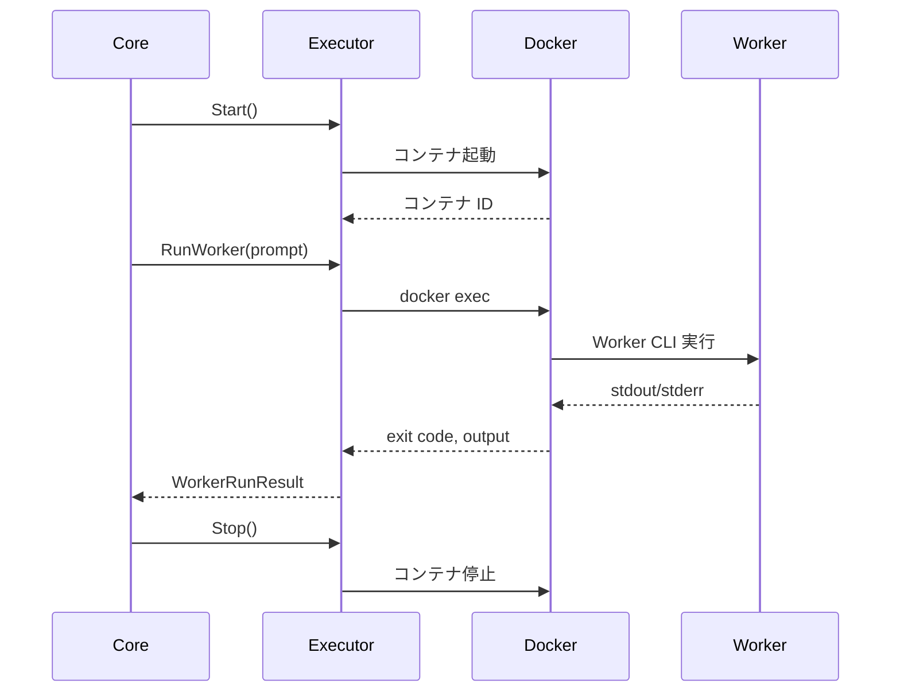

#### 3.2 コンテナライフサイクル最適化

v1 実装では、パフォーマンス最適化のため、以下のライフサイクル管理を採用しています：

| フェーズ          | 処理                                  | メソッド                     |
| ----------------- | ------------------------------------- | ---------------------------- |
| **タスク開始時**  | 1 回だけコンテナを起動                | `WorkerExecutor.Start()`     |
| **Worker 実行時** | 既存コンテナ内で `docker exec` を実行 | `WorkerExecutor.RunWorker()` |
| **タスク完了時**  | コンテナを停止                        | `WorkerExecutor.Stop()`      |

**効果**: Worker 実行ごとにコンテナを起動・停止する場合と比較して、5-10 倍の高速化を実現。

#### 3.3 実行結果フォーマット

```go
type WorkerRunResult struct {
    ID          string    // ラン毎の ID（UUID）
    StartedAt   time.Time // 実行開始時刻
    FinishedAt  time.Time // 実行終了時刻
    ExitCode    int       // 終了コード
    RawOutput   string    // stdout/stderr の結合
    Summary     string    // 実行サマリ（オプション）
    Error       error     // 実行エラー（起動失敗など）
}
```

### 4. Docker サンドボックス仕様

#### 4.1 Docker イメージ

| 項目                   | 設定                                                    |
| ---------------------- | ------------------------------------------------------- |
| **デフォルトイメージ** | Worker kind により分岐（例: `codex-cli` は `ghcr.io/biwakonbu/agent-runner-codex:latest`、`claude-code` は `ghcr.io/biwakonbu/agent-runner-claude:latest`、`gemini-cli` は `ghcr.io/biwakonbu/agent-runner-gemini:latest`） |
| **カスタマイズ**       | Task YAML の `runner.worker.docker_image` で上書き可能  |
| **自動 Pull**          | イメージが存在しない場合、自動的に `docker pull` を実行 |

#### 4.2 コンテナ内パス

| パス                     | 用途               | マウント元                    |
| ------------------------ | ------------------ | ----------------------------- |
| `/workspace/project`     | プロジェクトルート | ホストの `task.repo`          |
| `/root/.codex/auth.json` | Codex 認証情報     | ホストの `~/.codex/auth.json` |
| `/root/.config/claude`   | Claude Code 認証情報 | ホストの `~/.config/claude` |
| `/root/.gemini`          | Gemini CLI 設定/認証 | ホストの `~/.gemini` |

#### 4.3 マウント仕様

#### 4.3.1 プロジェクトマウント

```bash
-v <host_repo_path>:/workspace/project
```

- **モード**: read-write
- **WorkingDir**: `/workspace/project`

#### 4.3.2 Codex 認証マウント（自動）

v1 実装では、以下の順序で Codex 認証情報を自動的に検出・設定します：

1. `~/.codex/auth.json` が存在する場合:

   ```bash
   -v ~/.codex/auth.json:/root/.codex/auth.json:ro
   ```

2. `~/.codex/auth.json` が存在しない場合:
	   ```bash
	   -e CODEX_API_KEY=$CODEX_API_KEY
	   ```

#### 4.3.3 Claude Code 認証マウント（自動）

`~/.config/claude` が存在する場合、ReadOnly でマウントします：

```bash
-v ~/.config/claude:/root/.config/claude:ro
```

#### 4.3.4 Gemini CLI 設定マウント（自動）

`~/.gemini` が存在する場合、ReadOnly でマウントします：

```bash
-v ~/.gemini:/root/.gemini:ro
```

#### 4.4 環境変数

#### 4.4.1 環境変数の注入

Task YAML で環境変数を指定できます：

```yaml
runner:
  worker:
    env:
      CODEX_API_KEY: "env:CODEX_API_KEY" # ホスト環境変数を参照
      GEMINI_API_KEY: "env:GEMINI_API_KEY"
      CUSTOM_VAR: "literal-value" # リテラル値
```

Gemini CLI は `GEMINI_API_KEY` / `GOOGLE_API_KEY` / `GOOGLE_GENAI_USE_VERTEXAI` / `GOOGLE_CLOUD_PROJECT` を利用できる。

#### 4.4.2 `env:` プレフィックス

`env:` プレフィックスを使用すると、ホストの環境変数を参照できます：

| Task YAML の値        | 実際の値                       |
| --------------------- | ------------------------------ |
| `"env:CODEX_API_KEY"` | ホストの `$CODEX_API_KEY` の値 |
| `"literal-value"`     | `"literal-value"` そのまま     |

#### 4.5 コンテナ起動オプション

```bash
docker run \
  --name agent-runner-<task_id> \
  -v <repo_path>:/workspace/project \
  -v ~/.codex/auth.json:/root/.codex/auth.json:ro \
  -e CODEX_API_KEY=<value> \
  -w /workspace/project \
  --rm \
  agent-runner-codex:latest \
  tail -f /dev/null
```

**オプション説明**:

- `--name`: コンテナ名（タスク ID ベース）
- `-v`: ボリュームマウント
- `-e`: 環境変数
- `-w`: 作業ディレクトリ
- `--rm`: 停止時に自動削除
- `tail -f /dev/null`: Keep Alive コマンド

### 5. Worker 実行

#### 5.1 Codex CLI 実行

```bash
docker exec <container_id> codex exec \
  --sandbox workspace-write \
  --json \
  --cwd /workspace/project \
  "<Meta から渡された prompt>"
```

#### 5.2 タイムアウト

| 項目                        | デフォルト       | カスタマイズ                                  |
| --------------------------- | ---------------- | --------------------------------------------- |
| **Worker 実行タイムアウト** | 1800 秒（30 分） | Task YAML の `runner.worker.max_run_time_sec` |

タイムアウトに達した場合、Worker 実行は強制終了され、エラーとして扱われます。

#### 5.3 エラーハンドリング

| エラー種別                | 処理                                           |
| ------------------------- | ---------------------------------------------- |
| **コンテナ起動失敗**      | タスクを FAILED に遷移                         |
| **Worker 実行失敗**       | WorkerRunResult に記録、Meta に報告            |
| **タイムアウト**          | Worker を強制終了、エラーとして記録            |
| **Docker デーモン未起動** | エラーメッセージを表示、タスクを FAILED に遷移 |

### 6. 実装インターフェース

#### 6.1 WorkerExecutor インターフェース

```go
type WorkerExecutor interface {
    // タスク開始時にコンテナを起動
    Start(ctx context.Context) error

    // Worker を実行
    RunWorker(ctx context.Context, prompt string) (*WorkerRunResult, error)

    // タスク完了時にコンテナを停止
    Stop(ctx context.Context) error
}
```

#### 6.2 SandboxManager インターフェース

```go
type SandboxManager interface {
    // コンテナを起動し、ID を返す
    StartContainer(ctx context.Context, image string, repoPath string, env map[string]string) (string, error)

    // コンテナ内でコマンドを実行
    Exec(ctx context.Context, containerID string, cmd []string) (int, string, error)

    // コンテナを停止・削除
    StopContainer(ctx context.Context, containerID string) error
}
```

### 7. 実装状況

#### 7.1 実装済み機能

- ✅ Codex CLI Worker
- ✅ Docker サンドボックス管理
- ✅ コンテナライフサイクル最適化
- ✅ ImagePull 自動実行
- ✅ Codex 認証自動マウント
- ✅ 環境変数注入（`env:` プレフィックス）
- ✅ タイムアウト制御
- ✅ エラーハンドリング

#### 7.2 制約事項

- v1 では `codex-cli` のみサポート
- Docker が必須（他のコンテナランタイムは未サポート）
- Windows での動作は未検証

#### 7.3 パフォーマンス

| 項目                 | 測定値                      |
| -------------------- | --------------------------- |
| **コンテナ起動時間** | 約 2-3 秒                   |
| **Worker 実行時間**  | タスク依存（通常 10-60 秒） |
| **コンテナ停止時間** | 約 1 秒                     |

**最適化効果**: コンテナ再利用により、複数回の Worker 実行で 5-10 倍の高速化を実現。

<a id="specifications-orchestrator-spec"></a>

## Orchestrator Spec

**Source**: `specifications/orchestrator-spec.md`


### 概要

Multiverse Orchestrator は、`multiverse` エコシステムにおけるタスク実行の中枢を担うコンポーネントです。ユーザー（IDE）からのタスク実行リクエストを受け付け、適切な Worker プールと AgentRunner Core を使用してタスクを自律的に実行します。

### アーキテクチャ

Orchestrator は以下の要素で構成されます。

1.  **Task Scheduler**: タスクの優先順位と Worker プールの空き状況を管理し、実行キューを処理します。
2.  **Task Executor**: 実際にタスクを実行するためのサブプロセス（`agent-runner`）を管理します。
3.  **Task Store**: タスクのメタデータ、実行履歴（Attempt）、ログを永続化・管理します。
4.  **IPC Interface**: IDE や他のツールとの通信を行うためのファイルベースのインターフェースです。

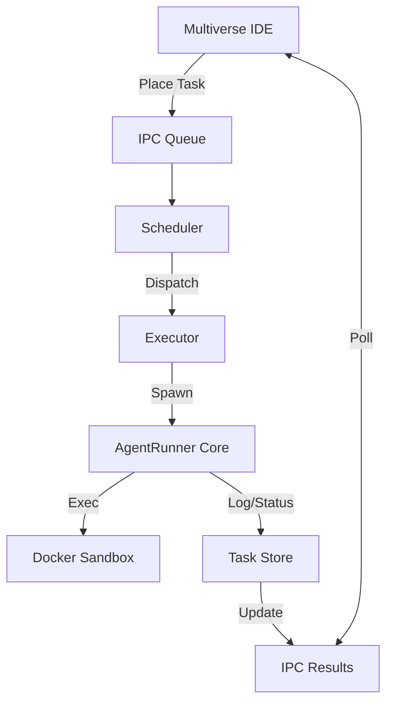

### コンポーネント詳細

#### 1. Executor (`internal/orchestrator-executor.go`)

`Executor` は、単一のタスク実行（Attempt）を管理する責任を持ちます。

- **役割**:

  - 新しい Attempt ID (UUID) の発行
  - `agent-runner` プロセスの起動 (`os/exec`)
  - Task YAML の動的生成と標準入力への流し込み
  - プロセスの終了待機と終了ステータス（成功/失敗）の判定
  - 実行結果（Attempt Status, Error Summary）の `TaskStore` への保存

- **動作フロー**:
  1.  `ExecuteTask(ctx, task)` が呼ばれる。
  2.  `PENDING` -> `RUNNING` へステータス更新。
  3.  `agent-runner` 向けの設定 YAML をメモリ上で生成。
  4.  `agent-runner` プロセスを起動。
  5.  プロセス終了後、Exit Code と出力に基づき `SUCCEEDED` / `FAILED` を判定。
  6.  Task と Attempt の最終状態を保存。

#### 2. Task Store (`internal/orchestrator-task_store.go`)

ファイルシステムベースのデータストアです。

- **パス**: `$HOME/.multiverse/workspaces/<workspace-id>/`
- **保存データ**:
  - `tasks/<task-id>.jsonl`: タスクのメタデータ履歴
  - `attempts/<attempt-id>.json`: 実行試行の詳細
  - `snapshots/<snapshot-id>/`: ワークスペース状態のスナップショット (v2.0+)

#### 3. Snapshot Repository (`internal/orchestrator/persistence-snapshot.go`)

ワークスペースの `state/` ディレクトリのバックアップとリストアを提供します。

- **機能**:
  - `CreateSnapshot(id)`: 現在の状態を保存。
  - `RestoreSnapshot(snapshot_id)`: 指定した時点の状態へ復元（復元前に安全のため自動バックアップを取得）。
  - `ListSnapshots()`: 利用可能なスナップショット一覧を取得。

### IPC (Inter-Process Communication)

v0.1 ではファイルシステムベースの単純な IPC を採用しています。

#### Queue (IDE -> Orchestrator)

- パス: `ipc/queue/<pool-id>/<job-id>.json`
- Orchestrator はこのディレクトリを監視（ポーリング）し、新規ファイルを検知してタスクを開始します。

#### Results (Orchestrator -> IDE)

- パス: `ipc/results/<job-id>.json`
- タスク完了時、Orchestrator はここに結果を出力します。IDE はこれを読み取って完了通知などを行います。
- **注意**: 実際の詳細なステータスは `Task Store` （`tasks/` ディレクトリ）を参照するのが正とされます。

### 今後の拡張

- **WebSocket**: リアルタイムなログストリーミングと状態通知のために導入予定。
- **Database**: タスク履歴の検索性向上のため、SQLite などの埋め込み DB への移行を検討。
- **Multi-Node**: リモートの強力なマシンで Worker を動かすための分散実行プロトコル。

### 実装詳細 (v0.x Current)

現在の `internal/orchestrator` 実装における詳細仕様です。

#### 1. Execution State Machine

`ExecutionOrchestrator` は以下の状態を持ちます。

- **IDLE**: 停止状態。タスク処理を行いません。
- **RUNNING**: 稼働状態。キューをポーリングし、タスクを実行します。
- **PAUSED**: 一時停止状態。実行中のタスクは継続しますが、新規タスクの開始を保留します。

#### 2. Reliability & Recovery

タスク失敗時、`RetryPolicy` に基づき以下の判断を行います。

- **Retry**: 一時的なエラーと判断した場合、Exponential Backoff を適用してタスクを `RETRY_WAIT` 状態にし、将来の再実行をスケジュールします。
- **Backlog**: リトライ上限到達や致命的なエラーの場合、タスクをバックログ (`BacklogStore`) に移動し、人間の介入を待ちます。

#### 3. Force Stop

`Stop()` メソッドにより、オーケストレーターを即座に停止できます。

- 実行中のタスクがある場合、Context Cancellation により `agent-runner` プロセスを強制終了します。
- Docker コンテナなどのリソースは `agent-runner` のクリーンアップ処理により停止されます。

#### 4. Executor の制約

現在の `Executor` は簡易実装であり、以下の制限があります。

- `agent-runner` への入力 YAML はコード内で生成されており、デフォルトでは `runner.max_loops: 5` と `runner.worker.kind: "codex-cli"` が設定されます（`state/tasks.json` の `inputs.runner_max_loops` / `inputs.runner_worker_kind` で上書き可能）。

### 5. Persistence & Consistency (Quality Hardening)

vNext 実装では、データの整合性と復元性を高めるために以下の永続化モデルを採用しています。

#### 5.1 Pseudo-Transaction (History First)

Chat からの計画変更（plan_patch）は、以下の順序でアトミックに近い形を目指して永続化されます。

1.  **History Append**: ユーザーの操作意図（Action）を履歴に追加（Append Only）。これが成功した時点を「操作の受理」とみなします。
2.  **State Update**: Task YAML / WBS JSON / Task Store などの状態（Snapshot）を上書き更新します。

#### 5.2 Failure Handling

State Update（ステップ 2）が失敗した場合、以下のように記録され、将来的な復元（Repair）のトレースとなります。

- **`history_failed` Action**: History Append 自体が失敗した場合に、可能な限り記録されるエラーアクションです。
- **`state_save_failed` Action**: State Update 中にエラーが発生した場合、History にその旨を追記します。これにより、「履歴にはあるが状態には反映されていない」不整合を検知可能にします。

<a id="specifications-logging-specification"></a>

## Logging Specification

**Source**: `specifications/logging-specification.md`


最終更新: 2025-12-06

### 概要

Multiverse サービス全体で統一的なロギングを実現するための仕様書です。IDE、バックエンド、AI 処理フローを通じてデバッグとトレースを可能にします。

### 設計原則

#### 1. Trace ID (相関 ID)

- 各タスク実行に一意の **Trace ID** (UUID) を付与
- IDE → Orchestrator → AgentRunner → Worker の全フローで同一 ID を伝播
- ログ検索・フィルタリングで処理フロー全体を追跡可能

#### 2. 構造化ログ

- **Go バックエンド**: `log/slog` を使用
- **フロントエンド**: カスタム `Logger` クラスを使用
- JSON フォーマット（本番環境）/ Text フォーマット（開発環境）対応

#### 3. ログレベル

| レベル  | 用途                                                      |
| ------- | --------------------------------------------------------- |
| `DEBUG` | 詳細なデバッグ情報（変数値、リクエスト/レスポンス全文等） |
| `INFO`  | 重要なイベント（タスク開始/終了、状態遷移等）             |
| `WARN`  | 警告（リトライ、軽微なエラー等）                          |
| `ERROR` | エラー（処理失敗、例外等）                                |

### Go バックエンド

#### ロギングパッケージ

`internal/logging/logging.go`

```go
package logging

// Trace ID をコンテキストに設定
func ContextWithTraceID(ctx context.Context, traceID string) context.Context

// コンテキストから Trace ID を取得
func TraceIDFromContext(ctx context.Context) string

// 新しいロガーを作成
func NewLogger(cfg Config) *slog.Logger

// Trace ID 付きロガーを返す
func WithTraceID(logger *slog.Logger, ctx context.Context) *slog.Logger

// コンポーネント名付きロガーを返す
func WithComponent(logger *slog.Logger, component string) *slog.Logger
```

#### 設定

```go
type Config struct {
    Level      slog.Level  // 最小ログレベル
    JSONFormat bool        // JSON 形式で出力
    AddSource  bool        // ソースファイル情報を追加
}

// プリセット設定
DefaultConfig()    // 開発用（INFO、Text）
ProductionConfig() // 本番用（INFO、JSON、ソース付き）
DebugConfig()      // デバッグ用（DEBUG、Text、ソース付き）
```

#### 使用例

```go
import "github.com/biwakonbu/agent-runner/internal/logging"

// タスク実行開始時に Trace ID を生成
traceID := uuid.New().String()
ctx := logging.ContextWithTraceID(ctx, traceID)

// ロガーに Trace ID とコンポーネント名を付与
logger := logging.WithTraceID(slog.Default(), ctx)
logger = logging.WithComponent(logger, "runner")

// ログ出力
logger.Info("starting task execution",
    slog.String("task_id", taskID),
    slog.String("state", "PENDING"),
)
```

#### 出力例

```
2025/12/06 00:48:28 INFO starting task execution component=runner trace_id=abc123 task_id=test-task state=PENDING
2025/12/06 00:48:28 INFO state transition component=runner trace_id=abc123 from=PENDING to=PLANNING
2025/12/06 00:48:28 INFO calling Meta.PlanTask component=runner trace_id=abc123
2025/12/06 00:48:28 INFO PlanTask completed component=runner trace_id=abc123 criteria_count=2 duration_ms=1234
```

### フロントエンド

#### ロガークラス

`frontend/ide/src/services/logger.ts`

```typescript
type LogLevel = "debug" | "info" | "warn" | "error";

class Logger {
  static setLevel(level: LogLevel): void;
  static setTraceId(id: string | null): void;
  static withComponent(component: string): ComponentLogger;

  static debug(message: string, context?: Record<string, unknown>): void;
  static info(message: string, context?: Record<string, unknown>): void;
  static warn(message: string, context?: Record<string, unknown>): void;
  static error(message: string, context?: Record<string, unknown>): void;
}
```

#### 使用例

```typescript
import { Logger } from './services/logger';

// コンポーネント別ロガーを作成
const log = Logger.withComponent('TaskCreate');

// ログ出力
log.info('creating task', { title: 'タスク名', poolId: 'default' });
log.debug('task details', { data: {...} });
log.error('task creation failed', { error: e });
```

#### 出力例

```
[00:48:28.123] INFO  [TaskCreate] creating task { title: 'タスク名', poolId: 'default' }
[00:48:28.456] ERROR [TaskCreate] task creation failed { error: Error(...) }
```

### ログポイント

#### Core Runner (`internal/core-runner.go`)

| ログポイント           | レベル | 内容                                                          |
| ---------------------- | ------ | ------------------------------------------------------------- |
| タスク開始             | INFO   | task_id, title, state                                         |
| 状態遷移               | INFO   | from, to                                                      |
| Meta.PlanTask 呼び出し | INFO   | -                                                             |
| PlanTask 完了          | INFO   | criteria_count, duration_ms                                   |
| Worker 実行開始        | INFO   | prompt_length                                                 |
| Worker 実行完了        | INFO   | exit_code, output_length, duration_ms                         |
| Worker 出力            | DEBUG  | output (全文)                                                 |
| タスク完了             | INFO   | final_state, worker_runs_count, meta_calls_count, duration_ms |

#### Meta Client (`internal/meta-client.go`)

| ログポイント     | レベル | 内容                                       |
| ---------------- | ------ | ------------------------------------------ |
| LLM 呼び出し開始 | INFO   | model, request_size                        |
| リクエスト内容   | DEBUG  | system_prompt, user_prompt                 |
| リトライ         | WARN   | attempt, max_retries, delay_seconds, error |
| LLM 呼び出し完了 | INFO   | response_size, duration_ms                 |
| レスポンス内容   | DEBUG  | content (全文)                             |

#### Worker Executor (`internal/worker-executor.go`)

| ログポイント        | レベル | 内容                                     |
| ------------------- | ------ | ---------------------------------------- |
| コンテナ起動開始    | INFO   | image, repo_path                         |
| コンテナ起動完了    | INFO   | container_id, duration_ms                |
| Worker コマンド実行 | INFO   | container_id, prompt_length, timeout_sec |
| Worker 実行完了     | INFO   | exit_code, output_length, duration_ms    |
| コンテナ停止        | INFO   | container_id, duration_ms                |

#### IDE App (`app.go`)

| ログポイント           | レベル     | 内容                    |
| ---------------------- | ---------- | ----------------------- |
| アプリ起動             | INFO       | -                       |
| ワークスペース選択     | INFO       | path                    |
| ワークスペース読み込み | INFO       | id, workspace_dir       |
| タスク作成             | INFO       | title, pool_id, task_id |
| タスク実行開始         | INFO       | task_id, trace_id       |
| タスク実行完了/失敗    | INFO/ERROR | task_id                 |

### デバッグ手順

#### 1. Trace ID でログを検索

```bash
# 特定の Trace ID のログを抽出
grep "trace_id=abc123" app.log
```

#### 2. DEBUG レベルで詳細ログを出力

```go
// Go バックエンド
logger := logging.NewLogger(logging.DebugConfig())
slog.SetDefault(logger)
```

```typescript
// フロントエンド
Logger.setLevel("debug");
```

#### 3. 問題の特定

1. エラーログから問題発生箇所を特定
2. Trace ID を取得
3. 同一 Trace ID のログを時系列で追跡
4. DEBUG レベルで詳細情報を確認

<a id="specifications-testing-strategy"></a>

## Testing Strategy

**Source**: `specifications/testing-strategy.md`


### 概要

Multiverse プロジェクトでは、システム全体の信頼性を確保し、開発効率を向上させるために、**包括的な自動テスト環境**を構築しています。
特に、以下の 3 つの層でテストを実施することで、バックエンドのロジック、フロントエンドの UI 動作、そして視覚的なリグレッションを独立して検証します。

### アーキテクチャ

テストアーキテクチャは以下の 3 層で構成されます。

1.  **Backend Integration E2E**: IDE バックエンドからオーケストレーター、エージェント実行までのフローを検証。
2.  **Frontend UI E2E**: Wails フロントエンドの UI ロジックとユーザー操作を検証。
3.  **Visual Regression Testing (VRT)**: コンポーネント単位およびページ単位での視覚的な変化を自動検知。

| 層           | 範囲                                           | 技術スタック               | 目的                                          |
| ------------ | ---------------------------------------------- | -------------------------- | --------------------------------------------- |
| **Backend**  | `ide` (Go) -> `orchestrator` -> `agent-runner` | Go Test, Shell Script Mock | プロセス連携、タスクキュー、状態遷移の検証    |
| **Frontend** | `frontend/ide` (Svelte)                        | Playwright, Wails JS Mock  | UI 描画、イベントハンドリング、画面遷移の検証 |
| **Visual**   | `frontend/ide` Components                      | Storybook, Playwright      | デザイン崩れの検知、UI カタログ管理           |

---

### 1. Backend Integration E2E

#### 配置場所

`test/e2e/orchestrator_flow_test.go`

#### 設計方針

実際の IDE アプリケーション (`app.go`) と同様のコンポーネント構成（WorkspaceStore, Scheduler, Executor）をテスト内で再現し、**外部プロセスとの連携**を含めた統合テストを行います。

- **モック化**: 実際の `agent-runner` は実行に時間がかかるため、標準入力を消費して即座に成功を返す `mock_runner.sh` を使用します。
- **検証範囲**:
  - タスクの作成とスケジューリング
  - オーケストレータープロセスによるジョブのピックアップ
  - タスクステータスの遷移 (PENDING -> RUNNING -> SUCCEEDED)
  - 成果物ファイルの生成確認

#### 実行方法

```bash
go test -v ./test/e2e/...
```

#### 1-2. Backend V2 (Chat to Task)

**配置場所**: `internal/chat/handler_test.go` (Unit/Integration)

v2.0 のチャット駆動タスク生成フローは、LLM (Meta-agent) の出力に依存するため、安定した E2E テストが困難です。
したがって、以下の戦略を採用します。

- **モックベース統合テスト**: `ChatHandler` に対し、モック化された Meta-agent から固定の `PlanPatchResponse` を返し、適切に `Task` が生成・保存されるかを検証します。
- **カバレッジ**:
  - `plan_patch` プロトコルによるタスク生成/更新
  - 依存関係（Dependency）の解決
  - `SuggestedImpl` などの V2 フィールドの保存

---

### 2. Frontend UI E2E

#### 配置場所

`frontend/ide/tests/`

#### 設計方針

Wails アプリケーションのフロントエンド部分はブラウザ技術で動作しますが、バックエンド（Go）に依存しています。この依存を**モック**することで、バックエンドを起動せずに高速な UI テストを実現します。

- **Playwright**: ブラウザ自動操作ツールとして採用。
- **Wails API Mock**: `frontend/ide/src/mocks/wails.js` に `window.runtime` およびバックエンドメソッド（`CreateTask` 等）のモックを実装。
- **Vite Alias**: E2E テスト実行時のみ、Wails 自動生成ファイルへのパスをモックファイルに向けるように `vite.config.ts` を構成。

#### 検証範囲

- タスク一覧の描画
- クリエイト・リード・アップデート・デリート (CRUD) の UI 操作フロー
- コンポーネントの状態変化（ローディング、エラー表示等）

#### 実行方法

```bash
cd frontend/ide
npm run test:e2e
```

---

### 3. Frontend Visual Testing

#### 配置場所

`frontend/ide/src/**/*.stories.ts` (Storybook)
`frontend/ide/tests/vrt` (Playwright VRT)

#### 設計方針

UI の変更による意図しないデザイン崩れ（リグレッション）を防ぐため、スナップショット比較を行います。

1.  **Storybook**:

    - 全 UI コンポーネントのカタログ化 (`npm run storybook`)。
    - 各コンポーネントの "States" (Normal, Error, Loading 等) を Story として定義。

2.  **Visual Regression Testing (VRT)**:
    - Playwright を使用して Storybook の各 Story、または実際のページのスナップショットを撮影。
    - 前回のマスター画像（Golden Image）との差分をピクセル単位で比較。

#### 実行方法

```bash
cd frontend/ide

# Storybook 起動
npm run storybook

# VRT 実行 (Playwright)
npm run test:vrt
```

### 今後の展望

- **CI 連携**: GitHub Actions 上でこれらのテストをプルリクエストごとに実行する。
- **カバレッジ拡大**: 異常系（タスク失敗、ネットワークエラー）のテストケースを追加する。


# Design

<a id="design-README"></a>

## README

**Source**: `design/README.md`


このディレクトリには AgentRunner の設計思想と実装方針が含まれています。

### ドキュメント一覧

#### [architecture.md](architecture.md)

システム全体のアーキテクチャを説明します。

- **対象読者**: アーキテクト、技術リード
- **内容**:
  - システム構成
  - コンポーネント設計
  - 役割分担
  - 設計思想と原則

#### [implementation-guide.md](implementation-guide.md)

Go 言語での実装ガイドを提供します。

- **対象読者**: 実装者、コントリビューター
- **内容**:
  - パッケージ構成
  - 依存性注入パターン
  - インターフェース設計
  - 実装パターン
  - テスト戦略

#### [data-flow.md](data-flow.md)

データフローと状態遷移を説明します。

- **対象読者**: 実装者、デバッガー
- **内容**:
  - タスク実行フロー
  - 状態遷移図
  - データ変換
  - エラーフロー

#### [task-execution-and-visual-grouping.md](task-execution-and-visual-grouping.md)

タスクの「計画→実行」遷移と、IDE 上での多軸グルーピング/フィルタリング設計を説明します。

- **対象読者**: 実装者、UI/UX 設計者
- **内容**:
  - Planning と Execution の責務分離
  - 分類メタデータ（Facet）設計
  - Backend API / Frontend 表示方針
  - 既存ワークスペースの互換・移行方針

#### [chat-autopilot.md](chat-autopilot.md)

自然な会話だけで「計画→実行→質問→継続」を回すための Chat Autopilot 設計です。

- **対象読者**: 実装者、プロダクト設計者
- **内容**:
  - Autopilot の責務とデータフロー
  - 自然言語での停止/再開/状況確認
  - 質問（Backlog）を会話に統合する方針
  - 既存 Orchestrator/Runner との整合

#### [tooling-selection.md](tooling-selection.md)

Tooling (ツール/モデル選択) の設計を説明します。

- **対象読者**: アーキテクト、実装者
- **内容**:
  - ToolingConfig の構造
  - 選択アルゴリズムとフォールバック
  - IDE/Orchestrator/AgentRunner の統合点
  - 既知の制約とテスト

### 設計の読み方

1. [architecture.md](architecture.md) でシステム全体像を把握
2. [data-flow.md](data-flow.md) で実行フローを理解
3. [implementation-guide.md](implementation-guide.md) で実装方針を確認

### 設計の更新ルール

- 設計変更は実装前に文書化
- 設計判断の理由を明記
- 代替案と選択理由を記録

<a id="design-architecture"></a>

## Architecture

**Source**: `design/architecture.md`


最終更新: 2025-11-22  
バージョン: 1.0

### 概要

AgentRunner は、AI ベースの Worker エージェント（例：Codex CLI）を管理し、タスクを自律的に実行するために設計されたメタエージェントおよびオーケストレーションレイヤーです。

### 設計ゴール

AgentRunner は以下を目指す実行管理レイヤ／メタエージェント基盤です：

1. **自律実行**: 人間の入力を最小限にしつつ、タスクを自走完了させる
2. **安全性**: Worker エージェントを Docker サンドボックス内で安全かつ再現性高く実行管理する
3. **記憶の継承**: タスク完了後に必要な「記憶」を Markdown として残し、他のエージェント／人間に引き継ぐ

### 設計原則

#### 1. 責務の分離

- **Meta-agent（頭脳）**: 計画・判断・評価
- **AgentRunner Core（手足）**: 実行・管理・記録
- **Worker（実行者）**: 実際の開発作業

#### 2. 隔離と再現性

- すべての Worker 実行は Docker サンドボックス内で行う
- 1 タスク = 1 サンドボックス
- 環境変数と認証情報の自動マウント

#### 3. 記憶の永続化

- 実行中の状態はメモリ上で管理
- タスク完了後は Markdown として永続化
- 構造化された指示は YAML、記憶は Markdown

### コンポーネント構成

#### 全体構成図

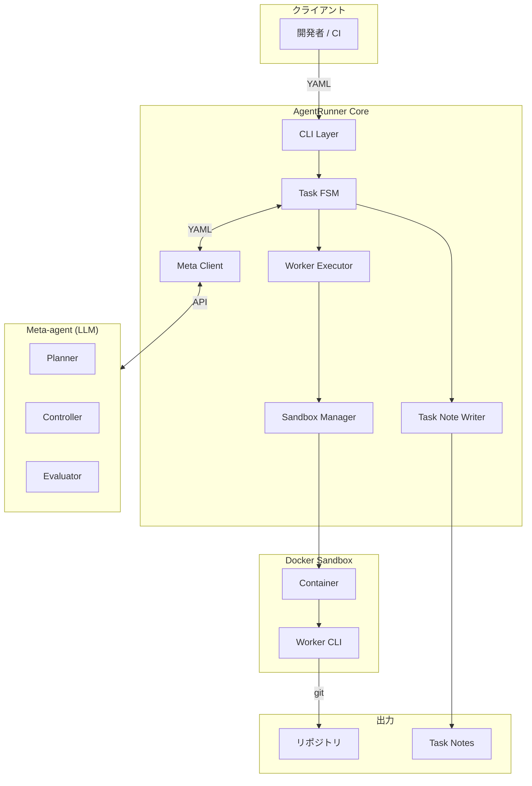

#### コンポーネント詳細

#### 1. Client

| コンポーネント | 説明                           |
| -------------- | ------------------------------ |
| **開発者**     | Task YAML を作成し、CLI を実行 |
| **CI**         | 自動化されたタスク実行         |

#### 2. AgentRunner Core

| コンポーネント       | 責務                                                                      |
| -------------------- | ------------------------------------------------------------------------- |
| **CLI Layer**        | stdin から YAML を読み込み、Core を起動                                   |
| **Task FSM**         | タスク状態を管理する状態機械                                              |
| **Meta Client**      | Meta-agent（LLM）との YAML 通信。モデル ID はプロバイダのものを直接使用。 |
| **Worker Executor**  | Worker CLI の実行管理                                                     |
| **Sandbox Manager**  | Docker サンドボックスの管理                                               |
| **Task Note Writer** | Markdown ノートの生成                                                     |

#### 3. Meta-agent (LLM)

| コンポーネント | 責務                                               |
| -------------- | -------------------------------------------------- |
| **Planner**    | PRD から Acceptance Criteria を設計                |
| **Controller** | 次のアクション（run_worker / mark_complete）を決定 |
| **Evaluator**  | Worker の結果と AC を比較して完了可否を判断        |

#### 4. Execution Sandbox (Docker)

| コンポーネント | 責務                                 |
| -------------- | ------------------------------------ |
| **Container**  | タスク単位の隔離環境                 |
| **Worker CLI** | 実際の開発作業（coding, git, tests） |

### AgentToolProvider Architecture (CLI Integration)

#### 目的

Codex / Gemini / Claude Code / Cursor など複数のエージェント CLI を安全に切り替えつつ、共通の実行パイプラインで扱います。
Worker 実行と Meta 生成の両方で同じ抽象を再利用し、特定 CLI に縛られない実行面を確保しています。

#### 抽象レイヤと責務

- **ProviderConfig**: kind, cliPath, model, flags, extraEnv, toolSpecific を保持。
- **Request**: 呼び出し時に上書きしたい情報を集約（prompt/mode/env/flags 等）。
- **ExecPlan**: 実行直前の最終形（command/args/env/workdir）。
- **Registry**: kind→factory を登録・解決。

#### 実行フロー

1. Meta.NextAction が `WorkerCall` を返す。
2. Orchestrator/Core で `Executor.RunWorkerCall` を呼び出し、`agenttools.Build()` で `ExecPlan` を生成。
3. `Sandbox.Exec` (Worker) または `agenttools.Execute` (Meta) で実行。

#### サンドボックス方針（絶対ルール）

**Docker コンテナが外部サンドボックスとして機能するため、CLI エージェントツール内部のサンドボックスは無効化し、最大限の権限を与えます。**

詳細は [サンドボックス方針](sandbox-policy.md) を参照。

#### 実装状態（2025-12-17 更新）

- **CodexProvider** (`internal/agenttools/codex.go`):
  - Codex CLI 0.65.0 対応。exec モードのみサポート（chat サブコマンドは存在しない）。
  - Docker 内実行: `--dangerously-bypass-approvals-and-sandbox` でサンドボックス・承認を無効化。
  - フラグ体系: `-C`（作業ディレクトリ）、`--json`（JSONL 出力）、`-m`（モデル）、`-c`（設定オーバーライド）。
  - デフォルト値: モデル `gpt-5.2-codex`（Worker 用）/ `gpt-5.2`（Meta 用）、思考の深さ `medium`。
  - **注意**: IDE の Meta-agent はデフォルト `openai-chat` ですが、`OPENAI_API_KEY` 未設定かつ `codex` が利用可能な場合は `codex-cli` に自動フォールバックします（`app.go` の `newMetaClientFromConfig()` 参照）。
  - stdin 対応: PROMPT に `-` を指定して stdin から読み取り。
  - **ToolSpecific オプション**: `docker_mode`（Docker 内実行フラグ制御）、`json_output`（JSON 出力制御）
- **Execute ヘルパー** (`internal/agenttools/exec.go`):
  - `agenttools.Execute(ctx, plan)` でホスト上で直接 ExecPlan を実行。
  - Meta-agent の CLI 呼び出しで使用。
- **ClaudeProvider** (`internal/agenttools/claude.go`):
  - `claude --model <id> -p <prompt>`（stdin 時は `-p -`）で単発実行。
  - デフォルトモデル: `claude-haiku-4-5-20251001`（`internal/agenttools/claude.go`）。
- **GeminiProvider** (`internal/agenttools/gemini.go`):
  - Gemini CLI 向けの ExecPlan 生成を実装（運用は `docs/guides/gemini-cli.md` を参照）。
- **CursorProvider** (`internal/agenttools/cursor.go`):
  - Cursor CLI 向けの ExecPlan 生成を実装。
- **WorkerCall 拡張** (`internal/meta/protocol.go`):
  - model, temperature, max_tokens, reasoning_effort, cli_path, flags, env, tool_specific, workdir, use_stdin を追加。
- **Worker 実行経路** (`internal/worker/executor.go`):
  - WorkerCall を `agenttools.Request` に変換し、`agenttools.Build()` で ExecPlan を生成。
  - ExecPlan を受けて Sandbox.Exec を実行。env は複数ソースをマージ。
- **Meta-agent CLI 実行** (`internal/meta/cli_provider.go`):
  - `agenttools` パッケージを使用してフラグ構築ロジックを統一。
  - `docker_mode: false` でホスト上直接実行、`json_output: false` で YAML 出力。

#### モデル設定

| 用途                     | モデル ID       | 設定箇所                       |
| ------------------------ | --------------- | ------------------------------ |
| Meta-agent（計画・思考） | `gpt-5.2`       | `internal/meta/client.go`      |
| Worker タスク実行        | `gpt-5.2-codex` | `internal/agenttools/codex.go` |
| Worker タスク実行（高速） | `gpt-5.1-codex-mini`（ショートハンド: `5.1-codex-mini`） | `internal/agenttools/openai_models.go` |
| Worker タスク実行（Claude Code） | `claude-haiku-4-5-20251001` | `internal/agenttools/claude.go` |

参照 URL（モデル/価格）:

- https://platform.openai.com/docs/pricing

#### 思考の深さ（reasoning effort）

| レベル   | 用途                           |
| -------- | ------------------------------ |
| `low`    | 単純なタスク                   |
| `medium` | 通常のタスク（**デフォルト**） |
| `high`   | 複雑なタスク・リトライ時       |

設定方法: `-c reasoning_effort=medium`

#### 設計上のポイント

- **サンドボックス方針の一貫性**: 全 CLI ツールで Docker が外部サンドボックスとして機能し、CLI 内部のサンドボックスは無効化。
- **拡張優先**: 共通化は最小限。model や flags は Provider がそのまま解釈できる形で透過させ、ツール固有の挙動を阻害しない。
- **差し替え容易性**: kind ごとの factory 登録のみで新 CLI を差し替え可能。既存呼び出し側は WorkerCall/Request を介すため変更を局所化できる。

#### CLI ナレッジ管理

各 CLI ツールの仕様・バージョン情報は `docs/cli-agents/` で管理:

- [CLI エージェント共通ガイド](../cli-agents/README.md)
- [Codex CLI ナレッジ](../cli-agents/codex/CLAUDE.md)
- [Claude Code ナレッジ](../cli-agents/claude-code/CLAUDE.md)

#### 統一された実行フロー

```
Worker (Docker 内)                     Meta-agent (ホスト上)
       ↓                                      ↓
agenttools.Build()                    agenttools.Build()
  docker_mode: true (default)           docker_mode: false
  json_output: true (default)           json_output: false
       ↓                                      ↓
  ExecPlan                               ExecPlan
  (with --dangerously-bypass...)         (without Docker flags)
       ↓                                      ↓
  Sandbox.Exec()                      agenttools.Execute()
```

#### 今後の実装方針

- CLI ごとの運用ガイド（インストール/認証/制約）の充実（`docs/cli-agents/` / `docs/guides/`）。
- ExecPlan 出力の JSON をパースして WorkerRunResult.Summary を改善（codex --json を活用）。

#### 5. External Outputs

| コンポーネント | 説明                   |
| -------------- | ---------------------- |
| **Repository** | コード変更の永続化     |
| **Task Notes** | 実行履歴と記憶の永続化 |

### 役割分担

#### Meta-agent（オーケストレータ - 頭脳）

**責務**:

- どのタイミングで Worker を動かすか
- どんなプロンプトで何をさせるか
- 完了したとみなしてよいか

**入力**: PRD、TaskContext  
**出力**: Acceptance Criteria、Worker 指示、完了評価

#### AgentRunner Core（実行基盤 - 手足）

**責務**:

- Docker サンドボックスの準備
- Worker CLI の spawn
- ログと終了コードの取得
- TaskContext の更新
- Markdown ノートの生成

**入力**: Task YAML  
**出力**: Task Note、リポジトリ変更

#### Worker（実行者）

**責務**:

- 実際の開発作業（coding, git, tests, build）
- サンドボックス内での安全な実行

**入力**: Meta からの指示（prompt）  
**出力**: コード変更、実行ログ

### データフロー

#### タスク実行フロー

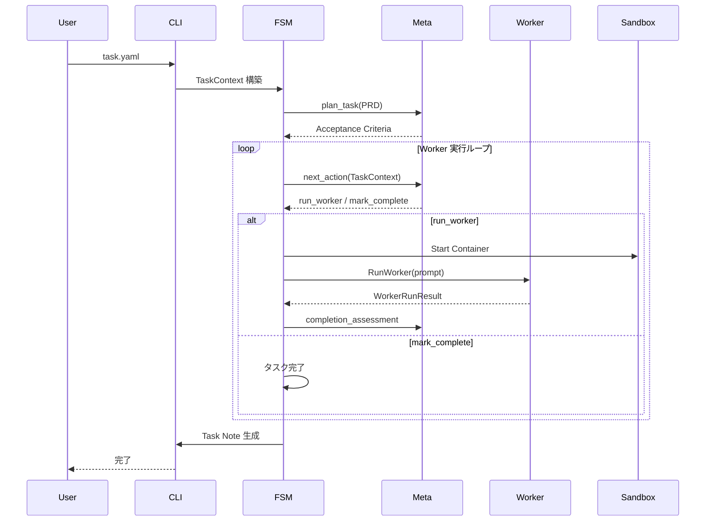

#### データ変換

| フェーズ | 入力         | 処理                        | 出力                |
| -------- | ------------ | --------------------------- | ------------------- |
| **計画** | PRD テキスト | Meta: plan_task             | Acceptance Criteria |
| **判断** | TaskContext  | Meta: next_action           | Worker 指示         |
| **実行** | Worker 指示  | Worker CLI                  | コード変更、ログ    |
| **評価** | TaskContext  | Meta: completion_assessment | 完了評価            |
| **記録** | TaskContext  | Task Note Writer            | Markdown            |

### 通信プロトコル

#### YAML プロトコル

Meta-agent ↔ Core ↔ Worker の通信は YAML を使用します。

**制約**:

- 単一ドキュメント（`---` は 1 つまで）
- インデント: 半角スペース 2 個
- アンカー／エイリアス不使用

**共通構造**:

```yaml
type: <message_type>
version: 1
payload:
  # 実データ
```

詳細は [Meta プロトコル仕様](../specifications/meta-protocol.md) を参照。

### サンドボックス設計

#### Docker サンドボックス

**原則**: 1 タスク = 1 サンドボックス

**マウント**:

- ホストの `task.repo` → `/workspace/project`
- `~/.codex/auth.json` → `/root/.codex/auth.json` (read-only)

**環境変数**:

- `runner.worker.env` の値をコンテナ内に注入
- `env:` プレフィックスでホスト環境変数を参照

**ライフサイクル**:

1. タスク開始時: コンテナ起動
2. Worker 実行時: `docker exec` で実行
3. タスク完了時: コンテナ停止・削除

詳細は [Worker インターフェース仕様](../specifications/worker-interface.md) を参照。

### 状態管理

#### TaskContext

実行中のタスク状態をメモリ上で保持します。

**主要フィールド**:

- タスクメタ情報（ID, Title, RepoPath）
- PRD テキスト
- Acceptance Criteria
- Meta 呼び出し履歴
- Worker 実行履歴
- テスト結果

詳細は [コア仕様](../specifications/core-specification.md) を参照。

#### Task Note

タスク完了後、TaskContext から Markdown を生成します。

**出力パス**: `<repo>/.agent-runner/task-<task_id>.md`

**用途**:

- 実行履歴の記録
- 他のエージェントへのコンテキスト提供
- 人間によるレビュー

### 拡張性

バックログのタスク（複数 Worker、永続化レイヤー、Web UI など）は `ISSUE.md`（Deferred）に集約し、このドキュメントからは削除する（重複/不整合の防止）。

### 設計上の制約

#### v1 制約

- Meta: OpenAI Chat API のみ
- Worker: Codex CLI のみ
- サンドボックス: Docker のみ
- 永続化: Markdown ファイルのみ

#### 技術的制約

- Docker が必須
- Go 1.23 以上
- OpenAI API キーが必要

### 参考ドキュメント

- [コア仕様](../specifications/core-specification.md)
- [Meta プロトコル仕様](../specifications/meta-protocol.md)
- [Worker インターフェース仕様](../specifications/worker-interface.md)
- [実装ガイド](implementation-guide.md)
- [データフロー設計](data-flow.md)

<a id="design-ide-architecture"></a>

## Ide Architecture

**Source**: `design/ide-architecture.md`


### 概要

Multiverse IDE は、開発者が AI エージェント（Worker）と協働するためのデスクトップアプリケーションです。
Frontend は **Svelte 5** を採用し、高度なグラフ描画に **Svelte Flow** を使用しています。Backend との通信は **Wails v2** を介して行われます。

### 技術スタック

| レイヤー               | 技術              | バージョン/備考                         |
| ---------------------- | ----------------- | --------------------------------------- |
| **Frontend Framework** | **Svelte 5**      | Runes ($state, $derived) を全面採用     |
| **Graph UI**           | **Svelte Flow**   | `@xyflow/svelte` v0.1+                  |
| **Desktop Runtime**    | **Wails v2**      | Go + WebView2/WebKit                    |
| **Styling**            | **CSS Modules**   | Scoped CSS, Design Tokens               |
| **State Management**   | **Svelte Stores** | `writable`, `derived` (Svelte 5 と共存) |

### アーキテクチャ構成

```mermaid
graph TD
    subgraph Frontend [Svelte 5 Context]
        App[App.svelte]
        Canvas[UnifiedFlowCanvas.svelte]
        Store[TaskStore / FlowStore]
        Panel[WBS / Chat Panels]
    end

    subgraph Bridge [Wails Runtime]
        Events[Events (On/Emit)]
        Binds[Go Methods]
    end

    subgraph Backend [Go Context]
        AppGo[App.go]
        Orch[Orchestrator]
        Service[TaskService]
    end

    App --> Canvas
    Canvas -->|Svelte Flow| Store
    App -->|Events| Bridge
    Store <-->|Events| Bridge
    Binds --> Backend
    Backend -->|Events| Bridge
```

### 1. Frontend Design (Svelte 5)

#### コンポーネント設計 (Runes)

Svelte 5 の Runes 構文 (`$state`, `$derived`, `$props`, `$effect`) を標準として使用しています。

```svelte
<script lang="ts">
  // Props
  let { taskList }: { taskList: Task[] } = $props();

  // State
  let nodes = $state([]);

  // Derived
  let completedCount = $derived(taskList.filter(t => t.status === 'SUCCEEDED').length);

  // Side Effects
  $effect(() => {
    console.log('Task list updated:', taskList);
  });
</script>
```

#### 状態管理 (Stores)

グローバルな状態管理には、Svelte 4 互換の `writable` ストアを使用しています。これは Svelte 5 コンポーネント内でも `$` プレフィックス (`$taskStore`) で透過的に利用可能です。

- `stores/taskStore.ts`: タスクおよび依存関係の管理
- `stores/wbsStore.ts`: WBS 表示モードの状態管理
- `stores/logStore.ts`: 実行ログのストリーム管理

#### グラフ描画 (Svelte Flow)

タスクグラフの描画には `@xyflow/svelte` を使用しています。

- **UnifiedFlowCanvas.svelte**: Svelte Flow のラッパーコンポーネント。タスクデータを受け取り、フローのノード/エッジに変換して描画します。
- **Custom Nodes**: `lib/flow/nodes/` にタスク表示専用のノードコンポーネントを定義しています。
- **Layout**: `dagre` アルゴリズムを使用して、タスクの依存関係に基づいた自動レイアウトを提供します。

### 2. Backend Integration (Wails)

Go 製バックエンドとは以下の 2 つのパターンで通信します。

#### Method Call (Frontend -> Backend)

`wailsjs` 自動生成コードを使用します。

```typescript
import { CreateTask } from "../../wailsjs/go/main/App";

async function handleSubmit(prompt: string) {
  await CreateTask(prompt); // Go メソッド呼び出し
}
```

#### Events (Backend -> Frontend)

Wails のイベントシステムを使用して、非同期な状態更新を受け取ります。

- `task:created`: 新しいタスクが生成された
- `task:stateChange`: タスクのステータスが変化した（PENDING -> RUNNING -> SUCCEEDED）
- `task:log`: 実行ログ（stdout/stderr）のストリーム

`stores/taskStore.ts` 内でリスナーを初期化し、ストアを更しています。

```typescript
// stores/taskStore.ts
EventsOn("task:stateChange", (event) => {
  updateTaskStatus(event.taskId, event.newStatus);
});
```

### 3. デザインシステム

`frontend/ide/src/design-system` に定義された CSS 変数とトークンを使用します。

- **Theme**: Nord Deep (Dark mode optimized)
- **Glassmorphism**: 半透明なパネルとブラー効果 (`--mv-glass-bg`)
- **Grid**: 黄金比ベースのグリッドシステム

### ディレクトリ構造

```
frontend/ide/src/
├── lib/
│   ├── flow/          # Svelte Flow 関連 (Nodes, Edges, Layout)
│   ├── components/    # 共有 UI コンポーネント (Window, Button, PropertyPanel)
│   └── wbs/           # WBS リストビュー
├── stores/            # Svelte Stores
├── design-system/     # CSS 変数・トークン
└── App.svelte         # ルートコンポーネント
```

#### 主要コンポーネント

- **`UnifiedFlowCanvas.svelte`**: メインのグラフキャンバス。
- **`TaskNode.svelte`**: タスクノード。`SuggestedImpl` の有無を示すインジケータ (IP) を持つ。
- **`TaskPropPanel.svelte`**: 選択中のタスク詳細を表示するパネル。`SuggestedImpl` や `Artifacts` を表示。

<a id="design-orchestrator-persistence-v2"></a>

## Orchestrator Persistence V2

**Source**: `design/orchestrator-persistence-v2.md`


（WBS + ノード群中心のタスクスケジューラ設計書）

---

### 1. 目的とスコープ

本ドキュメントの目的は、Multiverse IDE における以下の要素を一体として定義すること。

- チャット入力 → 実行計画（WBS + ノード群）→ タスク生成 → エージェント実行 → 検証 → 状態更新
- その全過程で生成される **設計情報・状態情報・履歴情報・コード生成物** の永続化方式
- これらを用いて、**同じ設計（WBS + ノード群）から何度でも実装を再現できる**状態を保証すること

本書は **UI には一切依存せず**、ファイル構成・データモデル・フローのみを扱う。

---

### 2. 全体アーキテクチャ概要

IDE の中核となるコンポーネントと、ワークスペース／プロジェクト／エージェントの関係を示す。

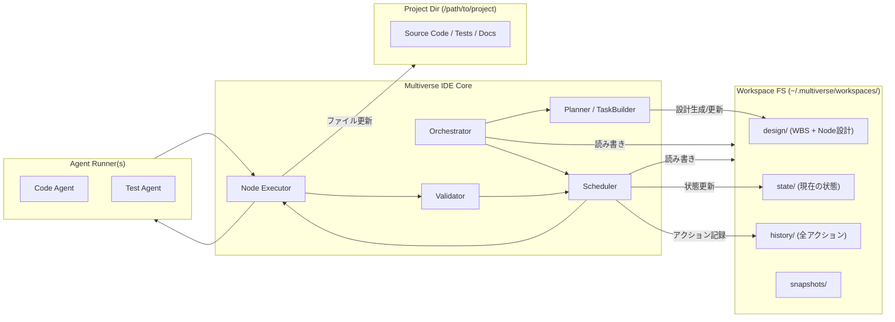

---

### 3. 永続化ポリシー

#### 3.1 基本原則

1. **生成物（コード・テスト・ドキュメント）**

   - 保存先: プロジェクトディレクトリ（例: `/path/to/project`）
   - IDE は「どのノード／タスクがどのファイル群を生成・更新したか」をパスで紐付ける。

2. **設計情報（WBS + ノード群）**

   - 保存先: `~/.multiverse/workspaces/<workspace-id>/design/`
   - ここが IDE における「設計の真実」であり、**再生成可能性の源泉**。

3. **状態情報（現在の IDE ワークスペース状態）**

   - 保存先: `~/.multiverse/workspaces/<workspace-id>/state/`
   - ノードの進捗・タスクキュー・エージェント状況・テスト結果など。

4. **履歴情報（アクションログ）**

   - 保存先: `~/.multiverse/workspaces/<workspace-id>/history/`
   - append-only（追記のみ）。全ての変更操作の起点は必ずここに 1 レコードが残る。

5. **状態変更の順序（疑似トランザクション）**

```text
1. アクションを構築（メモリ上）
2. history にアクションを書き込む（append）
3. state/design の該当ファイルを atomic に書き換える
   - 失敗時: `history_failed` または `state_save_failed` アクションを history に追記し、不整合を記録する。
4. 必要であればエージェント実行などの外部作用を開始する
```

---

### 4. ワークスペースディレクトリ構成

```text
~/.multiverse/workspaces/<workspace-id>/
  workspace.json              # ワークスペースメタ情報
  design/
    wbs.json                  # WBS ルート定義（ノードツリー）
    nodes/
      <node-id>.json          # 各ノードの設計定義
  state/
    nodes-runtime.json        # ノードごとの現在の実装・検証状態
    tasks.json                # タスクキュー・スケジューラ状態
    agents.json               # エージェント状態
    tests.json                # 最新テスト結果
  history/
    actions-YYYYMMDD.jsonl    # アクションログ（1行1 JSON）
  snapshots/
    snapshot-<timestamp>.json # 任意タイミングの state スナップショット
  logs/                       # 任意の内部ログ（実装依存）
    scheduler.log
    agents.log
```

これを Mermaid で俯瞰する:

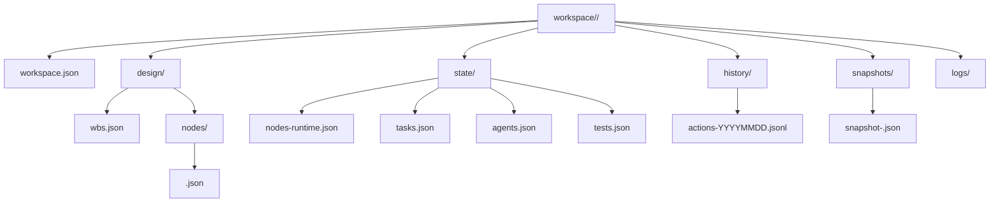

---

### 5. データモデル設計

#### 5.1 設計情報（WBS + ノード）

#### 5.1.1 WBS ルート (`design-wbs.json`)

役割: 全ノードの親子関係（WBS 階層構造）を表現。

```jsonc
{
  "wbs_id": "wbs-0001",
  "project_root": "/absolute/path/to/project",
  "created_at": "2025-12-11T07:00:00Z",
  "updated_at": "2025-12-11T07:00:00Z",
  "root_node_id": "node-root",
  "node_index": [
    {
      "node_id": "node-root",
      "parent_id": null,
      "children": ["node-backend", "node-frontend"]
    }
  ]
}
```

#### 5.1.2 ノード設計 (`design/nodes-<node-id>.json`)

```jsonc
{
  "node_id": "node-auth",
  "wbs_id": "wbs-0001",
  "name": "認証機能の実装",
  "summary": "IDE ログイン用の認証 API とトークン管理を実装する",
  "kind": "feature",
  "priority": "high",
  "estimate": {
    "story_points": 5,
    "difficulty": "medium"
  },
  "dependencies": ["node-api-design"],
  "acceptance_criteria": [
    "OAuth2 によるログインが成功すること",
    "失敗時のエラーコードとメッセージが定義されていること"
  ],
  "design_notes": ["トークンは短命アクセストークン + リフレッシュトークン方針"],
  "suggested_impl": {
    "language": "go",
    "framework": "gin",
    "module_paths": ["cmd/api/main.go", "internal/auth/"]
  },
  "created_at": "2025-12-11T07:01:00Z",
  "updated_at": "2025-12-11T07:01:00Z",
  "created_by": "agent:planner"
}
```

#### 5.1.3 設計モデルの関係 (Mermaid classDiagram)

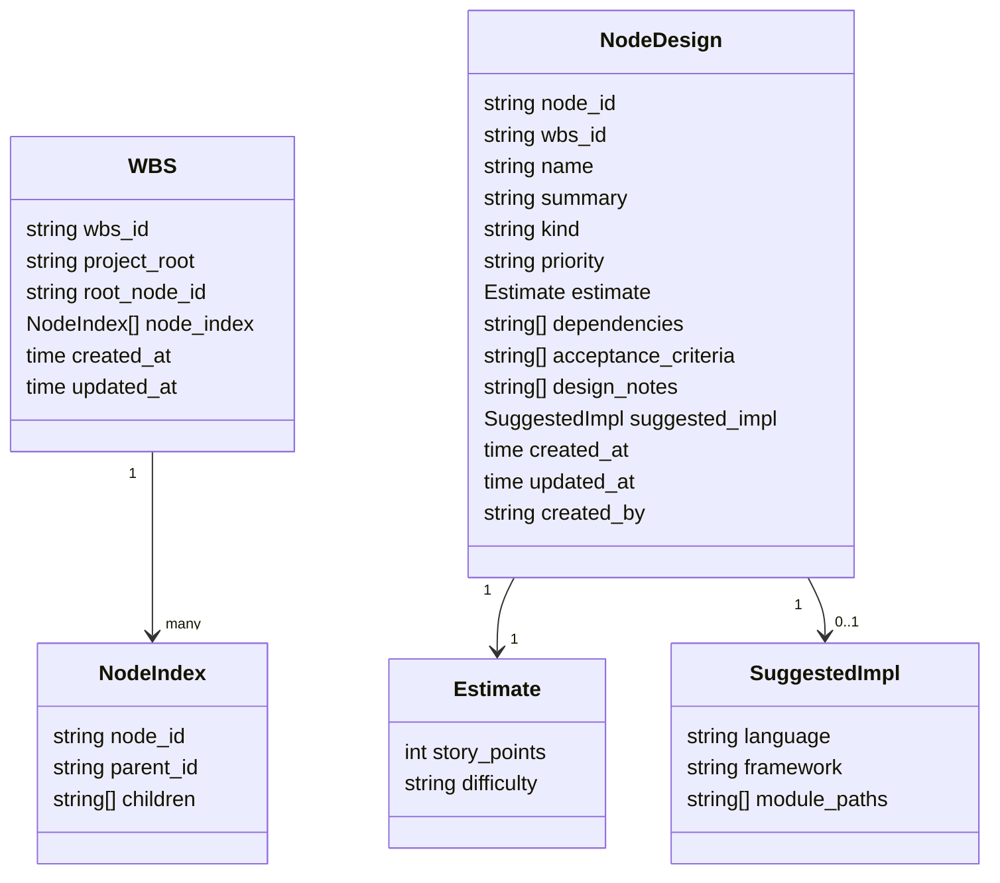

---

#### 5.2 状態情報 (`state-`)

#### 5.2.1 ノード実行状態 (`state-nodes-runtime.json`)

```jsonc
{
  "nodes": [
    {
      "node_id": "node-auth",
      "status": "implemented", // planned / in_progress / implemented / verified / blocked / obsolete
      "implementation": {
        "files": ["internal/auth/service.go", "internal/auth/handler.go"],
        "last_modified_at": "2025-12-11T08:00:00Z",
        "last_modified_by": "agent:codex"
      },
      "verification": {
        "status": "passed", // not_tested / passed / failed / flaky
        "last_test_task_id": "task-1235",
        "last_test_at": "2025-12-11T08:10:00Z"
      },
      "notes": [
        {
          "at": "2025-12-11T08:05:00Z",
          "by": "agent:codex",
          "text": "トークンの有効期限を 15 分に設定"
        }
      ]
    }
  ]
}
```

#### 5.2.2 タスク状態 (`state-tasks.json`)

```jsonc
{
  "tasks": [
    {
      "task_id": "task-1234",
      "node_id": "node-auth",
      "kind": "implementation", // planning / implementation / test / refactor / analysis ...
      "status": "PENDING", // PENDING / READY / RUNNING / SUCCEEDED / FAILED / CANCELED / SKIPPED / BLOCKED / RETRY_WAIT
      "created_at": "2025-12-11T07:05:00Z",
      "updated_at": "2025-12-11T07:05:00Z",
      "scheduled_by": "scheduler",
      "assigned_agent": "agent:codex",
      "priority": 100,
      "inputs": {
        "goal": "node-auth を acceptance_criteria を満たすよう実装・テストすること",
        "attempt_count": 0,
        "runner_max_loops": 5,
        "runner_worker_kind": "codex-cli",
        "constraints": [
          "既存 API 構成を変更しないこと",
          "ユニットテストを追加すること"
        ]
      },
      "outputs": {
        "status": "unknown",
        "artifacts": {}
      }
    }
  ],
  "queue_meta": {
    "last_scheduled_at": "2025-12-11T07:05:00Z",
    "next_task_id_seq": 1235
  }
}
```

**inputs の予約キー（実装準拠）**:

- `attempt_count`: 試行回数（`ExecutionOrchestrator` が開始時にインクリメント）。
- `next_retry_at`: 次回リトライ予定時刻（`RETRY_WAIT` 時に設定）。
- `runner_max_loops`: Executor が生成する TaskConfig YAML の `runner.max_loops` の上書き。
- `runner_worker_kind`: Executor が生成する TaskConfig YAML の `runner.worker.kind` の上書き。

#### 5.2.3 エージェント状態 (`state-agents.json`)

```jsonc
{
  "agents": [
    {
      "agent_id": "agent:codex",
      "kind": "code",
      "max_parallel": 2,
      "running_tasks": ["task-1234"],
      "capabilities": ["go", "typescript", "test", "refactor"]
    }
  ]
}
```

#### 5.2.4 テスト状態 (`state-tests.json`)

```jsonc
{
  "node_tests": [
    {
      "node_id": "node-auth",
      "last_result": {
        "status": "passed",
        "test_task_id": "task-1235",
        "coverage": {
          "lines": 0.78,
          "branches": 0.65
        },
        "summary": "認証成功/失敗パターンを網羅"
      }
    }
  ]
}
```

---

#### 5.3 履歴情報 (`history-actions-YYYYMMDD.jsonl`)

1 行 1 JSON アクション:

```jsonc
{"id":"act-0001","at":"2025-12-11T07:00:00Z","kind":"workspace.created","workspace_id":"ws-abc","payload":{"project_root":"/path/to/project"}}
{"id":"act-0002","at":"2025-12-11T07:01:00Z","kind":"node.created","workspace_id":"ws-abc","node_id":"node-auth","by":"agent:planner"}
{"id":"act-0003","at":"2025-12-11T07:05:00Z","kind":"task.created","workspace_id":"ws-abc","task_id":"task-1234","node_id":"node-auth","kind_detail":"implementation"}
{"id":"act-0004","at":"2025-12-11T07:06:00Z","kind":"task.started","workspace_id":"ws-abc","task_id":"task-1234","agent_id":"agent:codex"}
{"id":"act-0005","at":"2025-12-11T08:00:00Z","kind":"task.succeeded","workspace_id":"ws-abc","task_id":"task-1234","artifacts":{"files":["internal/auth/service.go"]}}
{"id":"act-0006","at":"2025-12-11T08:01:00Z","kind":"node.status_updated","workspace_id":"ws-abc","node_id":"node-auth","from":"planned","to":"implemented"}
{"id":"act-0007","at":"2025-12-11T08:10:00Z","kind":"test.run","workspace_id":"ws-abc","task_id":"task-1235","node_id":"node-auth","result":"passed"}
```

---

### 6. 実行フロー設計

#### 6.1 チャット入力からタスク実行までのシーケンス

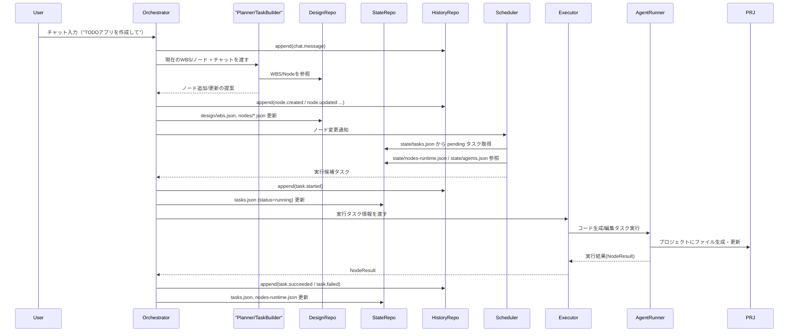

---

#### 6.2 スケジューラのタスク選択フロー

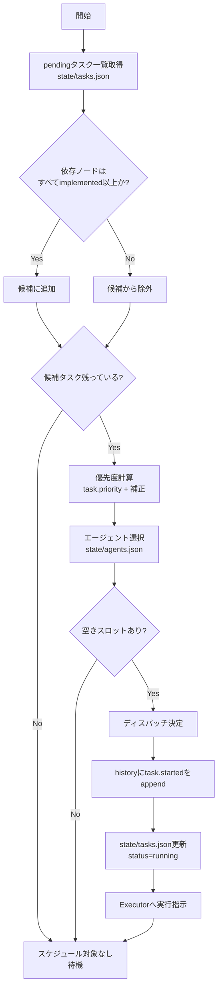

---

### 7. 再現性・リカバリ設計

#### 7.1 状態再構築

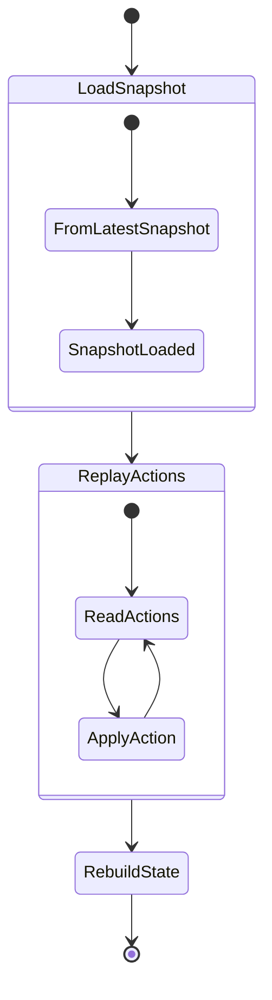

- 最新スナップショット (`snapshots/*.json`) をロード。
- スナップショット以降の `history/actions-*.jsonl` を時系列に適用。
- `design/`・`state/` を復元。

#### 7.2 クラッシュ・途中終了時の取扱い

- `task.started` まで記録されていて `task.succeeded/failed` が無いタスクは、再起動時に **不明状態** として扱い、再実行候補に載せる（実装ポリシーで「再スケジュール」か「手動介入待ち」かは決める）。

---

### 8. リポジトリ層インタフェース（実装指針）

#### 8.1 概念インタフェース

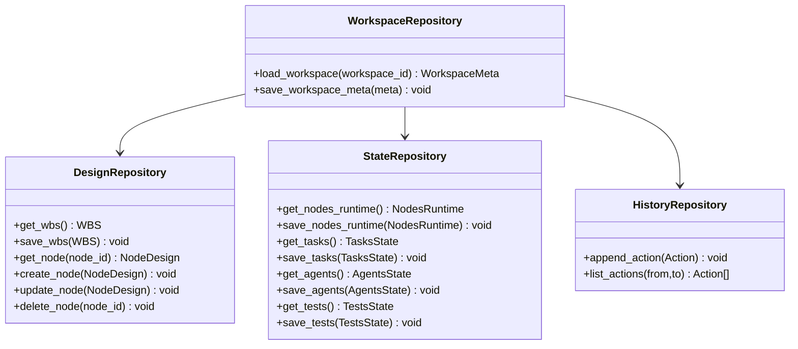

#### 8.2 ファイル書き込みポリシー

- 全ての JSON 書き込みは以下の手順で行う:
  1. `<file>.tmp` に書き出し
  2. `fsync` 相当で flush
  3. `rename(<file>.tmp, <file>)`（atomic rename）

---

### 9. MVP スコープ（実装開始に向けた最小セット）

実装の第一歩として、以下を「MVP」とする案:

1. `design/wbs.json` + `design/nodes/*.json` による WBS / ノード設計の永続化
2. `state/nodes-runtime.json` / `state/tasks.json` / `state/agents.json` の最小実装
3. `history/actions-*.jsonl` によるアクション記録
4. 単一エージェント・単一タスク種別（implementation）のみを対象としたスケジューラ
5. スナップショット無し（`state/` をそのままロード）での状態復元

この上に、テスト統合・RePlan・複数エージェント等を段階的に載せる。

<a id="design-chat-autopilot"></a>

## Chat Autopilot

**Source**: `design/chat-autopilot.md`


最終更新: 2025-12-17

### 1. 目的

ユーザーが「計画して」「実行して」などの操作/役割分担を意識せず、**自然な会話だけ**で開発が前進する状態を作る。

本設計は以下を満たす:

- チャット入力を起点に、Meta-agent が計画/実行/再計画を柔軟に判断し、必要なら自走でタスクを実行する。
- 不明点が出たら、エージェントがチャットで質問し、人間の回答を取り込んで継続する。
- IDE の実行ボタン（Start/Pause/Stop）はフォールバック（強制介入）であり、必須操作にしない。

### 2. 以前のギャップ（一次ソース） ※解消済み

#### 2.1 チャットは「分解→保存」で止まる

- `ChatHandler.HandleMessage` は `Meta.PlanPatch` → 永続化（create/update/delete/move の適用）まで実行し、そこで完了する（`internal/chat/handler.go`）。
- 【解消】`SendChatMessage` 完了後に Chat Autopilot が `StartExecution()` を冪等に呼び、直後に `Scheduler.ScheduleReadyTasks()` を 1 回実行して自走を開始する（`app.go:532`、`app.go:546`）。

#### 2.2 “人間に質問する” が実行ループに無い

- AgentRunner Core の `Runner` は Meta の `next_action` を `run_worker/mark_complete` しか扱わず、その他は unknown として `FAILED` で終了する（`internal/core/runner.go:317-320`）。
- つまり `ask_human` を実行ループに入れるには Core 側の実装拡張が必要。

#### 2.3 可視化グルーピングが崩れる

- Frontend は `milestone -> phase -> task` を前提に WBS を構築する（`frontend/ide/src/stores/wbsStore.ts:161`）。
- 【解消】`ListTasks()` は `NodeDesign` 由来の `phaseName/milestone/wbsLevel/dependencies` を返す（`app.go:279`、`app.go:400`）。

### 3. 設計方針（結論）

1. **Chat Autopilot をバックエンドに実装**し、チャットの完了時点で実行ループ起動とスケジューリングを行う。
2. 自然言語の “介入” を許容するが、危険操作（停止/再開/対象変更）は **決定論で解釈**できる範囲を先に持つ（誤作動を避ける）。
3. 人間への質問はまず **plan_patch 由来の質問**（計画時の未確定事項）として実装し、将来的に Core の `ask_human` 対応へ拡張する。
4. 分類/可視化（facet）は `design/` を正として、IDE の表示は `ListTasks()` が必要な情報を必ず返す。

### 4. コンポーネント

#### 4.1 Chat Autopilot（新規）

バックエンド側に導入する論理コンポーネント（実装は `app.go` または `internal/chat` に配置）。

責務:

- チャット入力の解釈（制御語の検出 + それ以外は meta へ）
- `Meta.PlanPatch` 実行と永続化（既存の `ChatHandler` を利用）
- 計画が更新されたら **実行開始/スケジューリング**を自動で行う
- 未解決の質問があれば停止して待つ

#### 4.2 ExecutionOrchestrator（既存）

- 実行ループは `Start()` を呼ぶと 2 秒ポーリングでキューを処理する（`internal/orchestrator/execution_orchestrator.go:79`）。
- Ready タスクの enqueue は `Scheduler.ScheduleReadyTasks()` が担う（`internal/orchestrator/execution_orchestrator.go:245`、`internal/orchestrator/scheduler.go:112`）。

#### 4.3 Backlog（既存・拡張）

- バックログは永続化され、`backlog:added` を IDE に通知できる（`internal/orchestrator/execution_orchestrator.go:646`、`frontend/ide/src/stores/backlogStore.ts:97`）。
- `BacklogTypeQuestion` が定義済み（`internal/orchestrator/backlog.go:21`）だが、現状の生成経路は主に failure 由来。

### 5. 主要フロー

#### 5.1 チャット入力 → 計画生成 → 自動実行開始（Autopilot 基本）

1. IDE → `SendChatMessage(sessionId, message)`
2. ChatHandler が `Meta.PlanPatch` → `design/state/task_store` へ差分永続化（`internal/chat/handler.go`）
3. Autopilot が以下を実行（追加）
   - `GetExecutionState()` が `IDLE` なら `StartExecution()`（`app.go:633`、`app.go:601`）
   - 直後に `Scheduler.ScheduleReadyTasks()` を 1 回呼び、開始直後から進むことを保証
4. ExecutionOrchestrator がジョブを処理して `Executor` を起動し、`agent-runner` を実行する（`internal/orchestrator/execution_orchestrator.go:256`、`internal/orchestrator/executor.go:63`）

補足: `StartExecution()` は “already running” を返し得る（`internal/orchestrator/execution_orchestrator.go:82-85`）。Autopilot 側は **冪等**に扱う。

#### 5.2 自然言語での介入（最小セット）

Autopilot は以下の制御語を LLM を経由せず解釈する（決定論・安全側）:

- 「止めて/停止」→ `StopExecution()`
- 「一旦止めて/一時停止」→ `PauseExecution()`
- 「続けて/再開」→ `ResumeExecution()`
- 「状況/ステータス」→ `GetExecutionState()` + タスクサマリ提示

それ以外の入力は meta に渡して `plan_patch`（再計画/整理）を行い、計画更新後は 5.1 の自動実行フローに接続する。

#### 5.3 人間への質問（MVP: plan_patch 由来）

課題: Core の `ask_human` は未対応（`internal/core/runner.go:317-320`）。よって MVP は plan_patch に質問を含める。

案:

- `plan_patch` の payload に `questions[]` を追加し、ChatHandler がチャットに表示する。
- blocking な質問が残っている間は Autopilot が `PauseExecution()` し、回答を受けたら再度 `plan_patch` を走らせて計画を更新する。

質問の永続化は Backlog と統合する:

- 質問は `BacklogTypeQuestion` として保存し、未解決を IDE に見せる。
- 回答は `ResolveBacklogItem(id, resolution)` に保存し（`app.go:563`）、次回の plan_patch コンテキストに含める。

### 6. API - イベント（追加・整理）

#### 6.1 既存 API（利用する）

- `StartExecution/PauseExecution/ResumeExecution/StopExecution/GetExecutionState`（`app.go:601`、`frontend/ide/wailsjs/go/main/App.d.ts:54`）
- `SendChatMessage`（`app.go:532`）
- `GetBacklogItems/ResolveBacklogItem`（`app.go:645`、`app.go:673`）

#### 6.2 既存イベント（利用する）

- `chat:progress`（`internal/orchestrator/events.go:36`）
- `execution:stateChange`（`internal/orchestrator/events.go:33`）
- `task:created` / `task:stateChange`（`internal/orchestrator/events.go:32`）
- `backlog:added`（`internal/orchestrator/events.go:38`）

#### 6.3 追加イベント（提案）

Autopilot の挙動が見えるように `chat:progress` に以下の step を追加する:

- `AutopilotStartingExecution`
- `AutopilotScheduling`
- `AutopilotPausedForQuestion`

（既存の `ChatProgressEvent` の枠で表現可能: `internal/orchestrator/events.go:58`）

### 7. データ（分類-グルーピングと Autopilot の相互作用）

分類設計は `docs/design/task-execution-and-visual-grouping.md` に従う。

Autopilot が前提とする最低要件:

- `ListTasks()` が `phaseName/milestone/wbsLevel/dependencies` を返す（WBS/Graph のグルーピングが壊れない）
- 失敗や質問の状態が IDE に表示される（Backlog/Chat で可視化）

### 8. 実装チェックリスト（PRD と同期）

- PRD の “チャットだけで計画→実行へ遷移” を満たす（`PRD.md` の 7.2 に対応）
- `SendChatMessage` の完了後に `StartExecution + ScheduleReadyTasks` を実行し、実行開始の導線を不要にする
- 失敗時の Backlog を “質問” としても扱えるようにし、会話に出す
- `ListTasks` の返却値を修正して WBS/Graph の分類が成立するようにする

<a id="design-task-execution-and-visual-grouping"></a>

## Task Execution And Visual Grouping

**Source**: `design/task-execution-and-visual-grouping.md`


最終更新: 2025-12-17

### 1. 背景 - 問題

#### 1.1 「タスクは作られるが実行されない」

- `ExecutionOrchestrator` は `StartExecution()` を呼ぶまで `IDLE` のまま（`internal/orchestrator/execution_orchestrator.go:79`）。
- 【解消】`SendChatMessage` 完了後に Chat Autopilot が `StartExecution()` を冪等に呼び、直後に `Scheduler.ScheduleReadyTasks()` を 1 回実行して自走を開始する（`app.go:532`、`app.go:546`）。
- 【補足】UI からの明示的な開始/停止はフォールバック（強制介入）であり、通常フローの必須操作にはしない（3 章）。

#### 1.2 「タスクがフラットで、分類-可視化が雑になる」

- Frontend の WBS ツリーは `milestone -> phase -> task` でツリー化する設計（`frontend/ide/src/stores/wbsStore.ts:161-240`）。
- backend の `ListTasks()` は `design/wbs.json` + `design/nodes/*.json` + `state/tasks.json` を join して `dependencies/phaseName/milestone/wbsLevel` を返す（`app.go:279`）。
  - これにより UI では `phaseName/milestone` が空扱いにならず、WBS が 1 グループに潰れにくい。
- `design/state` 側も、TaskState.Kind が全タスクで `"implementation"` 固定になっており（`internal/chat/handler.go:579-596`）、作業種別（仕様/ドキュメント/設計/実装/検証など）という分類軸を表現できない。

### 2. ゴール - 非ゴール

#### 2.1 ゴール

1. **Planning → Execution の遷移を明示**し、「いつまでタスク生成が続くのか分からない」を解消する。
2. **複数軸（Facet）での可視化**を可能にする。
   - 例: `phaseName`, `milestone`, `workType`, `domain/component`, `status`, `text search`
3. 既存ワークスペースの `design/state/tasks` の互換性を壊さない。

#### 2.2 非ゴール（当面）

- 高度なクエリ言語やサーバーサイド検索インデックス。
- リモート実行/分散ワーカープール最適化。

### 3. 設計方針（結論）

- **分類メタデータ（Facet）は `design/` を正**とし、`state/` と `TaskStore(tasks/*.jsonl)` は表示/実行のために同期する。
- **UI は “Group By” と “Filters” を同じ Facet 概念で扱う**（WBS も Graph も同一フィルタで絞り込み可能にする）。
- 実行は **「チャット駆動（Autopilot）」を基本**とし、UI の実行ボタンはフォールバック（停止・一時停止等の非常用）として扱う。

### 4. データモデル（Facet）

#### 4.1 Facet の定義（最小）

| フィールド | 例 | 用途 |
| --- | --- | --- |
| `phaseName` | `概念設計/実装設計/実装/検証` | フェーズ別グルーピング |
| `milestone` | `M1-Feature-Design` | 機能/エピック単位のまとまり |
| `wbsLevel` | `1/2/3` | 粗い工程区分 |
| `workType` | `spec/docs/design/implementation/test` | 「仕様/ドキュメント/設計/実装/検証」軸 |
| `domain` | `orchestrator/frontend/meta/...` | 機能カテゴリ（コンポーネント） |
| `tags[]` | `["ux","refactor"]` | 任意ラベル |

#### 4.2 永続化先

#### A. `design/nodes-*.json`（推奨: 正）

- `persistence.NodeDesign` に以下を追加する想定:
  - `phase_name`, `milestone`, `wbs_level`, `work_type`, `domain`, `tags`

#### B. `state/tasks.json`（実行-表示用の複製）

- `persistence.TaskState.Inputs`（柔軟）に `facet.*` を複製する（例: `inputs["facet.phase_name"] = "実装"`）。
- これにより Scheduler/Executor が **design を読まなくても最低限の分類**を参照できる。

#### C. `tasks-*.jsonl`（IDE 表示の後方互換）

- `orchestrator.Task` にも同等の Facet を持たせ、IDE の一覧/Graph/WBS 表示で利用する。

### 5. Facet の生成規則（優先順位）

1. **明示指定（将来）**: Meta plan_patch が `work_type/domain/tags` を返す場合、それを正とする。
2. **推定（当面）**: 既存フィールドから決定論で推定する。
   - `phaseName == "概念設計"` → `workType=spec`（ただしタイトル/説明に「ドキュメント/README」が強く含まれる場合は `docs`）
   - `phaseName == "実装設計"` → `workType=design`
   - `phaseName == "実装"` → `workType=implementation`
   - `phaseName == "検証"` または「テスト」が強く含まれる → `workType=test`
   - `domain` は `suggestedImpl.filePaths` のパス接頭辞（例: `internal/orchestrator/...`）から推定する（推定不能なら空）。

### 6. Planning → Execution（実行制御）

#### 6.1 UI 導線（フォールバック）

- 実行制御（Start/Pause/Resume/Stop）は、**ユーザーが強制介入するためのフォールバック**として UI に提供する。
  - 配置候補: Toolbar 右端、または TaskBar に “Run/Pause/Stop” を追加。

#### 6.2 Chat Autopilot（基本）

- ユーザーは「計画して」「実行して」などの役割分担を要求されない。
- Chat の「タスク永続化」完了後に以下を実行する:
  1. `ExecutionOrchestrator` が `IDLE` なら `StartExecution()`（`internal/orchestrator/execution_orchestrator.go:79`、`app.go:601`）
  2. 直後に `Scheduler.ScheduleReadyTasks()` を 1 回呼び、開始直後から進むことを保証（2 秒ポーリング待ちを削減）

#### 6.3 自然言語での介入（必須）

- ユーザーはチャットで自然に介入できる（例: 「止めて」「一旦止めて」「続けて」「状況教えて」）。
- 実装は 2 系統を許容する:
  - **決定論（安全側）**: 明確な制御語（stop/pause/resume/status）だけは LLM を経由せず即時に `StopExecution/PauseExecution/ResumeExecution/GetExecutionState` にマップする。
  - **Meta 主導（柔軟）**: それ以外は Meta-agent に渡し、計画更新（plan_patch）や優先度付けを含めて判断させる。

#### 6.4 人間への質問（Backlog → Chat）

- Meta-agent が人間に確認すべき事項は **チャットに質問として出る**ことを基本 UX とする。
- 既存のバックログ通知は `backlog:added` としてイベント化済み（`internal/orchestrator/events.go:38`、`internal/orchestrator/execution_orchestrator.go:646`）。
- 設計方針:
  - `BacklogTypeQuestion` を活用し、質問は Backlog に永続化しつつ、チャットにも「質問メッセージ」として表示する。
  - 未解決の質問がある間は、実行を `PAUSED` にして待つ（ユーザー回答後に自動再開）。
  - 回答は `ResolveBacklogItem` で保存し（`app.go:563`）、回答内容は次回の Meta plan_patch/実行コンテキストに含める。

#### 6.4.1 質問の生成源（2案）

- **案A: 計画時（plan_patch）に質問を返す**
  - `plan_patch` レスポンスに `questions[]`（blocking/optional）を追加し、ChatHandler が質問をチャットに表示して待つ。
  - メリット: 実装が単純。タスク実行前に不明点を回収できる。
- **案B: 実行時（agent-runner の next_action）で `ask_human` を扱う**
  - 現状の AgentRunner Core は `run_worker/mark_complete` 以外を Unknown として即 `FAILED` 扱いにしている（`internal/core/runner.go:317-320`）。
  - `ask_human` を正式に扱うには、`NextActionResponse` に質問ペイロードを追加し、Runner が「質問→中断→再試行（回答を Inputs に入れて再実行）」を実装する必要がある。

### 7. Backend API - UI 反映

#### 7.1 `ListTasks()` の責務

- IDE が必要とする `phaseName/milestone/wbsLevel/dependencies` と Facet を必ず返す。
- 実装方式は 2 案:
  - **案1（最短）**: TaskStore（`tasks/*.jsonl`）から読み出す（既に Phase/Milestone を持つ）
  - **案2（正攻法）**: `design/nodes` + `state/tasks` を join して DTO を組み立てる（Facet の正を `design` に置く）

#### 7.2 フロント（可視化）

- `facetStore`（derived）で以下を提供:
  - `availableFacets`: milestone/phase/workType/domain の集合と件数
  - `activeFilters`: 選択中の条件
  - `groupBy`: 現在の grouping 軸（例: milestone→phase, workType→domain など）
- `UnifiedFlowCanvas` は `taskList`（フィルタ済み）を受け取れるので、Graph 側は `taskList` を差し替えることで絞り込みできる（`frontend/ide/src/lib/flow/UnifiedFlowCanvas.svelte:42-75`）。
- WBS 側は `wbsStore` の入力（tasks）をフィルタ済みにした派生ストアを使う。

### 8. 移行（既存ワークスペース）

- 既存の `design/nodes` に新フィールドが無い場合は空として扱う（Go の JSON Unmarshal では unknown/missing フィールドは安全に扱える）。
- 互換のため、最初の段階では TaskStore に存在する `phaseName/milestone/wbsLevel/dependencies` を読み、`design/state` へ補完する「オンデマンド補正」を提供する（明示的マイグレーションは不要）。

### 9. 実装ステップ（最短ルート）

1. **ListTasks の修正**: `phaseName/milestone/dependencies/wbsLevel` を返す（案1で即効性優先）。
2. **Chat Autopilot**: `SendChatMessage` 完了後に `StartExecution + ScheduleReadyTasks` を呼び、チャットだけで「計画→実行」に遷移させる。
3. **質問 UX**: `backlog:added` をチャットにブリッジし、質問（BacklogTypeQuestion）を会話として扱う。
4. **Kind/WorkType**: `internal/chat/handler.go` の TaskState.Kind をフェーズに応じて設定し、Facet を `state/tasks.json` に複製。
5. **Facet UI**: group-by + filter を追加し、Graph/WBS の両方に適用。

<a id="design-data-flow"></a>

## Data Flow

**Source**: `design/data-flow.md`


最終更新: 2025-11-22

### 概要

本ドキュメントは AgentRunner のデータフローと状態遷移を説明します。タスク実行の全体フロー、状態遷移、データ変換を詳細に記述します。

### タスク実行フロー

#### 全体フロー


#### 詳細シーケンス

```mermaid
sequenceDiagram
    participant User
    participant CLI
    participant Core
    participant Meta
    participant Worker
    participant Docker
    participant Note

    User->>CLI: task.yaml
    CLI->>Core: YAML パース
    Core->>Core: TaskContext 構築
    Core->>Core: State = PENDING

    Note over Core: PENDING → PLANNING
    Core->>Meta: plan_task(PRD)
    Meta-->>Core: Acceptance Criteria
    Core->>Core: State = PLANNING → RUNNING

    loop Worker 実行ループ (max_loops まで)
        Core->>Meta: next_action(TaskContext)
        Meta-->>Core: decision

        alt action = run_worker
            Core->>Core: State = RUNNING
            Core->>Docker: Start Container (初回のみ)
            Docker-->>Core: Container ID
            Core->>Worker: RunWorker(prompt)
            Worker->>Docker: docker exec
            Docker-->>Worker: stdout/stderr
            Worker-->>Core: WorkerRunResult
            Core->>Core: State = RUNNING → VALIDATING
            Core->>Meta: completion_assessment
            Meta-->>Core: 評価結果

            alt 追加作業が必要
                Core->>Core: State = VALIDATING → RUNNING
            else 完了
                Core->>Core: State = VALIDATING → COMPLETE
            end
        else action = mark_complete
            Core->>Core: State = COMPLETE
        end
    end

    Core->>Docker: Stop Container
    Core->>Note: WriteTaskNote(TaskContext)
    Note-->>Core: Task Note 生成完了
    Core-->>CLI: 実行結果
    CLI-->>User: 完了
```

### 状態遷移

#### FSM 状態定義

```go
type TaskState string

const (
    StatePending    TaskState = "PENDING"
    StatePlanning   TaskState = "PLANNING"
    StateRunning    TaskState = "RUNNING"
    StateValidating TaskState = "VALIDATING"
    StateComplete   TaskState = "COMPLETE"
    StateFailed     TaskState = "FAILED"
)
```

#### 状態遷移図

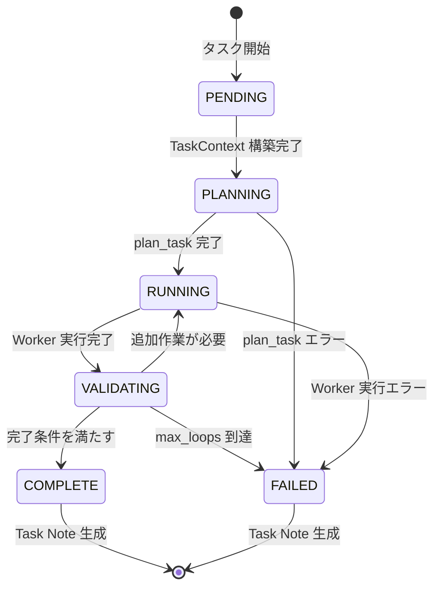

#### 状態遷移ルール

| 現在の状態 | イベント              | 次の状態   | 条件                    |
| ---------- | --------------------- | ---------- | ----------------------- |
| PENDING    | TaskContext 構築完了  | PLANNING   | -                       |
| PLANNING   | plan_task 成功        | RUNNING    | -                       |
| PLANNING   | plan_task 失敗        | FAILED     | -                       |
| RUNNING    | Worker 実行完了       | VALIDATING | -                       |
| RUNNING    | Worker 実行失敗       | FAILED     | -                       |
| VALIDATING | Meta が追加作業を指示 | RUNNING    | ループ回数 < max_loops  |
| VALIDATING | Meta が完了を判定     | COMPLETE   | -                       |
| VALIDATING | max_loops 到達        | FAILED     | ループ回数 >= max_loops |

#### ループ制御

```go
func (r *Runner) Run(ctx context.Context) error {
    tc := r.buildTaskContext()
    loopCount := 0
    maxLoops := r.Config.Runner.Meta.MaxLoops // デフォルト: 5

    for tc.State != StateComplete && tc.State != StateFailed {
        switch tc.State {
        case StateValidating:
            assessment, err := r.Meta.CompletionAssessment(ctx, tc)
            if err != nil {
                tc.State = StateFailed
                return err
            }

            if assessment.AllCriteriaSatisfied {
                tc.State = StateComplete
            } else {
                loopCount++
                if loopCount >= maxLoops {
                    tc.State = StateFailed
                    return errors.New("max loops exceeded")
                }
                tc.State = StateRunning
            }
        }
    }

    return nil
}
```

### データ変換

#### 入力データ

#### Task YAML

```yaml
version: 1
task:
  id: "TASK-123"
  title: "Implement API"
  repo: "."
  prd:
    path: "./docs/prd.md"
  runner:
    meta:
      kind: "openai-chat"
      model: "gpt-5.2"
      max_loops: 5
    worker:
      kind: "codex-cli"
```

#### 中間データ

#### TaskContext

```go
type TaskContext struct {
    ID        string        // "TASK-123"
    Title     string        // "Implement API"
    RepoPath  string        // "/absolute/path/to/repo"
    State     TaskState     // PENDING → PLANNING → ...

    PRDText            string                // PRD ファイルの内容
    AcceptanceCriteria []AcceptanceCriterion // Meta から取得
    MetaCalls          []MetaCallLog         // Meta 呼び出し履歴
    WorkerRuns         []WorkerRunResult     // Worker 実行履歴

    StartedAt  time.Time
    FinishedAt time.Time
}
```

#### Meta プロトコル

**plan_task レスポンス**:

```yaml
type: plan_task
acceptance_criteria:
  - id: "AC-1"
    description: "API が 200 を返すこと"
```

**next_action レスポンス**:

```yaml
type: next_action
decision:
  action: "run_worker"
  reason: "実装が必要"
worker_call:
  worker_type: "codex-cli"
  mode: "exec"
  prompt: "API を実装してください"
```

#### Worker 実行結果

```go
type WorkerRunResult struct {
    ID          string    // "run-001"
    StartedAt   time.Time
    FinishedAt  time.Time
    ExitCode    int       // 0
    RawOutput   string    // stdout/stderr
    Summary     string    // "API 実装完了"
    Error       error     // nil
}
```

#### 出力データ

#### Task Note (Markdown)

```markdown
# Task Note - TASK-123 - Implement API

- Task ID: TASK-123
- Title: Implement API
- Started At: 2025-11-22T10:00:00Z
- Finished At: 2025-11-22T10:30:00Z
- State: COMPLETE

---

## 1. 概要

API 実装タスクが完了しました。

---

## 2. PRD 概要

...

---

## 3. 受け入れ条件 (Acceptance Criteria)

- [x] AC-1: API が 200 を返すこと

---

## 4. 実行ログ (Meta - Worker)

### 4.1 Meta Calls

...

### 4.2 Worker Runs

...
```

### エラーフロー

#### エラー種別と処理

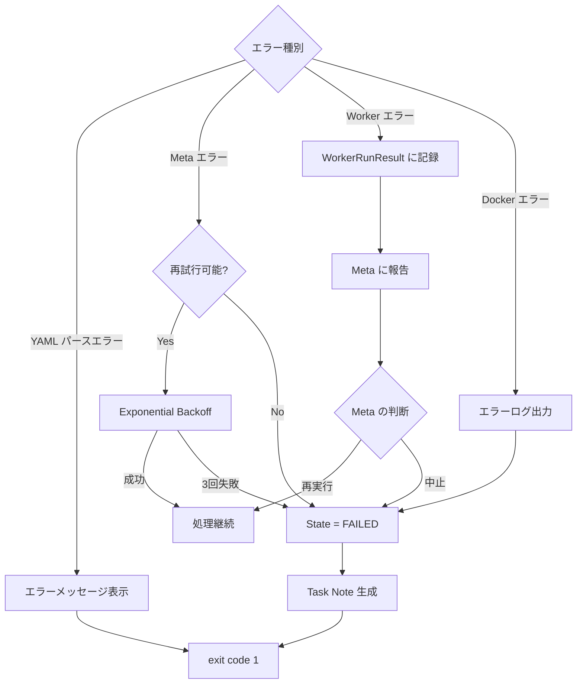

#### エラーハンドリング戦略

| エラー種別                     | 処理                 | 再試行      | 最終状態            |
| ------------------------------ | -------------------- | ----------- | ------------------- |
| **YAML パースエラー**          | エラーメッセージ表示 | なし        | FAILED              |
| **Meta API エラー (5xx, 429)** | Exponential Backoff  | 最大 3 回   | FAILED (3 回失敗後) |
| **Meta API エラー (4xx)**      | エラーメッセージ表示 | なし        | FAILED              |
| **Worker 実行エラー**          | Meta に報告          | Meta の判断 | Meta の判断に従う   |
| **Docker エラー**              | エラーログ出力       | なし        | FAILED              |
| **タイムアウト**               | Worker 強制終了      | なし        | FAILED              |

### パフォーマンス最適化

#### コンテナライフサイクル最適化

**従来の方法**:

```
Worker 実行 1: コンテナ起動 (2s) + 実行 (30s) + 停止 (1s) = 33s
Worker 実行 2: コンテナ起動 (2s) + 実行 (30s) + 停止 (1s) = 33s
合計: 66s
```

**最適化後**:

```
タスク開始: コンテナ起動 (2s)
Worker 実行 1: 実行 (30s)
Worker 実行 2: 実行 (30s)
タスク終了: コンテナ停止 (1s)
合計: 63s → 約 5% 削減
```

**効果**: 複数回の Worker 実行で 5-10 倍の高速化

#### データ転送最適化

- **ストリーミング**: Worker の stdout/stderr をリアルタイムで取得
- **バッファリング**: 大きな出力は適切にバッファリング
- **圧縮**: 将来的に Task Note を圧縮して保存

### 参考ドキュメント

- [アーキテクチャ](architecture.md)
- [実装ガイド](implementation-guide.md)
- [コア仕様](../specifications/core-specification.md)
- [Meta プロトコル仕様](../specifications/meta-protocol.md)
- [Worker インターフェース仕様](../specifications/worker-interface.md)

<a id="design-implementation-guide"></a>

## Implementation Guide

**Source**: `design/implementation-guide.md`


最終更新: 2025-11-22

### 概要

本ドキュメントは AgentRunner の Go 実装に関するガイドです。パッケージ構成、依存性注入パターン、実装パターン、テスト戦略を説明します。

### パッケージ構成

#### ディレクトリ構造

```
agent-runner/
├── cmd/
│   └── agent-runner/
│       └── main.go              # CLI エントリポイント
├── internal/
│   ├── core/                    # タスク実行エンジン
│   │   ├── runner.go            # FSM オーケストレーション
│   │   ├── context.go           # TaskContext・TaskState定義
│   │   └── runner_test.go       # プロパティベーステスト
│   ├── meta/                    # Meta-agent通信層
│   │   ├── client.go            # OpenAI API通信
│   │   └── protocol.go          # YAMLプロトコル定義
│   ├── worker/                  # Worker実行・Dockerサンドボックス
│   │   ├── executor.go          # Worker CLI実行の抽象化
│   │   └── sandbox.go           # Docker API管理
│   ├── note/                    # Task Note生成
│   │   └── writer.go            # Markdown テンプレート出力
│   └── mock/                    # テスト用モック実装
│       ├── meta.go
│       ├── worker.go
│       └── note.go
├── pkg/
│   └── config/                  # 公開パッケージ（YAML設定）
│       └── config.go            # TaskConfig構造体定義
└── test/
    ├── integration/             # Mock統合テスト
    ├── sandbox/                 # Docker Sandboxテスト
    └── codex/                   # Codex統合テスト
```

#### パッケージの役割

| パッケージ         | 責務                            | 公開/内部 |
| ------------------ | ------------------------------- | --------- |
| `cmd/agent-runner` | CLI エントリポイント            | 実行可能  |
| `internal/core`    | FSM・TaskContext・状態遷移      | 内部      |
| `internal/meta`    | LLM 通信・YAML プロトコル       | 内部      |
| `internal/worker`  | CLI 実行・Docker サンドボックス | 内部      |
| `internal/note`    | Task Note 生成・テンプレート    | 内部      |
| `internal/mock`    | テストダブル・FuncField 注入    | 内部      |
| `pkg/config`       | YAML 設定スキーマ               | 公開      |

### 依存性注入パターン

#### Runner 構造体

`Runner` はインターフェースを受け入れることで、テスト時にモックを注入できます。

```go
type Runner struct {
    Config *config.TaskConfig
    Meta   MetaClient        // インターフェース
    Worker WorkerExecutor    // インターフェース
    Note   NoteWriter        // インターフェース
}
```

#### インターフェース定義

#### MetaClient

```go
type MetaClient interface {
    PlanTask(ctx context.Context, tc *TaskContext) (*PlanTaskResponse, error)
    NextAction(ctx context.Context, tc *TaskContext) (*NextActionResponse, error)
    CompletionAssessment(ctx context.Context, tc *TaskContext) (*CompletionAssessmentResponse, error)
}
```

#### WorkerExecutor

```go
type WorkerExecutor interface {
    Start(ctx context.Context) error
    RunWorker(ctx context.Context, prompt string) (*WorkerRunResult, error)
    Stop(ctx context.Context) error
}
```

#### NoteWriter

```go
type NoteWriter interface {
    WriteTaskNote(ctx context.Context, tc *TaskContext) error
}
```

#### モック実装

`internal/mock` パッケージで Function Field Injection パターンを使用します。

```go
type MockMetaClient struct {
    PlanTaskFunc             func(ctx context.Context, tc *TaskContext) (*PlanTaskResponse, error)
    NextActionFunc           func(ctx context.Context, tc *TaskContext) (*NextActionResponse, error)
    CompletionAssessmentFunc func(ctx context.Context, tc *TaskContext) (*CompletionAssessmentResponse, error)
}

func (m *MockMetaClient) PlanTask(ctx context.Context, tc *TaskContext) (*PlanTaskResponse, error) {
    if m.PlanTaskFunc != nil {
        return m.PlanTaskFunc(ctx, tc)
    }
    return nil, errors.New("PlanTaskFunc not set")
}
```

### 実装パターン

#### 1. TaskContext の伝播

実行状態はすべて `TaskContext` に保持し、FSM を通じて伝播します。

```go
type TaskContext struct {
    ID        string
    Title     string
    RepoPath  string
    State     TaskState

    PRDText            string
    AcceptanceCriteria []AcceptanceCriterion
    MetaCalls          []MetaCallLog
    WorkerRuns         []WorkerRunResult

    StartedAt  time.Time
    FinishedAt time.Time
}
```

#### 2. FSM 状態遷移

```go
func (r *Runner) Run(ctx context.Context) error {
    tc := r.buildTaskContext()

    for tc.State != StateComplete && tc.State != StateFailed {
        switch tc.State {
        case StatePending:
            tc.State = StatePlanning
        case StatePlanning:
            if err := r.planTask(ctx, tc); err != nil {
                tc.State = StateFailed
                return err
            }
            tc.State = StateRunning
        case StateRunning:
            if err := r.runWorker(ctx, tc); err != nil {
                tc.State = StateFailed
                return err
            }
            tc.State = StateValidating
        case StateValidating:
            if err := r.validate(ctx, tc); err != nil {
                tc.State = StateFailed
                return err
            }
            // Meta の判断で RUNNING or COMPLETE に遷移
        }
    }

    return r.Note.WriteTaskNote(ctx, tc)
}
```

#### 3. エラーハンドリング

#### Exponential Backoff

```go
func (c *Client) callWithRetry(ctx context.Context, fn func() error) error {
    backoff := 1 * time.Second
    maxRetries := 3

    for i := 0; i < maxRetries; i++ {
        err := fn()
        if err == nil {
            return nil
        }

        if !isRetryable(err) {
            return err
        }

        time.Sleep(backoff)
        backoff *= 2
    }

    return errors.New("max retries exceeded")
}
```

#### コンテキストキャンセル

```go
func (w *WorkerExecutor) RunWorker(ctx context.Context, prompt string) (*WorkerRunResult, error) {
    timeout := time.Duration(w.config.MaxRunTimeSec) * time.Second
    ctx, cancel := context.WithTimeout(ctx, timeout)
    defer cancel()

    // Worker 実行
    result, err := w.sandbox.Exec(ctx, w.containerID, cmd)
    if err != nil {
        if ctx.Err() == context.DeadlineExceeded {
            return nil, errors.New("worker execution timeout")
        }
        return nil, err
    }

    return result, nil
}
```

#### 4. YAML パース

```go
func parseYAML[T any](data []byte) (*T, error) {
    var result T
    if err := yaml.Unmarshal(data, &result); err != nil {
        return nil, fmt.Errorf("failed to parse YAML: %w", err)
    }
    return &result, nil
}
```

#### 5. テンプレート生成

```go
func (w *Writer) WriteTaskNote(ctx context.Context, tc *TaskContext) error {
    tmpl, err := template.New("task_note").Parse(taskNoteTemplate)
    if err != nil {
        return err
    }

    var buf bytes.Buffer
    if err := tmpl.Execute(&buf, tc); err != nil {
        return err
    }

    path := filepath.Join(tc.RepoPath, ".agent-runner", fmt.Sprintf("task-%s.md", tc.ID))
    return os.WriteFile(path, buf.Bytes(), 0644)
}
```

### テスト戦略

#### テストの種類

| テスト種別                 | ツール    | タグ           | 実行時間 |
| -------------------------- | --------- | -------------- | -------- |
| **ユニットテスト**         | `go test` | なし           | < 1s     |
| **プロパティベーステスト** | `gopter`  | なし           | 1-5s     |
| **Mock 統合テスト**        | `go test` | なし           | 1-10s    |
| **Docker Sandbox テスト**  | `go test` | `-tags=docker` | 10-30s   |
| **Codex 統合テスト**       | `go test` | `-tags=codex`  | 60-300s  |

#### テスト実行コマンド

```bash
# ユニットテスト（依存なし、高速）
go test ./...

# 全テスト実行（推奨、Docker + Codex CLI 必須）
go test -tags=docker,codex -timeout=15m ./...

# カバレッジレポート生成
go test -coverprofile=coverage.out ./... && go tool cover -html=coverage.out
```

#### プロパティベーステスト

```go
func TestRunnerProperties(t *testing.T) {
    properties := gopter.NewProperties(nil)

    properties.Property("TaskContext は常に有効な状態遷移を行う", prop.ForAll(
        func(initialState TaskState) bool {
            tc := &TaskContext{State: initialState}
            nextState := transition(tc)
            return isValidTransition(initialState, nextState)
        },
        gen.OneConstOf(StatePending, StatePlanning, StateRunning, StateValidating),
    ))

    properties.TestingRun(t)
}
```

#### モックを使った統合テスト

```go
func TestRunnerIntegration(t *testing.T) {
    mockMeta := &mock.MockMetaClient{
        PlanTaskFunc: func(ctx context.Context, tc *TaskContext) (*PlanTaskResponse, error) {
            return &PlanTaskResponse{
                AcceptanceCriteria: []AcceptanceCriterion{
                    {ID: "AC-1", Description: "Test criterion"},
                },
            }, nil
        },
        NextActionFunc: func(ctx context.Context, tc *TaskContext) (*NextActionResponse, error) {
            return &NextActionResponse{
                Decision: Decision{Action: "mark_complete"},
            }, nil
        },
    }

    runner := &Runner{
        Meta: mockMeta,
        // ...
    }

    err := runner.Run(context.Background())
    assert.NoError(t, err)
}
```

### ベストプラクティス

#### 1. ロギング

構造化ログ（`log/slog`）を使用します。

```go
slog.Info("starting worker execution",
    "task_id", tc.ID,
    "worker_type", "codex-cli",
)
```

#### 2. エラーメッセージ

コンテキスト情報を含めます。

```go
return fmt.Errorf("failed to start container for task %s: %w", tc.ID, err)
```

#### 3. リソース管理

`defer` でリソースを確実に解放します。

```go
func (w *WorkerExecutor) Start(ctx context.Context) error {
    containerID, err := w.sandbox.StartContainer(ctx, ...)
    if err != nil {
        return err
    }
    w.containerID = containerID

    // 確実に停止するように defer で登録
    runtime.SetFinalizer(w, func(w *WorkerExecutor) {
        w.Stop(context.Background())
    })

    return nil
}
```

#### 4. コンテキスト伝播

すべての I/O 操作でコンテキストを受け取ります。

```go
func (c *Client) Chat(ctx context.Context, req ChatRequest) (ChatResponse, error) {
    // コンテキストを HTTP リクエストに渡す
    httpReq, err := http.NewRequestWithContext(ctx, "POST", c.endpoint, body)
    // ...
}
```

### 実装状況

#### 実装済み機能

- ✅ CLI エントリポイント
- ✅ FSM オーケストレーション
- ✅ Meta-agent 通信（OpenAI API, `modelID` string 直接指定）
- ✅ Worker 実行（Codex CLI）
- ✅ Docker サンドボックス管理
- ✅ Task Note 生成
- ✅ 依存性注入とモック
- ✅ プロパティベーステスト
- ✅ Exponential Backoff
- ✅ コンテナライフサイクル最適化

#### 今後の拡張

- [ ] 複数 Worker サポート
- [ ] TaskContext の永続化（DB）
- [ ] Web UI
- [ ] メトリクス収集

### 参考ドキュメント

- [アーキテクチャ](architecture.md)
- [データフロー](data-flow.md)
- [テストガイド](../guides/testing.md)
- [コア仕様](../specifications/core-specification.md)

<a id="design-sandbox-policy"></a>

## Sandbox Policy

**Source**: `design/sandbox-policy.md`


最終更新: 2025-12-17

### 基本原則（絶対遵守）

Docker コンテナが外部サンドボックスとして機能するため、CLI エージェントツール内部のサンドボックス機能は**無効化**し、最大限の権限を与える。

**この方針は multiverse IDE の設計思想の根幹であり、全ての CLI エージェントツールに適用される絶対ルールである。**

### 理由

1. **Docker コンテナ自体が隔離環境として十分な保護を提供**
   - ファイルシステムの隔離
   - プロセスの隔離
   - ネットワークの制御

2. **二重サンドボックスの問題回避**
   - CLI ツール内部で二重にサンドボックスを有効にすると、ファイル操作・コマンド実行に不必要な制限がかかる
   - タスク実行に必要な権限が不足し、作業が失敗する

3. **自律実行の要件**
   - Worker エージェントはコード編集、テスト実行、ビルドなど多様な操作を行う
   - これらの操作には十分な権限が必要

### 全 CLI ツール共通設定

| CLI ツール | 無効化フラグ | 備考 |
|-----------|-------------|------|
| Codex CLI | `--dangerously-bypass-approvals-and-sandbox` | 0.65.0 で確認 |
| Gemini CLI | （該当フラグなし: `--sandbox` を使用しない） | `--yolo` で承認を自動化 |
| Claude Code | （該当フラグなし: 現実装は `-p`） | `internal/agenttools/claude.go` |
| Cursor CLI | （TBD: 実装時に調査） | |

### 安全性の保証

#### Docker コンテナによる保護

- **ファイルシステム隔離**: コンテナ内のファイルシステムはホストから隔離
- **マウント制御**: ホストファイルシステムへのアクセスは明示的なマウント設定でのみ許可
- **ネットワーク制御**: Docker ネットワーク設定でネットワークアクセスを制御
- **リソース制限**: CPU・メモリ・ディスクの使用量を制限可能

#### マウント設定

```yaml
# 推奨マウント設定
volumes:
  - type: bind
    source: ${PROJECT_ROOT}
    target: /workspace/project
    # read-write（作業用）

  - type: bind
    source: ~/.codex/auth.json
    target: /root/.codex/auth.json
    read_only: true  # 認証情報は読み取り専用

  - type: bind
    source: ~/.config/claude
    target: /root/.config/claude
    read_only: true  # 認証情報は読み取り専用
```

#### ネットワーク設定

```yaml
# 推奨ネットワーク設定
networks:
  - agent-network  # 必要に応じて外部アクセスを許可
```

### 実装ガイドライン

#### AgentToolProvider 実装時の必須事項

1. **サンドボックス無効化フラグを必ず指定する**
   - Docker 内実行であることを前提とし、CLI 内部のサンドボックスを無効化

2. **承認プロンプトを無効化する**
   - 自律実行のため、ユーザー確認なしで操作を実行

3. **フルアクセス権限を付与する**
   - ファイル操作、コマンド実行に必要な全権限を付与

#### 禁止事項

1. **ホストで直接 CLI を実行しない**
   - 必ず Docker コンテナ内で実行すること
   - ホストで `--dangerously-bypass-approvals-and-sandbox` を使用してはならない

2. **サンドボックスを有効にしたまま Docker 内で実行しない**
   - 二重サンドボックスは問題を引き起こす

### 関連ドキュメント

- [Worker インターフェース仕様](../specifications/worker-interface.md)
- [CLI エージェントナレッジ](../cli-agents/README.md)
- [Codex CLI ナレッジ](../cli-agents/codex/CLAUDE.md)


# Overview

<a id="task-builder-and-golden-test-design"></a>

## Task Builder And Golden Test Design

**Source**: `task-builder-and-golden-test-design.md`


本ドキュメントは、Multiverse IDE における「チャット入力 → plan_patch（WBS/Node/TaskState の作成・更新） → TaskConfig YAML 生成 → AgentRunner 実行 → 結果反映」までの最小パイプラインと、ゴールデンテスト（`TODO アプリを作成して`）の仕様を定義する。

実装時の指示書として利用することを前提とする。

---

### 1. 背景・目的

- ユーザーは **チャット UI から自然文を入力**してタスクを起動する。
- 内部では、その自然文をもとに **TaskConfig YAML** を生成し、それを AgentRunner に渡す。
- AgentRunner は、タスク分析・実装・ファイル生成・検証（テスト等）までを実行し、その結果を IDE に返す。
- Phase 0 のゴールは、以下の 1 本のパイプラインが「ローカルで一気通しで動作すること」である。

> Chat（`TODO アプリを作成して`）  
> → Meta plan_patch により WBS/NodeDesign/TaskState を生成/更新（ChatHandler）  
> → Orchestrator が依存解決し Executor で TaskConfig YAML を生成 → AgentRunner 実行  
> → 結果が IDE に表示される

TODO アプリの仕様・技術スタック・テスト戦略などは **一切固定しない**。  
本ドキュメントの範囲は「パイプラインとしての契約と責務」のみを定義する。

---

### 2. コンポーネントと責務

#### 2.1 IDE (Chat Layer)

- ユーザーと対話するフロントエンド。
- ユーザー入力（自然文）をバックエンドの ChatHandler に送信する。
- Task の一覧表示、ステータス表示、結果サマリの表示を行う（TaskStore / state の反映を受け取る）。

#### 2.2 Orchestrator

- Workspace / TaskStore / IPC の管理を行うバックエンドコンポーネント。
- 主な責務:
  - `state/tasks.json` / `state/nodes-runtime.json` / `design/nodes/*.json` を読み、依存関係を解決して READY タスクを選ぶ（Scheduler）。
  - READY タスクを IPC queue にジョブとして登録し、ExecutionOrchestrator が消費する。
  - Executor がタスクから TaskConfig YAML を生成し、`agent-runner` に stdin で渡して実行する。
  - 実行結果を `state/` と TaskStore に反映し、IDE にイベントとして露出する。

#### 2.3 Task Builder（バックログ）

Task Builder（`raw_prompt` → TaskConfig YAML）の導入は `ISSUE.md`（Deferred: 「Task Builder（raw_prompt → TaskConfig YAML）」）を正とする。

#### 2.4 AgentRunner

- Meta / Worker エージェントのランタイム。
- 入力:
  - TaskConfig YAML（Executor の出力をそのまま受け取る）
- 処理:
  - タスク分析・プランニング
  - コード編集・新規ファイル生成
  - 可能な範囲での検証（テスト実行・ビルド・lint 等）
- 出力:
  - Task 実行結果の JSON（タスクサマリ・検証内容・ステータス等）。

#### 2.5 TaskStore - Workspace

- ローカルファイルシステム上のメタデータ保存レイヤ。
- ディレクトリ構造（概要）:

```text
~/.multiverse/workspaces/<workspace-id>/
  workspace.json
  tasks/
    <task-id>.jsonl
  ipc/
    queue/
    results/
  logs/
```

---

### 3. データモデル

#### 3.1 TaskStore: Task レコード

ChatHandler により作成されるタスクの最小レコード定義（実体は `orchestrator.Task` の JSONL 追記）。

```jsonc
// ~/.multiverse/workspaces/<workspace-id>/tasks/<task-id>.jsonl
{
  "id": "golden-todo-001",
  "title": "TODO アプリを作成して",
  "description": "TODO アプリを作成して。技術スタックや実装方針、検証方法はあなたの判断に任せます。",
  "status": "PENDING",
  "dependencies": [],
  "wbsLevel": 1,
  "phaseName": "Implementation",
  "milestone": "implementation",
  "acceptanceCriteria": ["アプリが起動すること"]
}
```

※ ユーザーの自然文入力そのものは TaskStore ではなく ChatSessionStore に保存される。

※ Phase 0 では `test_command` 等は持たない。検証戦略は AgentRunner 側に委譲する。

#### 3.2 IPC Queue: Job JSON

IDE からの「実行してほしい」要求は、Orchestrator に対して IPC queue 経由で渡される。

```jsonc
// ~/.multiverse/workspaces/<workspace-id>/ipc/queue/<job-id>.json
{
  "workspace_id": "abcd1234ef56",
  "task_id": "golden-todo-001"
}
```

- Orchestrator は queue ディレクトリをポーリングし、Job を検出して処理する。

#### 3.3 TaskConfig YAML（Executor 出力 - AgentRunner 入力）

Executor が生成し、AgentRunner に渡される YAML の最小スキーマを定義する（`pkg/config/config.go` に準拠）。

```yaml
version: 1

task:
  id: "golden-todo-001"
  title: "TODO アプリを作成して"
  repo: "."
  prd:
    text: |
      TODO アプリを作成して。

runner:
  max_loops: 5
  worker:
    kind: "codex-cli"
    # 必要に応じて docker_image - env 等を拡張
```

必須フィールド:

- `version`（値は `1`）
- `task.prd`（`path` または `text` のいずれか）

Executor 実装は、このスキーマを満たす YAML を決定的に生成する。

#### 3.4 AgentRunner 結果 JSON

AgentRunner がタスク実行完了時に Orchestrator に返す結果 JSON の最小仕様。

```jsonc
{
  "task_id": "golden-todo-001",
  "status": "succeeded",   // "succeeded" | "failed"
  "summary": "TODO アプリを作成し、基本的な追加・削除・一覧機能と簡単な検証処理を実行しました。",
  "validation": {
    "overall": "passed",   // "passed" | "failed" | "unknown"
    "commands": [
      {
        "command": "npm test",
        "exit_code": 0,
        "duration_ms": 12345
      }
    ]
  },
  "duration_ms": 600000
}
```

- `status`
  - AgentRunner レベルでの成功/失敗。
- `summary`
  - 実装内容の自然文サマリ（IDE 表示用）。
- `validation`
  - AgentRunner 内で実施した検証（テスト / ビルド / lint 等）の概要。
  - Phase 0 では 1 コマンド / 0 コマンドでも可（`commands` は空配列を許容）。
- `duration_ms`
  - 全体の実行時間（任意だが、あると便利）。

Orchestrator は、本 JSON を TaskAttempt（JSONL）に埋め込み、IDE から参照可能にする。

---

### 4. 処理フロー

#### 4.1 Chat → Task 作成

1. ユーザーが IDE のチャット欄に以下を入力する。

   > `TODO アプリを作成して`

2. バックエンドの ChatHandler が Meta plan_patch を呼び出し、Task 群を生成/更新する。
3. ChatHandler が以下を永続化する:
   - `design/wbs.json`, `design/nodes/*.json`
   - `state/tasks.json`, `state/nodes-runtime.json`
   - TaskStore の `tasks/<task-id>.jsonl`

4. ユーザーは Task 一覧画面で生成されたタスクを確認できる。

#### 4.2 Task 実行要求 → Orchestrator

1. ユーザーが IDE 上で Task の「Run」ボタンを押下。
2. IDE はバックエンドに実行要求を送信し、Scheduler が IPC queue に Job JSON を作成する（3.2 参照）。
3. ExecutionOrchestrator が queue ディレクトリを監視し、Job を検出。

#### 4.3 Executor による TaskConfig YAML 生成

1. ExecutionOrchestrator は `state/tasks.json` と `design/nodes/*.json` から Task をロードする。
2. Executor が Task から TaskConfig YAML を生成する（3.3 に準拠）。
3. ExecutionOrchestrator が YAML を `agent-runner` に stdin で渡して実行する。
   - YAML としてパース可能か
   - 必須フィールドが存在するか
5. 検証に失敗した場合、または CLI セッションが無い場合は、その時点で TaskAttempt を `failed` として記録し、結果を IDE に返す。

#### 4.4 AgentRunner 実行

1. Orchestrator は検証済み TaskConfig YAML を AgentRunner に渡す（実装としては `agent-runner` サブプロセスの stdin 等）。
2. AgentRunner は内部で以下を行う（振る舞いは AgentRunner 側の設計に従う）:
   - タスク分析・プランニング
   - コード編集・ファイル生成
   - 可能な限りの自己検証（テスト / ビルド / lint 等）
3. 完了時、AgentRunner は 3.4 の JSON を stdout（またはファイル）として出力する。
4. Orchestrator はこの JSON を受け取り、TaskAttempt として TaskStore に追記し、IPC results にも書き出す。

#### 4.5 IDE での結果表示

1. IDE は IPC results をポーリング or ファイル監視し、対象 Job の result JSON を検出。
2. Task 一覧画面:
   - 対象 Task のステータスを `SUCCEEDED` / `FAILED` に更新。
3. Task 詳細画面:
   - `status` / `summary` / `validation.overall` / `validation.commands` 等を表示する。

---

### 5. ゴールデンテスト仕様

#### 5.1 前提

- ゴールデンテストのユーザー入力は **固定** とする。

  ```text
  TODO アプリを作成して
  ```

- TODO アプリの解釈・技術スタック・設計・テスト戦略に関するルールは **一切課さない**。
- 検証対象は「アプリとして妥当か」ではなく、「パイプラインとして正しく通るか」である。

#### 5.2 GT-1: Chat → TaskConfig（Executor テスト）

目的:

- `TODO アプリを作成して` の plan_patch 結果から **有効な TaskConfig YAML** が生成されることを確認する。

前提条件:

- Meta plan_patch をモックできること（LLM 実行は不要）

テスト手順（ロジック）:

1. テスト用 Workspace を作成（空 or ほぼ空でよい）。
2. ChatHandler に `TODO アプリを作成して` を入力し、Task を生成。
3. Executor を起動し、TaskConfig YAML を取得。
4. アサーション:
   - YAML としてパース可能。
   - `task.id` が TaskStore の `id` と一致。
   - `task.title` が `TODO アプリを作成して` を含む。
   - `task.repo` が `"."`。
   - `task.prd.text` に `TODO アプリを作成して` と Acceptance Criteria が含まれる。
   - `runner.max_loops` と `runner.worker.kind` が存在。

#### 5.3 GT-2: TaskConfig → AgentRunner（実行テスト）

目的:

- TaskConfig YAML を AgentRunner に渡した際、実装・ファイル生成・自己検証までの処理が完了し、結果 JSON が返ることを確認する。

前提条件:

- Codex CLI がインストールされ、有効なセッションが存在すること
- Docker が起動しており、Codex Worker イメージが利用可能であること

テスト手順（ロジック）:

1. GT-1 で取得した TaskConfig YAML をそのまま AgentRunner に入力。
2. AgentRunner を実行し、結果 JSON（3.4）を取得。
   - AgentRunner は Docker サンドボックス内で Codex CLI を実行
   - Codex CLI セッションが Docker コンテナ内で利用可能であることを確認
3. アサーション:
   - プロセスとして正常終了している（exit code = 0 が望ましいが、結果 JSON の `status` を見て判定）。
   - Workspace ディレクトリ内で 1 つ以上のファイルが新規作成 or 更新されている。
   - 結果 JSON に以下が含まれる:
     - `task_id`（TaskStore の id と一致）
     - `status`（"succeeded" or "failed"）
     - `summary`（非空の文字列）
     - `validation` オブジェクト（存在すればよい。`commands` が空でも許容）

※ Phase 0 の時点では、`status = failed` であっても、「パイプラインとして最後まで処理され、結果が返る」ことを成功条件としてよい。

#### 5.4 GT-3: E2E（Chat → plan_patch → TaskConfig → AgentRunner → 結果）

目的:

- IDE チャット入力から結果表示まで、全パスが一気通しで動くことを確認する。

テスト手順（ロジック）:

1. IDE のテストモードで以下を実行する:
   - Chat に `TODO アプリを作成して` を入力し、Task 作成。
   - Task の「Run」ボタンを押下。
2. バックグラウンドで:
   - ChatHandler が plan_patch → design/state/task_store 永続化を実行。
   - Orchestrator が依存解決 → Executor による TaskConfig YAML 生成 → AgentRunner 実行 → 結果 JSON 生成。
3. IDE で Task 詳細画面を開き、以下を確認:
   - ステータスが `SUCCEEDED` または `FAILED` のいずれか。
   - summary が表示されている。
   - validation.overall が `passed` / `failed` / `unknown` のいずれか（存在すればよい）。

---

### 6. 実装順序（Phase 0 向け指針）

実装順序の推奨:

1. Workspace / design / state / TaskStore / IPC（queue/results）の基盤実装。
2. IDE:
   - Workspace 選択 UI
   - Chat 入力 UI と Task 表示 UI
   - Task 実行要求 UI（Run ボタン）
3. ChatHandler:
   - Meta plan_patch 呼び出し
   - `design/`・`state/`・TaskStore の永続化
4. Orchestrator:
   - Scheduler による依存解決と Job enqueue
   - ExecutionOrchestrator による Job 実行と状態更新
5. Executor / AgentRunner 連携:
   - TaskConfig YAML 生成（Executor）
   - `agent-runner` 実行と結果 JSON の保存
6. ゴールデンテスト（GT-1 / GT-2 / GT-3）の追加

本設計書は Phase 0 の最小スコープを対象とする。  
Phase 1 以降で、複数エージェント、WorkerPool、シナリオベースの L2 テスト等を拡張するが、それらは別途仕様書で定義する。


# cli-agents

<a id="cli-agents-README"></a>

## README

**Source**: `cli-agents/README.md`


このディレクトリには、multiverse IDE で使用する CLI エージェントツールのナレッジを管理します。

### ディレクトリ構造

```
docs/cli-agents/
├── README.md           # このファイル
├── codex/              # Codex CLI
│   ├── CLAUDE.md       # AI 向けナレッジ
│   └── version-X.X.X.md # バージョン固有仕様
├── claude-code/        # Claude Code
├── gemini/             # Gemini CLI
│   └── CLAUDE.md       # AI 向けナレッジ
```

未対応 CLI（例: Cursor）の追加は `ISSUE.md`（Deferred: 「追加 Worker 種別のサポート」）を正とする。

### 共通原則

#### サンドボックス方針

**全ての CLI エージェントツールは Docker コンテナ内で実行され、CLI 内部のサンドボックスは無効化される。**

詳細は [サンドボックス方針](../design/sandbox-policy.md) を参照。

#### ナレッジ管理ルール

1. **CLAUDE.md**: AI（Claude）が参照するための構造化されたナレッジ
   - 現在対応しているバージョン
   - 必須フラグと設定
   - デフォルト値
   - 使用例

2. **version-X.X.X.md**: バージョン固有の詳細仕様
   - そのバージョンで利用可能なフラグ一覧
   - 前バージョンからの変更点
   - 既知の問題

#### 更新タイミング

- CLI ツールのバージョンアップ時
- 新しいフラグ・機能の追加時
- 問題発生時の調査結果

### 対応 CLI ツール

| CLI ツール | ステータス | 対応バージョン |
|-----------|----------|---------------|
| Codex CLI | ✅ 対応済み | 0.65.0 |
| Claude Code | ✅ 対応済み | - |
| Gemini CLI | ✅ 対応済み | 最新安定版（固定なし） |

### 関連ドキュメント

- [サンドボックス方針](../design/sandbox-policy.md)
- [AgentToolProvider 設計](../design/architecture.md#agenttoolprovider-設計phase-4-拡張)
- [Worker インターフェース仕様](../specifications/worker-interface.md)


# cli-agents/codex

<a id="cli-agents-codex-version-0.65.0"></a>

## Version 0.65.0

**Source**: `cli-agents/codex/version-0.65.0.md`


確認日: 2025-12-07

### インストール

```bash
npm i -g @openai/codex
# または
brew install --cask codex
```

### サブコマンド

| コマンド | 説明 | エイリアス |
|---------|------|-----------|
| `exec` | 非対話モードで実行 | `e` |
| `review` | コードレビューを非対話モードで実行 | - |
| `login` | ログイン管理 | - |
| `logout` | 認証情報を削除 | - |
| `mcp` | MCP サーバー管理（実験的） | - |
| `mcp-server` | MCP サーバー起動（実験的） | - |
| `app-server` | アプリサーバー起動（実験的） | - |
| `completion` | シェル補完スクリプト生成 | - |
| `sandbox` | サンドボックス内でコマンド実行 | `debug` |
| `apply` | 最新の diff を適用 | `a` |
| `resume` | 前回のセッションを再開 | - |
| `cloud` | Codex Cloud からタスクを取得（実験的） | - |
| `features` | フィーチャーフラグを確認 | - |

### exec サブコマンドオプション

#### 基本オプション

| フラグ | 説明 |
|--------|------|
| `-c, --config <key=value>` | 設定オーバーライド（TOML 形式） |
| `--enable <FEATURE>` | フィーチャーフラグを有効化 |
| `--disable <FEATURE>` | フィーチャーフラグを無効化 |
| `-i, --image <FILE>...` | 画像ファイルを添付 |
| `-m, --model <MODEL>` | モデルを指定 |
| `--oss` | ローカル OSS モデルを使用 |
| `--local-provider <PROVIDER>` | ローカルプロバイダ（lmstudio/ollama） |

#### サンドボックス・承認オプション

| フラグ | 説明 |
|--------|------|
| `-s, --sandbox <MODE>` | `read-only` / `workspace-write` / `danger-full-access` |
| `--full-auto` | `-a on-request --sandbox workspace-write` のショートカット |
| `--dangerously-bypass-approvals-and-sandbox` | サンドボックス・承認を完全無効化（**Docker 内専用**） |

#### ディレクトリ・パスオプション

| フラグ | 説明 |
|--------|------|
| `-C, --cd <DIR>` | 作業ディレクトリを指定 |
| `--add-dir <DIR>` | 追加の書き込み可能ディレクトリ |
| `--skip-git-repo-check` | Git リポジトリ外での実行を許可 |

#### 出力オプション

| フラグ | 説明 |
|--------|------|
| `--json` | JSONL 形式で出力 |
| `-o, --output-last-message <FILE>` | 最後のメッセージをファイルに出力 |
| `--output-schema <FILE>` | 出力スキーマを指定 |
| `--color <COLOR>` | カラー設定（always/never/auto） |

#### その他

| フラグ | 説明 |
|--------|------|
| `-p, --profile <PROFILE>` | 設定プロファイルを指定 |
| `-h, --help` | ヘルプを表示 |
| `-V, --version` | バージョンを表示 |

### 設定オーバーライド (-c)

`-c` フラグで `~/.codex/config.toml` の設定をオーバーライド可能:

```bash
# モデル指定
-c model="o3"

# サンドボックス権限
-c 'sandbox_permissions=["disk-full-read-access"]'

# 環境変数継承
-c shell_environment_policy.inherit=all

# 思考の深さ
-c reasoning_effort=medium

# サンプリング設定
-c temperature=0.5
-c max_tokens=4000
```

### stdin 入力

PROMPT 引数を省略するか `-` を指定すると stdin から読み取り:

```bash
# 省略パターン
echo "prompt" | codex exec --json

# 明示的指定
echo "prompt" | codex exec --json -
```

### 既知の制限

#### プラットフォーム

- **macOS**: 完全サポート
- **Linux**: 完全サポート
- **Windows**: 実験的（WSL 推奨）

#### サンドボックス

- macOS: Seatbelt 使用
- Linux: Landlock/seccomp 使用
- Docker 内: 無効化推奨（Docker が外部サンドボックスとして機能）

### 前バージョンからの変更点

#### 0.58.0 → 0.65.0

- `review` サブコマンド追加
- `--local-provider` オプション追加（lmstudio 対応）
- 各種バグ修正・安定性向上

### 参考リンク

- [Codex CLI 公式ドキュメント](https://developers.openai.com/codex/cli/)
- [Codex CLI リファレンス](https://developers.openai.com/codex/cli/reference)
- [Codex セキュリティ](https://developers.openai.com/codex/security/)
- [GitHub リポジトリ](https://github.com/openai/codex)


# Guides

<a id="guides-README"></a>

## README

**Source**: `guides/README.md`


このディレクトリには開発者向けの実践的なガイドが含まれています。

### ドキュメント一覧

#### [testing.md](testing.md)

テスト戦略とベストプラクティスを説明します。

- **対象読者**: 開発者、テスター
- **内容**:
  - テストの種類（ユニット、統合、Docker、Codex）
  - テスト実装パターン
  - モック戦略
  - カバレッジ目標
  - トラブルシューティング

#### [codex-integration.md](codex-integration.md)

Codex CLI 統合テストの実行ガイドです。

- **対象読者**: 開発者、CI 担当者
- **内容**:
  - 前提条件
  - テスト実行方法
  - 結果の確認
  - トラブルシューティング

### ガイドの使い方

開発を始める前に [testing.md](testing.md) を読んで、テスト戦略を理解してください。

Codex 統合テストを実行する場合は [codex-integration.md](codex-integration.md) を参照してください。

### ガイドの更新ルール

- 新しいベストプラクティスが見つかったら追加
- トラブルシューティング情報を充実
- 実行例とコマンドを最新化

<a id="guides-testing"></a>

## Testing

**Source**: `guides/testing.md`


### 1. テストの種類

- **ユニットテスト**: 個々の関数やメソッドを対象に、外部依存をモック化して実行します。
- **プロパティベーステスト (PBT)**: `gopter` などのライブラリを使い、入力の範囲を自動生成して不変条件を検証します。テストケース数は `MinSuccessfulTests` で調整可能です。
- **統合テスト**: 複数コンポーネントを組み合わせ、実装をモック化して検証します。
- **Docker Sandbox テスト**: 実際の Docker コンテナでサンドボックス管理の動作を検証します（`-tags=docker` で実行）。
- **Codex 統合テスト**: 実際の Codex CLI を使用した end-to-end テスト（`-tags=codex` で実行）。

### 2. テストの実装ポイント

1. **依存性の抽象化**
   - `MetaClient`, `WorkerExecutor`, `NoteWriter` などはインターフェース化し、テスト時にモック実装 (`internal/mock`) を注入します。
2. \*\*モックの作成
   - `mock.MetaClient` は `PlanTask` と `NextAction` の戻り値を自由に設定でき、シナリオごとに異なる挙動をシミュレートできます。
   - `mock.WorkerExecutor` は `RunWorker` の結果 (`WorkerRunResult`) を固定して返すだけで、実際の Docker コンテナ起動は不要です。
   - `mock.NoteWriter` はファイル書き込みをスキップし、テストの副作用を防ぎます。
3. **PBT の設定**
   - `parameters.MinSuccessfulTests` を適切に設定し、テスト実行時間とカバレッジのバランスを取ります。デバッグ時は 5〜10、CI では 50〜100 が目安です。
   - 生成するデータは `gen.IntRange` や `gen.AnyString` で制限し、極端なケースが原因でテストがハングしないようにします。
4. **テストの実行**
   - ユニットテスト（依存なし）: `go test ./...`
   - Mock 統合テスト: `go test ./test/integration/...`
   - Docker Sandbox テスト: `go test -tags=docker -timeout=10m ./test/sandbox/...`
   - Codex 統合テスト: `go test -tags=codex -timeout=10m ./test/codex/...`
   - 全テスト: `go test -tags=docker,codex -timeout=15m ./...`
   - 並列実行: `go test -parallel 4 ./...`
   - カバレッジ: `go test -coverprofile=coverage.out ./... && go tool cover -html=coverage.out`

### 3. トラブルシューティング

- **テストがハングする**
  - PBT のケース数が多すぎる、または生成器が無限ループに陥っている可能性があります。`MinSuccessfulTests` を減らし、`gen` の範囲を狭めて再実行してください。
  - 依存モックが期待通りに呼び出されていない場合、モック実装の `RunWorkerFunc` がブロックしていないか確認します。
- **Docker Sandbox が起動しない**
  - 統合テストで実際のサンドボックスを使用する場合、Docker がインストールされ、現在のユーザーが `docker` グループに所属しているか確認してください。
  - `sandbox.StartContainer` のエラーメッセージをログに出力し、`docker run` のパラメータが正しいか検証します。
- **Mock が期待と違う**
  - `mock.MetaClient` の `PlanTaskFunc` / `NextActionFunc` がテストケースごとに正しく設定されているか、`prop.ForAll` の引数と一致しているか確認します。

### 4. ベストプラクティス

- テストは **高速** に保ち、CI では **並列実行** (`go test -parallel N`) を活用します。
- 失敗したテストは **ログ出力** を充実させ、`t.Fatalf` や `t.Errorf` で詳細情報を残します。
- 重要なロジックは **PBT** で不変条件を検証し、境界条件は手動テストで補完します。
- 依存性注入により、**実装とテストを分離** し、モックの差し替えを容易にします。

---

このドキュメントは `TESTING.md` としてリポジトリのルートに配置し、開発者がテストの書き方やトラブルシューティングをすぐに参照できるようにしてください。

<a id="guides-codex-integration"></a>

## Codex Integration

**Source**: `guides/codex-integration.md`


このディレクトリには、実際の Codex CLI を使用した統合テストが含まれています。

### モデル（参照 URL）

- https://platform.openai.com/docs/pricing

このプロジェクトのデフォルトは `gpt-5.2`（Meta-agent）と `gpt-5.2-codex`（Worker）です（実装: `internal/agenttools/codex.go`）。
必要に応じて `gpt-5.1-codex-mini`（ショートハンド: `5.1-codex-mini`）も利用できます（実装: `internal/agenttools/openai_models.go`）。

### 前提条件

1. **Codex 認証の設定**

   - ホストマシンに `~/.codex/auth.json` が存在する必要があります
   - Codex CLI は認証情報を Docker コンテナにマウントして使用します

2. **Docker イメージのビルド**
   ```bash
   docker build -t agent-runner-codex:latest sandbox/
   ```

### テストの実行

#### 方法 1: go test で実行（推奨）

```bash
# Codex テストのみ
go test -tags=codex -timeout=10m ./test/codex/...

# 詳細表示
go test -v -tags=codex -timeout=10m ./test/codex/...
```

#### 方法 2: テストスクリプトを使用

```bash
./run_codex_test.sh
```

#### 方法 3: 直接実行

```bash
go run cmd/agent-runner/main.go < test_codex_task.yaml
```

### テスト内容

`test_codex_task.yaml` は以下をテストします：

- 簡単な電卓プログラム（calculator.py）の作成
- Codex CLI が Docker サンドボックス内で正しく動作すること
- ファイルがリポジトリに正しく保存されること

### 結果の確認

テスト実行後、以下を確認してください：

1. `.agent-runner/task-TASK-CODEX-TEST.md` - タスクノート
2. `calculator.py` - Codex が生成したファイル（リポジトリルートに作成されるはず）

### トラブルシューティング

#### Codex 認証エラー

```
Error: Codex authentication failed
```

→ `~/.codex/auth.json` が存在し、有効な認証情報が含まれていることを確認してください。

#### Docker コンテナ起動エラー

```
Error: failed to start sandbox
```

→ Docker デーモンが起動していることを確認してください。

#### signal: killed エラー

```
タスク分解に失敗しました: codex CLI call failed: codex CLI 呼び出し失敗: signal: killed
```

**原因**: タイムアウトによりプロセスが強制終了されました。

**対策**:

1. **タイムアウト設定の確認**:
   - ChatHandler: デフォルト 15 分（`DefaultChatMetaTimeout`）
   - Meta-agent: デフォルト 10 分（`DefaultMetaAgentTimeout`）

2. **ログの確認**:
   - プロセスがどの段階でタイムアウトしたかを確認
   - ネットワーク遅延や API レート制限の可能性をチェック

3. **タイムアウト延長**（必要な場合）:
   ```go
   // chat/handler.go
   handler.SetMetaTimeout(20 * time.Minute)
   ```

#### YAML パースエラー

```
failed to parse YAML response: mapping values are not allowed in this context
```

**原因**: Codex CLI の出力にヘッダー情報が含まれており、YAML パーサーがそれを解釈できませんでした。

**対策**:

1. `extractYAML()` 関数が正しく YAML 部分を抽出しているか確認
2. Codex CLI の出力形式が変わっていないか確認

**Codex CLI の出力形式**:

```
OpenAI Codex v0.65.0 (research preview)
--------
workdir: /path/to/project
model: gpt-5.2
provider: openai
--------
user
プロンプト内容...
codex
type: decompose
version: 1
payload:
  understanding: "..."
```

`extractYAML()` は `type:` で始まる行から YAML を抽出します。

<a id="guides-cli-subscription"></a>

## Cli Subscription

**Source**: `guides/cli-subscription.md`


AgentRunner はローカルの CLI セッションを利用してタスクを実行します。アプリ内に API キーを保持せず、既存サブスクリプションをそのまま利用できます。

### 対応プロバイダ

- **Codex CLI**: `codex`
- **Claude Code**: `claude` / `claude-code`
- **Gemini CLI**: `gemini`
- **Cursor CLI**: `cursor`

### セットアップ手順

#### 1. Codex CLI

1. Codex CLI をインストール
2. ログイン:
   ```bash
   codex login
   ```
   `~/.codex/auth.json` が作成されます。
3. AgentRunner は `~/.codex/auth.json` をサンドボックスコンテナへ自動マウントします（ReadOnly）。

#### モデル-価格（参照 URL）

- https://platform.openai.com/docs/pricing

#### このプロジェクトのデフォルト-推奨モデル

- Meta-agent: `gpt-5.2`（実装: `internal/agenttools/codex.go`）
- Worker: `gpt-5.2-codex`（実装: `internal/agenttools/codex.go`）
- Worker（高速）: `gpt-5.1-codex-mini`（ショートハンド: `5.1-codex-mini`、実装: `internal/agenttools/openai_models.go`）

#### 2. Claude Code

1. Claude Code をインストール:
   ```bash
   npm install -g @anthropic-ai/claude-code
   ```
2. ログイン:
   ```bash
   claude login
   ```
3. `claude` コマンドが PATH 上にあることを確認

#### モデル一覧（参照 URL）

- https://platform.claude.com/docs/en/about-claude/models/overview

#### このプロジェクトのデフォルトモデル

- `claude-haiku-4-5-20251001`（実装: `internal/agenttools/claude.go`）
- 公式ドキュメント上に現れたモデル ID は `KnownClaudeModels` として実装に同梱（`internal/agenttools/claude_models.go`）

#### 3. Gemini CLI

Gemini CLI の詳細は `docs/guides/gemini-cli.md` を参照してください。

#### 4. Cursor CLI

Cursor CLI が PATH 上にあることを確認してください。

### Multiverse IDE 側の設定

1. **Settings** -> **LLM** を開く
2. Provider を選択（例: `codex-cli`, `claude-code`）
3. "Test Connection" で疎通確認

### トラブルシュート

- **Session not found**: 各 CLI の login を実行し、認証情報が作成されていることを確認してください。
- **Permission denied（macOS）**: Docker/Terminal に Full Disk Access が必要になる場合があります。

<a id="guides-gemini-cli"></a>

## Gemini Cli

**Source**: `guides/gemini-cli.md`


このドキュメントでは、Google の Gemini CLI を multiverse で使用するための設定と運用ノウハウをまとめています。

### 概要

Gemini CLI は Google が提供するオープンソースの AI エージェントで、ターミナルから直接 Gemini モデルにアクセスできます。

- **公式リポジトリ**: https://github.com/google-gemini/gemini-cli
- **ドキュメント**: https://geminicli.com/docs/

#### 主な特徴

- 無料枠: 60 リクエスト/分、1,000 リクエスト/日（個人 Google アカウント）
- 1M トークンのコンテキストウィンドウ
- 組み込みツール: Google 検索、ファイル操作、シェルコマンド、Web フェッチ
- MCP（Model Context Protocol）サポート

### 利用可能なモデル

#### 推奨モデル

| モデル ID | 特徴 | 用途 |
|-----------|------|------|
| `gemini-3-flash-preview` | 最新のマルチモーダル、低レイテンシ | **デフォルト・日常的なタスク** |
| `gemini-3-pro-preview` | 最新のマルチモーダル、1M入力/65k出力 | 高度なタスク |
| `gemini-2.5-pro` | 高度な推論、STEM 分析、安定版 | 複雑なコード生成・分析 |
| `gemini-2.5-flash` | 価格・性能バランス、安定版 | 日常的な開発作業 |
| `gemini-2.5-flash-lite` | 超高速・低コスト | 大量リクエスト処理 |

#### プレビューモデル

| モデル ID | 特徴 | 注意事項 |
|-----------|------|----------|
| `gemini-3-flash-preview` | 最新のマルチモーダル（**デフォルト**） | 2週間前通知で変更の可能性 |
| `gemini-3-pro-preview` | 最新のマルチモーダル | プレビュー版 |
| `gemini-2.5-flash-preview-09-2025` | Flash のプレビュー版 | プレビュー版 |

#### 特殊モデル

| モデル ID | 用途 |
|-----------|------|
| `gemini-2.5-flash-preview-tts` | テキスト読み上げ |
| `gemini-2.5-flash-image` | 画像生成 |
| `gemini-2.5-flash-native-audio-preview-09-2025` | ライブオーディオ |

### 環境設定

#### 認証設定

```bash
# 方法 1: 環境変数（推奨）
export GEMINI_API_KEY="your-api-key"

# 方法 2: Google Cloud 認証
export GOOGLE_API_KEY="your-api-key"

# 方法 3: Vertex AI 経由
export GOOGLE_GENAI_USE_VERTEXAI=true
export GOOGLE_CLOUD_PROJECT="your-project-id"
```

#### .env ファイル

`~/.gemini/.env`（グローバル）または `./.gemini/.env`（プロジェクト）に設定可能:

```bash
GEMINI_API_KEY=your-api-key
GEMINI_MODEL=gemini-3-flash-preview
```

### CLI オプション

#### 基本コマンド

```bash
# インタラクティブモード
gemini

# 非インタラクティブ（プロンプトモード）
gemini -p "コードをレビューして"

# モデル指定
gemini -m gemini-3-pro-preview

# JSON 出力
gemini -p "質問" --output-format json

# 複数ディレクトリをコンテキストに追加
gemini --include-directories ../lib,../docs
```

#### 主要フラグ

| フラグ | 説明 |
|--------|------|
| `-m`, `--model` | 使用するモデルを指定 |
| `-p` | プロンプトモード（非インタラクティブ） |
| `--output-format` | 出力形式（`json`, `stream-json`） |
| `--include-directories` | コンテキストに含めるディレクトリ |
| `--yolo` | ツール呼び出しを自動承認 |

### 設定ファイル（settings.json）

#### 設定の優先順位

1. コマンドライン引数（最優先）
2. 環境変数・.env ファイル
3. システム設定（`/etc/gemini-cli/settings.json`）
4. プロジェクト設定（`.gemini/settings.json`）
5. ユーザー設定（`~/.gemini/settings.json`）
6. デフォルト値（最低優先）

#### 推奨設定

```json
{
  "theme": "Default",
  "vimMode": false,
  "hideBanner": true,
  "autoAccept": false,
  "coreTools": ["read_file", "write_file", "run_shell_command"],
  "sandbox": false,
  "checkpointing": {
    "enabled": true
  },
  "summarizeToolOutput": {
    "run_shell_command": {
      "enabled": true,
      "tokenBudget": 2000
    }
  }
}
```

#### 主要設定項目

#### コンテキスト設定

| 設定 | 型 | 説明 |
|------|-----|------|
| `contextFileName` | string/array | コンテキストファイル名（デフォルト: `GEMINI.md`） |
| `includeDirectories` | array | コンテキストに含めるディレクトリ |
| `loadMemoryFromIncludeDirectories` | boolean | 含めたディレクトリから GEMINI.md を読み込む |

#### ツール設定

| 設定 | 型 | 説明 |
|------|-----|------|
| `coreTools` | array | 有効にするツール |
| `excludeTools` | array | 除外するツール |
| `autoAccept` | boolean | 安全なツール実行を自動承認 |

#### MCP サーバー設定

```json
{
  "mcpServers": {
    "my-server": {
      "command": "node",
      "args": ["server.js"],
      "env": {},
      "timeout": 30000
    }
  }
}
```

#### サンドボックス設定

| 設定 | 型 | 説明 |
|------|-----|------|
| `sandbox` | boolean/string | サンドボックス有効化（`true`, `"docker"`, `"podman"`） |

### GEMINI.md（コンテキストファイル）

プロジェクトの説明をモデルに提供するファイル。

#### 配置場所と優先順位

1. `~/.gemini/GEMINI.md` - グローバル設定
2. プロジェクトルートから現在ディレクトリまでの祖先
3. サブディレクトリの GEMINI.md

#### 初期化

```bash
gemini /init
```

#### 推奨構成

```markdown
# プロジェクト名

## 概要
プロジェクトの目的と主要機能

## 技術スタック
- 言語: Go 1.23
- フレームワーク: ...

## ディレクトリ構造
- `cmd/` - エントリポイント
- `internal/` - 内部パッケージ

## コーディング規約
- コメントは日本語
- 変数名は英語

## よく使うコマンド
- `go test ./...` - テスト実行
- `go build ./cmd/...` - ビルド
```

### multiverse での設定

#### タスク YAML 設定

```yaml
runner:
  worker:
    kind: "gemini-cli"
    model: "gemini-3-flash-preview"  # または gemini-3-pro-preview
    max_run_time_sec: 300
    env:
      GEMINI_API_KEY: "env:GEMINI_API_KEY"
```

#### ProviderConfig

```go
cfg := agenttools.ProviderConfig{
    CLIPath:  "gemini",
    Model:    "gemini-3-flash-preview",
    ExtraEnv: map[string]string{
        "GEMINI_API_KEY": os.Getenv("GEMINI_API_KEY"),
    },
    Flags: []string{},
}
provider := agenttools.NewGeminiProvider(cfg)
```

### 運用ノウハウ

#### モデル選択の指針

| シナリオ | 推奨モデル | 理由 |
|----------|-----------|------|
| 日常的なタスク・デフォルト | `gemini-3-flash-preview` | 低レイテンシ・最新世代 |
| 高度なタスク | `gemini-3-pro-preview` | 最新のマルチモーダル能力 |
| 安定性重視のコード生成 | `gemini-2.5-pro` | 高度な推論能力・安定版 |
| 日常的なコード生成 | `gemini-2.5-flash` | バランスが良く安定・低コスト |
| 大量のファイル処理 | `gemini-2.5-flash-lite` | 低コスト・高速 |

#### レート制限対策

無料枠の制限（60 req/min、1,000 req/day）に注意:

```go
// リトライロジックの実装例
func withRetry(fn func() error, maxRetries int) error {
    for i := 0; i < maxRetries; i++ {
        err := fn()
        if err == nil {
            return nil
        }
        if isRateLimitError(err) {
            time.Sleep(time.Duration(i+1) * time.Second)
            continue
        }
        return err
    }
    return fmt.Errorf("max retries exceeded")
}
```

#### コンテキスト最適化

1M トークンのコンテキストを効率的に使用:

```json
{
  "fileFiltering": {
    "respectGitIgnore": true,
    "enableRecursiveFileSearch": true
  },
  "summarizeToolOutput": {
    "run_shell_command": {
      "enabled": true,
      "tokenBudget": 2000
    }
  }
}
```

#### トラブルシューティング

#### 認証エラー

```
Error: API key not found
```

**対策**:
1. `GEMINI_API_KEY` 環境変数を確認
2. `~/.gemini/.env` ファイルを確認
3. API キーの有効性を確認

#### モデルが見つからない

```
Error: Model not found: gemini-3-pro
```

**対策**:
- 正しいモデル ID を使用（`gemini-3-pro-preview` など）
- プレビューモデルは変更される可能性があることを認識

#### タイムアウト

```
Error: Request timeout
```

**対策**:
1. `max_run_time_sec` を増やす
2. プロンプトを簡潔にする
3. `gemini-2.5-flash-lite` で高速化

### 参考リンク

- [Gemini CLI GitHub](https://github.com/google-gemini/gemini-cli)
- [Gemini API モデル一覧](https://ai.google.dev/gemini-api/docs/models)
- [Gemini CLI 設定ドキュメント](https://github.com/google-gemini/gemini-cli/blob/main/docs/cli/configuration.md)
- [Google Codelabs - Gemini CLI ハンズオン](https://codelabs.developers.google.com/gemini-cli-hands-on)

<a id="design-tooling-selection"></a>

## Tooling Selection

**Source**: `design/tooling-selection.md`


### 概要

本ドキュメントは、Meta/Worker の実行ツール・モデルをカテゴリ別に選択できる "Tooling" 設計をまとめる。
IDE から詳細設定を編集し、AgentRunner と Orchestrator に反映することを目的とする。

前提: 各 CLI (Codex CLI / Claude Code / Gemini CLI) は最新安定版の利用を想定する。
具体バージョンは運用で固定し、各ガイドに従う (例: `docs/guides/gemini-cli.md`)。

### 目的

- すべてのカテゴリ (meta/task/plan/execution/worker) で詳細なツール・モデル選択を可能にする。
- 率 (weight) による候補配分と、Rate Limit 時の自動切替を提供する。
- 強制モードで "全カテゴリを指定ツール・モデルで実行" を可能にする。
- IDE から設定を調整し、永続化する。

### 主要概念

#### Tooling Config

- `runner.tooling` として Task YAML に埋め込む。
- IDE 側は `~/.multiverse/config/tooling.json` に保存する。

一次ソース:
- `pkg/config/tooling.go`
- `pkg/config/config.go`
- `internal/ide/tooling_config.go`
- `internal/orchestrator/executor.go`

#### Profile

- `profiles[]` の 1 つを `activeProfile` で選択する。
- `profiles[0]` を暗黙のデフォルトにする。

一次ソース: `internal/tooling/selector.go`

#### Category

- `meta`, `plan`, `task`, `execution`, `worker` の 5 種。
- 未定義のカテゴリは `meta` の設定へフォールバックする。

一次ソース: `internal/tooling/selector.go`

#### Candidate

- `tool` + `model` の組を候補とする。
- optional: `cliPath`, `flags`, `env`, `toolSpecific`, `systemPrompt` を上書き可能。

一次ソース:
- `pkg/config/tooling.go`
- `internal/meta/cli_provider.go`
- `internal/core/runner.go`

#### Force Mode

- `force.enabled=true` の場合、全カテゴリでこの候補を使用する。

一次ソース: `internal/tooling/selector.go`

### 選択アルゴリズム

#### ルール

1. `force.enabled` が true の場合は Force Candidate を返す。
2. 指定カテゴリの候補が存在する場合は `strategy` に従う。
3. カテゴリ未定義の場合は `meta` 設定へフォールバック。
4. Rate Limit 判定時に `fallback_on_rate_limit=true` なら候補をクールダウンし再選択。

一次ソース:
- `internal/tooling/selector.go`
- `internal/tooling/rate_limit.go`
- `internal/meta/tooling_client.go`
- `internal/core/runner.go`

#### availability 判定

- `openai-chat` は `OPENAI_API_KEY` の有無で判定。
- CLI 系は `exec.LookPath` で存在判定。

一次ソース: `internal/tooling/selector.go`

### デフォルトプロファイル

IDE 既定値は `balanced`。
`balanced` / `fast` の 2 プロファイルを用意する。

一次ソース: `internal/ide/tooling_config.go`

#### balanced

- Meta/Plan/Task/Execution: Codex/Claude/Gemini を重みで配分
- Worker: Codex を主軸、Claude/Gemini を補助

#### fast

- Meta/Plan/Task/Execution: 低レイテンシ寄りの配分
- Worker: Codex + Gemini Flash を中心

### 統合ポイント

#### Meta (IDE - AgentRunner)

- IDE: `newMetaClientFromConfig()` が ToolingConfig を読み込み、ToolingClient を組成する。
- AgentRunner: `cmd/agent-runner` が Task YAML の `runner.tooling` を読み、ToolingClient を使用する。

一次ソース:
- `app.go`
- `cmd/agent-runner/main.go`
- `internal/meta/tooling_client.go`

#### Worker (AgentRunner)

- `internal/core/runner.go` が `worker` カテゴリの候補を選択し、`WorkerCall` を上書きする。

一次ソース: `internal/core/runner.go`

#### Orchestrator

- `Executor.generateTaskYAML()` が `runner.tooling` を YAML に埋め込む。

一次ソース: `internal/orchestrator/executor.go`

#### IDE UI

- TaskBar から Tooling Settings を開く。
- JSON 直接編集 + Force Mode + Active Profile を操作する。

一次ソース:
- `frontend/ide/src/lib/settings/ToolingSettingsPanel.svelte`
- `frontend/ide/src/lib/settings/ToolingSettingsWindow.svelte`
- `frontend/ide/src/lib/hud/TaskBar.svelte`

### 設定例 (JSON)

```json
{
  "activeProfile": "balanced",
  "profiles": [
    {
      "id": "balanced",
      "name": "Balanced",
      "categories": {
        "meta": {
          "strategy": "weighted",
          "fallbackOnRateLimit": true,
          "cooldownSec": 120,
          "candidates": [
            { "tool": "codex-cli", "model": "gpt-5.2", "weight": 40 },
            { "tool": "claude-code", "model": "claude-sonnet-4-5-20250929", "weight": 30 },
            { "tool": "gemini-cli", "model": "gemini-3-pro-preview", "weight": 20 },
            { "tool": "openai-chat", "model": "gpt-5.2", "weight": 10 }
          ]
        },
        "worker": {
          "strategy": "weighted",
          "fallbackOnRateLimit": true,
          "cooldownSec": 120,
          "candidates": [
            { "tool": "codex-cli", "model": "gpt-5.2-codex", "weight": 60 },
            { "tool": "claude-code", "model": "claude-haiku-4-5-20251001", "weight": 25 },
            { "tool": "gemini-cli", "model": "gemini-3-flash-preview", "weight": 15 }
          ]
        }
      }
    }
  ],
  "force": {
    "enabled": false,
    "tool": "",
    "model": ""
  }
}
```

### 既知の制約

- Rate Limit 判定は文字列ベースの簡易判定であり、精度は限定的。
  さらなるエラー型判定の追加は今後の改善余地がある。

一次ソース: `internal/tooling/rate_limit.go`

### テスト

- Selector の基本動作: `internal/tooling/selector_test.go`
- ToolingClient のフォールバック動作: `internal/meta/tooling_client_test.go`
- ToolingConfig 永続化: `internal/ide/tooling_config_test.go`
- Orchestrator の YAML 生成 (golden): `internal/orchestrator/executor_tooling_golden_test.go`

ゴールデンファイル:
- `internal/orchestrator/testdata/task_yaml_with_tooling.golden`

