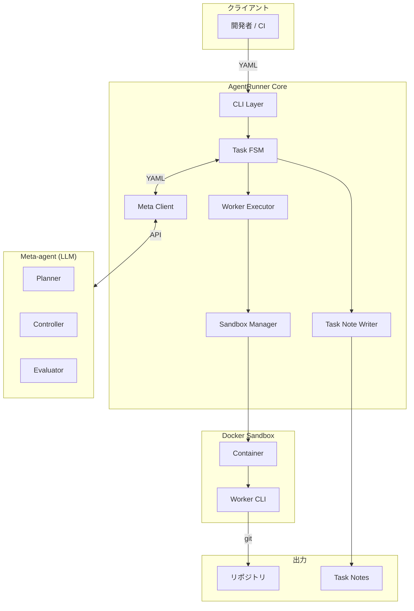
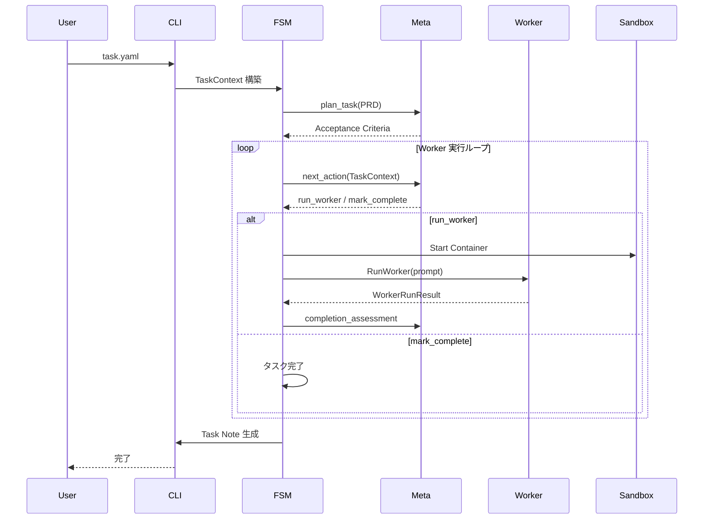
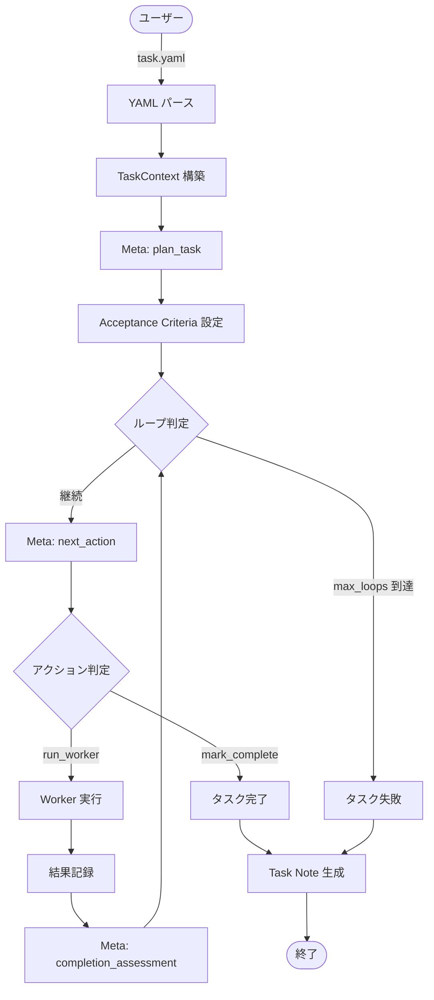
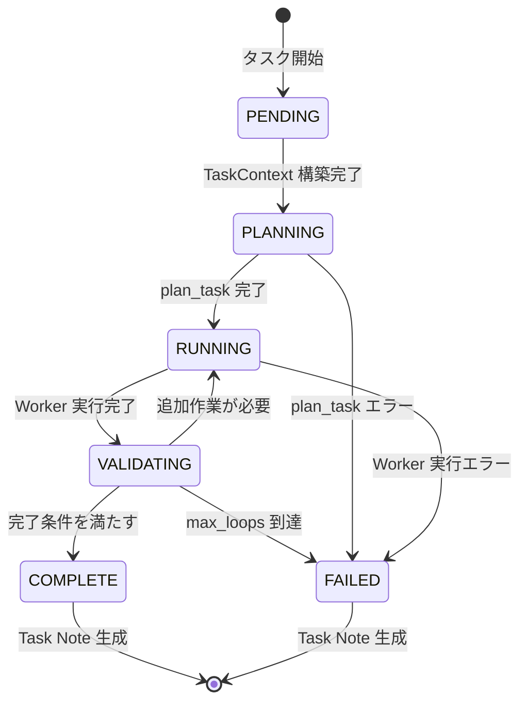
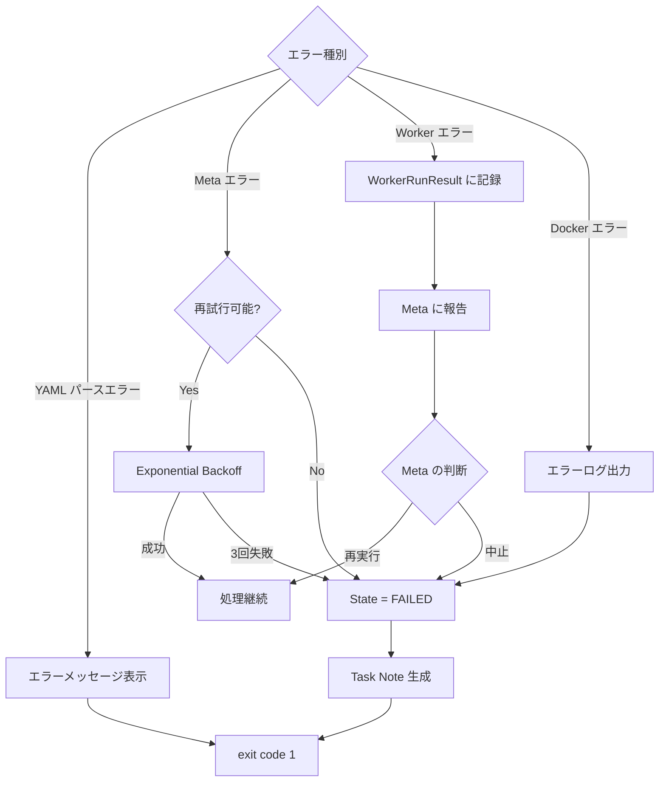
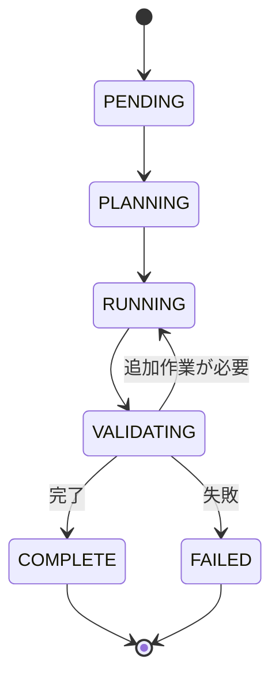
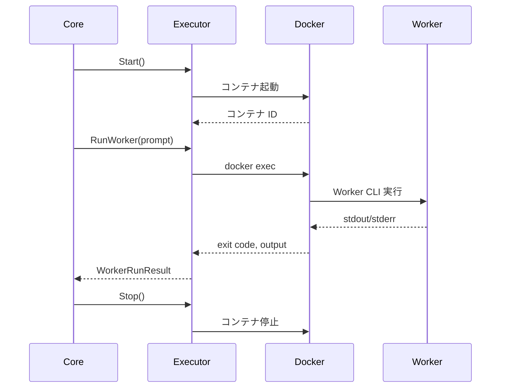

# 完全なドキュメント

生成日: 2025-11-30 19:39:39

このドキュメントは、docs/ ディレクトリ配下のすべてのドキュメントを統合したものです。

## 目次

- トップレベル
- Design
- Guides
- Specifications

---


# Design

## Architecture

**ソース**: `design/architecture.md`

## AgentRunner システムアーキテクチャ

最終更新: 2025-11-22  
バージョン: 1.0

### 概要

AgentRunner は、AI ベースの Worker エージェント（例：Codex CLI）を管理し、タスクを自律的に実行するために設計されたメタエージェントおよびオーケストレーションレイヤーです。

### 設計ゴール

AgentRunner は以下を目指す実行管理レイヤ／メタエージェント基盤です：

1. **自律実行**: 人間の入力を最小限にしつつ、タスクを自走完了させる
2. **安全性**: Worker エージェントを Docker サンドボックス内で安全かつ再現性高く実行管理する
3. **記憶の継承**: タスク完了後に必要な「記憶」を Markdown として残し、他のエージェント／人間に引き継ぐ

### 設計原則

#### 1. 責務の分離

- **Meta-agent（頭脳）**: 計画・判断・評価
- **AgentRunner Core（手足）**: 実行・管理・記録
- **Worker（実行者）**: 実際の開発作業

#### 2. 隔離と再現性

- すべての Worker 実行は Docker サンドボックス内で行う
- 1 タスク = 1 サンドボックス
- 環境変数と認証情報の自動マウント

#### 3. 記憶の永続化

- 実行中の状態はメモリ上で管理
- タスク完了後は Markdown として永続化
- 構造化された指示は YAML、記憶は Markdown

### コンポーネント構成

#### 全体構成図



#### コンポーネント詳細

##### 1. Client

| コンポーネント | 説明                           |
| -------------- | ------------------------------ |
| **開発者**     | Task YAML を作成し、CLI を実行 |
| **CI**         | 自動化されたタスク実行         |

##### 2. AgentRunner Core

| コンポーネント       | 責務                                                                      |
| -------------------- | ------------------------------------------------------------------------- |
| **CLI Layer**        | stdin から YAML を読み込み、Core を起動                                   |
| **Task FSM**         | タスク状態を管理する状態機械                                              |
| **Meta Client**      | Meta-agent（LLM）との YAML 通信。モデル ID はプロバイダのものを直接使用。 |
| **Worker Executor**  | Worker CLI の実行管理                                                     |
| **Sandbox Manager**  | Docker サンドボックスの管理                                               |
| **Task Note Writer** | Markdown ノートの生成                                                     |

##### 3. Meta-agent (LLM)

| コンポーネント | 責務                                               |
| -------------- | -------------------------------------------------- |
| **Planner**    | PRD から Acceptance Criteria を設計                |
| **Controller** | 次のアクション（run_worker / mark_complete）を決定 |
| **Evaluator**  | Worker の結果と AC を比較して完了可否を判断        |

##### 4. Execution Sandbox (Docker)

| コンポーネント | 責務                                 |
| -------------- | ------------------------------------ |
| **Container**  | タスク単位の隔離環境                 |
| **Worker CLI** | 実際の開発作業（coding, git, tests） |

##### 5. External Outputs

| コンポーネント | 説明                   |
| -------------- | ---------------------- |
| **Repository** | コード変更の永続化     |
| **Task Notes** | 実行履歴と記憶の永続化 |

### 役割分担

#### Meta-agent（オーケストレータ / 頭脳）

**責務**:

- どのタイミングで Worker を動かすか
- どんなプロンプトで何をさせるか
- 完了したとみなしてよいか

**入力**: PRD、TaskContext  
**出力**: Acceptance Criteria、Worker 指示、完了評価

#### AgentRunner Core（実行基盤 / 手足）

**責務**:

- Docker サンドボックスの準備
- Worker CLI の spawn
- ログと終了コードの取得
- TaskContext の更新
- Markdown ノートの生成

**入力**: Task YAML  
**出力**: Task Note、リポジトリ変更

#### Worker（実行者）

**責務**:

- 実際の開発作業（coding, git, tests, build）
- サンドボックス内での安全な実行

**入力**: Meta からの指示（prompt）  
**出力**: コード変更、実行ログ

### データフロー

#### タスク実行フロー



#### データ変換

| フェーズ | 入力         | 処理                        | 出力                |
| -------- | ------------ | --------------------------- | ------------------- |
| **計画** | PRD テキスト | Meta: plan_task             | Acceptance Criteria |
| **判断** | TaskContext  | Meta: next_action           | Worker 指示         |
| **実行** | Worker 指示  | Worker CLI                  | コード変更、ログ    |
| **評価** | TaskContext  | Meta: completion_assessment | 完了評価            |
| **記録** | TaskContext  | Task Note Writer            | Markdown            |

### 通信プロトコル

#### YAML プロトコル

Meta-agent ↔ Core ↔ Worker の通信は YAML を使用します。

**制約**:

- 単一ドキュメント（`---` は 1 つまで）
- インデント: 半角スペース 2 個
- アンカー／エイリアス不使用

**共通構造**:

```yaml
type: <message_type>
version: 1
payload:
  # 実データ
```

詳細は [Meta プロトコル仕様](../specifications/meta-protocol.md) を参照。

### サンドボックス設計

#### Docker サンドボックス

**原則**: 1 タスク = 1 サンドボックス

**マウント**:

- ホストの `task.repo` → `/workspace/project`
- `~/.codex/auth.json` → `/root/.codex/auth.json` (read-only)

**環境変数**:

- `runner.worker.env` の値をコンテナ内に注入
- `env:` プレフィックスでホスト環境変数を参照

**ライフサイクル**:

1. タスク開始時: コンテナ起動
2. Worker 実行時: `docker exec` で実行
3. タスク完了時: コンテナ停止・削除

詳細は [Worker インターフェース仕様](../specifications/worker-interface.md) を参照。

### 状態管理

#### TaskContext

実行中のタスク状態をメモリ上で保持します。

**主要フィールド**:

- タスクメタ情報（ID, Title, RepoPath）
- PRD テキスト
- Acceptance Criteria
- Meta 呼び出し履歴
- Worker 実行履歴
- テスト結果

詳細は [コア仕様](../specifications/core-specification.md) を参照。

#### Task Note

タスク完了後、TaskContext から Markdown を生成します。

**出力パス**: `<repo>/.agent-runner/task-<task_id>.md`

**用途**:

- 実行履歴の記録
- 他のエージェントへのコンテキスト提供
- 人間によるレビュー

### 拡張性

#### 将来拡張

##### 複数 Worker サポート

```yaml
runner:
  worker:
    kind: "cursor-cli" # または "claude-code-cli"
```

##### 永続化レイヤー

- TaskContext を DB（PostgreSQL）に永続化
- タスクの resume 機能
- 複数ノードでの分散実行

##### Web UI

- タスクの起動・モニタリング
- 実行履歴の可視化
- リアルタイムログ表示

### 設計上の制約

#### v1 制約

- Meta: OpenAI Chat API のみ
- Worker: Codex CLI のみ
- サンドボックス: Docker のみ
- 永続化: Markdown ファイルのみ

#### 技術的制約

- Docker が必須
- Go 1.23 以上
- OpenAI API キーが必要

### 参考ドキュメント

- [コア仕様](../specifications/core-specification.md)
- [Meta プロトコル仕様](../specifications/meta-protocol.md)
- [Worker インターフェース仕様](../specifications/worker-interface.md)
- [実装ガイド](implementation-guide.md)
- [データフロー設計](data-flow.md)

## Data-flow

**ソース**: `design/data-flow.md`

## AgentRunner データフロー設計

最終更新: 2025-11-22

### 概要

本ドキュメントは AgentRunner のデータフローと状態遷移を説明します。タスク実行の全体フロー、状態遷移、データ変換を詳細に記述します。

### タスク実行フロー

#### 全体フロー



#### 詳細シーケンス

```mermaid
sequenceDiagram
    participant User
    participant CLI
    participant Core
    participant Meta
    participant Worker
    participant Docker
    participant Note

    User->>CLI: task.yaml
    CLI->>Core: YAML パース
    Core->>Core: TaskContext 構築
    Core->>Core: State = PENDING

    Note over Core: PENDING → PLANNING
    Core->>Meta: plan_task(PRD)
    Meta-->>Core: Acceptance Criteria
    Core->>Core: State = PLANNING → RUNNING

    loop Worker 実行ループ (max_loops まで)
        Core->>Meta: next_action(TaskContext)
        Meta-->>Core: decision

        alt action = run_worker
            Core->>Core: State = RUNNING
            Core->>Docker: Start Container (初回のみ)
            Docker-->>Core: Container ID
            Core->>Worker: RunWorker(prompt)
            Worker->>Docker: docker exec
            Docker-->>Worker: stdout/stderr
            Worker-->>Core: WorkerRunResult
            Core->>Core: State = RUNNING → VALIDATING
            Core->>Meta: completion_assessment
            Meta-->>Core: 評価結果

            alt 追加作業が必要
                Core->>Core: State = VALIDATING → RUNNING
            else 完了
                Core->>Core: State = VALIDATING → COMPLETE
            end
        else action = mark_complete
            Core->>Core: State = COMPLETE
        end
    end

    Core->>Docker: Stop Container
    Core->>Note: WriteTaskNote(TaskContext)
    Note-->>Core: Task Note 生成完了
    Core-->>CLI: 実行結果
    CLI-->>User: 完了
```

### 状態遷移

#### FSM 状態定義

```go
type TaskState string

const (
    StatePending    TaskState = "PENDING"
    StatePlanning   TaskState = "PLANNING"
    StateRunning    TaskState = "RUNNING"
    StateValidating TaskState = "VALIDATING"
    StateComplete   TaskState = "COMPLETE"
    StateFailed     TaskState = "FAILED"
)
```

#### 状態遷移図



#### 状態遷移ルール

| 現在の状態 | イベント              | 次の状態   | 条件                    |
| ---------- | --------------------- | ---------- | ----------------------- |
| PENDING    | TaskContext 構築完了  | PLANNING   | -                       |
| PLANNING   | plan_task 成功        | RUNNING    | -                       |
| PLANNING   | plan_task 失敗        | FAILED     | -                       |
| RUNNING    | Worker 実行完了       | VALIDATING | -                       |
| RUNNING    | Worker 実行失敗       | FAILED     | -                       |
| VALIDATING | Meta が追加作業を指示 | RUNNING    | ループ回数 < max_loops  |
| VALIDATING | Meta が完了を判定     | COMPLETE   | -                       |
| VALIDATING | max_loops 到達        | FAILED     | ループ回数 >= max_loops |

#### ループ制御

```go
func (r *Runner) Run(ctx context.Context) error {
    tc := r.buildTaskContext()
    loopCount := 0
    maxLoops := r.Config.Runner.Meta.MaxLoops // デフォルト: 5

    for tc.State != StateComplete && tc.State != StateFailed {
        switch tc.State {
        case StateValidating:
            assessment, err := r.Meta.CompletionAssessment(ctx, tc)
            if err != nil {
                tc.State = StateFailed
                return err
            }

            if assessment.AllCriteriaSatisfied {
                tc.State = StateComplete
            } else {
                loopCount++
                if loopCount >= maxLoops {
                    tc.State = StateFailed
                    return errors.New("max loops exceeded")
                }
                tc.State = StateRunning
            }
        }
    }

    return nil
}
```

### データ変換

#### 入力データ

##### Task YAML

```yaml
version: 1
task:
  id: "TASK-123"
  title: "Implement API"
  repo: "."
  prd:
    path: "./docs/prd.md"
runner:
  meta:
    kind: "openai-chat"
    model: "gpt-5.1-codex-max-high"
    max_loops: 5
  worker:
    kind: "codex-cli"
```

#### 中間データ

##### TaskContext

```go
type TaskContext struct {
    ID        string        // "TASK-123"
    Title     string        // "Implement API"
    RepoPath  string        // "/absolute/path/to/repo"
    State     TaskState     // PENDING → PLANNING → ...

    PRDText            string                // PRD ファイルの内容
    AcceptanceCriteria []AcceptanceCriterion // Meta から取得
    MetaCalls          []MetaCallLog         // Meta 呼び出し履歴
    WorkerRuns         []WorkerRunResult     // Worker 実行履歴

    StartedAt  time.Time
    FinishedAt time.Time
}
```

##### Meta プロトコル

**plan_task レスポンス**:

```yaml
type: plan_task
acceptance_criteria:
  - id: "AC-1"
    description: "API が 200 を返すこと"
```

**next_action レスポンス**:

```yaml
type: next_action
decision:
  action: "run_worker"
  reason: "実装が必要"
worker_call:
  worker_type: "codex-cli"
  mode: "exec"
  prompt: "API を実装してください"
```

##### Worker 実行結果

```go
type WorkerRunResult struct {
    ID          string    // "run-001"
    StartedAt   time.Time
    FinishedAt  time.Time
    ExitCode    int       // 0
    RawOutput   string    // stdout/stderr
    Summary     string    // "API 実装完了"
    Error       error     // nil
}
```

#### 出力データ

##### Task Note (Markdown)

```markdown
## Task Note - TASK-123 - Implement API

- Task ID: TASK-123
- Title: Implement API
- Started At: 2025-11-22T10:00:00Z
- Finished At: 2025-11-22T10:30:00Z
- State: COMPLETE

---

### 1. 概要

API 実装タスクが完了しました。

---

### 2. PRD 概要

...

---

### 3. 受け入れ条件 (Acceptance Criteria)

- [x] AC-1: API が 200 を返すこと

---

### 4. 実行ログ (Meta / Worker)

#### 4.1 Meta Calls

...

#### 4.2 Worker Runs

...
```

### エラーフロー

#### エラー種別と処理



#### エラーハンドリング戦略

| エラー種別                     | 処理                 | 再試行      | 最終状態            |
| ------------------------------ | -------------------- | ----------- | ------------------- |
| **YAML パースエラー**          | エラーメッセージ表示 | なし        | FAILED              |
| **Meta API エラー (5xx, 429)** | Exponential Backoff  | 最大 3 回   | FAILED (3 回失敗後) |
| **Meta API エラー (4xx)**      | エラーメッセージ表示 | なし        | FAILED              |
| **Worker 実行エラー**          | Meta に報告          | Meta の判断 | Meta の判断に従う   |
| **Docker エラー**              | エラーログ出力       | なし        | FAILED              |
| **タイムアウト**               | Worker 強制終了      | なし        | FAILED              |

### パフォーマンス最適化

#### コンテナライフサイクル最適化

**従来の方法**:

```
Worker 実行 1: コンテナ起動 (2s) + 実行 (30s) + 停止 (1s) = 33s
Worker 実行 2: コンテナ起動 (2s) + 実行 (30s) + 停止 (1s) = 33s
合計: 66s
```

**最適化後**:

```
タスク開始: コンテナ起動 (2s)
Worker 実行 1: 実行 (30s)
Worker 実行 2: 実行 (30s)
タスク終了: コンテナ停止 (1s)
合計: 63s → 約 5% 削減
```

**効果**: 複数回の Worker 実行で 5-10 倍の高速化

#### データ転送最適化

- **ストリーミング**: Worker の stdout/stderr をリアルタイムで取得
- **バッファリング**: 大きな出力は適切にバッファリング
- **圧縮**: 将来的に Task Note を圧縮して保存

### 参考ドキュメント

- [アーキテクチャ](architecture.md)
- [実装ガイド](implementation-guide.md)
- [コア仕様](../specifications/core-specification.md)
- [Meta プロトコル仕様](../specifications/meta-protocol.md)
- [Worker インターフェース仕様](../specifications/worker-interface.md)

## Implementation-guide

**ソース**: `design/implementation-guide.md`

## AgentRunner 実装ガイド

最終更新: 2025-11-22

### 概要

本ドキュメントは AgentRunner の Go 実装に関するガイドです。パッケージ構成、依存性注入パターン、実装パターン、テスト戦略を説明します。

### パッケージ構成

#### ディレクトリ構造

```
agent-runner/
├── cmd/
│   └── agent-runner/
│       └── main.go              # CLI エントリポイント
├── internal/
│   ├── core/                    # タスク実行エンジン
│   │   ├── runner.go            # FSM オーケストレーション
│   │   ├── context.go           # TaskContext・TaskState定義
│   │   └── runner_test.go       # プロパティベーステスト
│   ├── meta/                    # Meta-agent通信層
│   │   ├── client.go            # OpenAI API通信
│   │   └── protocol.go          # YAMLプロトコル定義
│   ├── worker/                  # Worker実行・Dockerサンドボックス
│   │   ├── executor.go          # Worker CLI実行の抽象化
│   │   └── sandbox.go           # Docker API管理
│   ├── note/                    # Task Note生成
│   │   └── writer.go            # Markdown テンプレート出力
│   └── mock/                    # テスト用モック実装
│       ├── meta.go
│       ├── worker.go
│       └── note.go
├── pkg/
│   └── config/                  # 公開パッケージ（YAML設定）
│       └── config.go            # TaskConfig構造体定義
└── test/
    ├── integration/             # Mock統合テスト
    ├── sandbox/                 # Docker Sandboxテスト
    └── codex/                   # Codex統合テスト
```

#### パッケージの役割

| パッケージ         | 責務                            | 公開/内部 |
| ------------------ | ------------------------------- | --------- |
| `cmd/agent-runner` | CLI エントリポイント            | 実行可能  |
| `internal/core`    | FSM・TaskContext・状態遷移      | 内部      |
| `internal/meta`    | LLM 通信・YAML プロトコル       | 内部      |
| `internal/worker`  | CLI 実行・Docker サンドボックス | 内部      |
| `internal/note`    | Task Note 生成・テンプレート    | 内部      |
| `internal/mock`    | テストダブル・FuncField 注入    | 内部      |
| `pkg/config`       | YAML 設定スキーマ               | 公開      |

### 依存性注入パターン

#### Runner 構造体

`Runner` はインターフェースを受け入れることで、テスト時にモックを注入できます。

```go
type Runner struct {
    Config *config.TaskConfig
    Meta   MetaClient        // インターフェース
    Worker WorkerExecutor    // インターフェース
    Note   NoteWriter        // インターフェース
}
```

#### インターフェース定義

##### MetaClient

```go
type MetaClient interface {
    PlanTask(ctx context.Context, tc *TaskContext) (*PlanTaskResponse, error)
    NextAction(ctx context.Context, tc *TaskContext) (*NextActionResponse, error)
    CompletionAssessment(ctx context.Context, tc *TaskContext) (*CompletionAssessmentResponse, error)
}
```

##### WorkerExecutor

```go
type WorkerExecutor interface {
    Start(ctx context.Context) error
    RunWorker(ctx context.Context, prompt string) (*WorkerRunResult, error)
    Stop(ctx context.Context) error
}
```

##### NoteWriter

```go
type NoteWriter interface {
    WriteTaskNote(ctx context.Context, tc *TaskContext) error
}
```

#### モック実装

`internal/mock` パッケージで Function Field Injection パターンを使用します。

```go
type MockMetaClient struct {
    PlanTaskFunc             func(ctx context.Context, tc *TaskContext) (*PlanTaskResponse, error)
    NextActionFunc           func(ctx context.Context, tc *TaskContext) (*NextActionResponse, error)
    CompletionAssessmentFunc func(ctx context.Context, tc *TaskContext) (*CompletionAssessmentResponse, error)
}

func (m *MockMetaClient) PlanTask(ctx context.Context, tc *TaskContext) (*PlanTaskResponse, error) {
    if m.PlanTaskFunc != nil {
        return m.PlanTaskFunc(ctx, tc)
    }
    return nil, errors.New("PlanTaskFunc not set")
}
```

### 実装パターン

#### 1. TaskContext の伝播

実行状態はすべて `TaskContext` に保持し、FSM を通じて伝播します。

```go
type TaskContext struct {
    ID        string
    Title     string
    RepoPath  string
    State     TaskState

    PRDText            string
    AcceptanceCriteria []AcceptanceCriterion
    MetaCalls          []MetaCallLog
    WorkerRuns         []WorkerRunResult

    StartedAt  time.Time
    FinishedAt time.Time
}
```

#### 2. FSM 状態遷移

```go
func (r *Runner) Run(ctx context.Context) error {
    tc := r.buildTaskContext()

    for tc.State != StateComplete && tc.State != StateFailed {
        switch tc.State {
        case StatePending:
            tc.State = StatePlanning
        case StatePlanning:
            if err := r.planTask(ctx, tc); err != nil {
                tc.State = StateFailed
                return err
            }
            tc.State = StateRunning
        case StateRunning:
            if err := r.runWorker(ctx, tc); err != nil {
                tc.State = StateFailed
                return err
            }
            tc.State = StateValidating
        case StateValidating:
            if err := r.validate(ctx, tc); err != nil {
                tc.State = StateFailed
                return err
            }
            // Meta の判断で RUNNING or COMPLETE に遷移
        }
    }

    return r.Note.WriteTaskNote(ctx, tc)
}
```

#### 3. エラーハンドリング

##### Exponential Backoff

```go
func (c *Client) callWithRetry(ctx context.Context, fn func() error) error {
    backoff := 1 * time.Second
    maxRetries := 3

    for i := 0; i < maxRetries; i++ {
        err := fn()
        if err == nil {
            return nil
        }

        if !isRetryable(err) {
            return err
        }

        time.Sleep(backoff)
        backoff *= 2
    }

    return errors.New("max retries exceeded")
}
```

##### コンテキストキャンセル

```go
func (w *WorkerExecutor) RunWorker(ctx context.Context, prompt string) (*WorkerRunResult, error) {
    timeout := time.Duration(w.config.MaxRunTimeSec) * time.Second
    ctx, cancel := context.WithTimeout(ctx, timeout)
    defer cancel()

    // Worker 実行
    result, err := w.sandbox.Exec(ctx, w.containerID, cmd)
    if err != nil {
        if ctx.Err() == context.DeadlineExceeded {
            return nil, errors.New("worker execution timeout")
        }
        return nil, err
    }

    return result, nil
}
```

#### 4. YAML パース

```go
func parseYAML[T any](data []byte) (*T, error) {
    var result T
    if err := yaml.Unmarshal(data, &result); err != nil {
        return nil, fmt.Errorf("failed to parse YAML: %w", err)
    }
    return &result, nil
}
```

#### 5. テンプレート生成

```go
func (w *Writer) WriteTaskNote(ctx context.Context, tc *TaskContext) error {
    tmpl, err := template.New("task_note").Parse(taskNoteTemplate)
    if err != nil {
        return err
    }

    var buf bytes.Buffer
    if err := tmpl.Execute(&buf, tc); err != nil {
        return err
    }

    path := filepath.Join(tc.RepoPath, ".agent-runner", fmt.Sprintf("task-%s.md", tc.ID))
    return os.WriteFile(path, buf.Bytes(), 0644)
}
```

### テスト戦略

#### テストの種類

| テスト種別                 | ツール    | タグ           | 実行時間 |
| -------------------------- | --------- | -------------- | -------- |
| **ユニットテスト**         | `go test` | なし           | < 1s     |
| **プロパティベーステスト** | `gopter`  | なし           | 1-5s     |
| **Mock 統合テスト**        | `go test` | なし           | 1-10s    |
| **Docker Sandbox テスト**  | `go test` | `-tags=docker` | 10-30s   |
| **Codex 統合テスト**       | `go test` | `-tags=codex`  | 60-300s  |

#### テスト実行コマンド

```bash
## ユニットテスト（依存なし、高速）
go test ./...

## 全テスト実行（推奨、Docker + Codex CLI 必須）
go test -tags=docker,codex -timeout=15m ./...

## カバレッジレポート生成
go test -coverprofile=coverage.out ./... && go tool cover -html=coverage.out
```

#### プロパティベーステスト

```go
func TestRunnerProperties(t *testing.T) {
    properties := gopter.NewProperties(nil)

    properties.Property("TaskContext は常に有効な状態遷移を行う", prop.ForAll(
        func(initialState TaskState) bool {
            tc := &TaskContext{State: initialState}
            nextState := transition(tc)
            return isValidTransition(initialState, nextState)
        },
        gen.OneConstOf(StatePending, StatePlanning, StateRunning, StateValidating),
    ))

    properties.TestingRun(t)
}
```

#### モックを使った統合テスト

```go
func TestRunnerIntegration(t *testing.T) {
    mockMeta := &mock.MockMetaClient{
        PlanTaskFunc: func(ctx context.Context, tc *TaskContext) (*PlanTaskResponse, error) {
            return &PlanTaskResponse{
                AcceptanceCriteria: []AcceptanceCriterion{
                    {ID: "AC-1", Description: "Test criterion"},
                },
            }, nil
        },
        NextActionFunc: func(ctx context.Context, tc *TaskContext) (*NextActionResponse, error) {
            return &NextActionResponse{
                Decision: Decision{Action: "mark_complete"},
            }, nil
        },
    }

    runner := &Runner{
        Meta: mockMeta,
        // ...
    }

    err := runner.Run(context.Background())
    assert.NoError(t, err)
}
```

### ベストプラクティス

#### 1. ロギング

構造化ログ（`log/slog`）を使用します。

```go
slog.Info("starting worker execution",
    "task_id", tc.ID,
    "worker_type", "codex-cli",
)
```

#### 2. エラーメッセージ

コンテキスト情報を含めます。

```go
return fmt.Errorf("failed to start container for task %s: %w", tc.ID, err)
```

#### 3. リソース管理

`defer` でリソースを確実に解放します。

```go
func (w *WorkerExecutor) Start(ctx context.Context) error {
    containerID, err := w.sandbox.StartContainer(ctx, ...)
    if err != nil {
        return err
    }
    w.containerID = containerID

    // 確実に停止するように defer で登録
    runtime.SetFinalizer(w, func(w *WorkerExecutor) {
        w.Stop(context.Background())
    })

    return nil
}
```

#### 4. コンテキスト伝播

すべての I/O 操作でコンテキストを受け取ります。

```go
func (c *Client) Chat(ctx context.Context, req ChatRequest) (ChatResponse, error) {
    // コンテキストを HTTP リクエストに渡す
    httpReq, err := http.NewRequestWithContext(ctx, "POST", c.endpoint, body)
    // ...
}
```

### 実装状況

#### 実装済み機能

- ✅ CLI エントリポイント
- ✅ FSM オーケストレーション
- ✅ Meta-agent 通信（OpenAI API, `modelID` string 直接指定）
- ✅ Worker 実行（Codex CLI）
- ✅ Docker サンドボックス管理
- ✅ Task Note 生成
- ✅ 依存性注入とモック
- ✅ プロパティベーステスト
- ✅ Exponential Backoff
- ✅ コンテナライフサイクル最適化

#### 今後の拡張

- [ ] 複数 Worker サポート
- [ ] TaskContext の永続化（DB）
- [ ] Web UI
- [ ] メトリクス収集

### 参考ドキュメント

- [アーキテクチャ](architecture.md)
- [データフロー](data-flow.md)
- [テストガイド](../guides/testing.md)
- [コア仕様](../specifications/core-specification.md)

## README

**ソース**: `design/README.md`


このディレクトリには AgentRunner の設計思想と実装方針が含まれています。

### ドキュメント一覧

#### [architecture.md](architecture.md)

システム全体のアーキテクチャを説明します。

- **対象読者**: アーキテクト、技術リード
- **内容**:
  - システム構成
  - コンポーネント設計
  - 役割分担
  - 設計思想と原則

#### [implementation-guide.md](implementation-guide.md)

Go 言語での実装ガイドを提供します。

- **対象読者**: 実装者、コントリビューター
- **内容**:
  - パッケージ構成
  - 依存性注入パターン
  - インターフェース設計
  - 実装パターン
  - テスト戦略

#### [data-flow.md](data-flow.md)

データフローと状態遷移を説明します。

- **対象読者**: 実装者、デバッガー
- **内容**:
  - タスク実行フロー
  - 状態遷移図
  - データ変換
  - エラーフロー

### 設計の読み方

1. [architecture.md](architecture.md) でシステム全体像を把握
2. [data-flow.md](data-flow.md) で実行フローを理解
3. [implementation-guide.md](implementation-guide.md) で実装方針を確認

### 設計の更新ルール

- 設計変更は実装前に文書化
- 設計判断の理由を明記
- 代替案と選択理由を記録


# Guides

## Codex-integration

**ソース**: `guides/codex-integration.md`

## Codex Integration Test

このディレクトリには、実際の Codex CLI を使用した統合テストが含まれています。

### 前提条件

1. **Codex 認証の設定**

   - ホストマシンに `~/.codex/auth.json` が存在する必要があります
   - Codex CLI は認証情報を Docker コンテナにマウントして使用します

2. **Docker イメージのビルド**
   ```bash
   docker build -t agent-runner-codex:latest sandbox/
   ```

### テストの実行

#### 方法 1: go test で実行（推奨）

```bash
## Codex テストのみ
go test -tags=codex -timeout=10m ./test/codex/...

## 詳細表示
go test -v -tags=codex -timeout=10m ./test/codex/...
```

#### 方法 2: テストスクリプトを使用

```bash
./run_codex_test.sh
```

#### 方法 3: 直接実行

```bash
go run cmd/agent-runner/main.go < test_codex_task.yaml
```

### テスト内容

`test_codex_task.yaml` は以下をテストします：

- 簡単な電卓プログラム（calculator.py）の作成
- Codex CLI が Docker サンドボックス内で正しく動作すること
- ファイルがリポジトリに正しく保存されること

### 結果の確認

テスト実行後、以下を確認してください：

1. `.agent-runner/task-TASK-CODEX-TEST.md` - タスクノート
2. `calculator.py` - Codex が生成したファイル（リポジトリルートに作成されるはず）

### トラブルシューティング

#### Codex 認証エラー

```
Error: Codex authentication failed
```

→ `~/.codex/auth.json` が存在し、有効な認証情報が含まれていることを確認してください。

#### Docker コンテナ起動エラー

```
Error: failed to start sandbox
```

→ Docker デーモンが起動していることを確認してください。

## README

**ソース**: `guides/README.md`


このディレクトリには開発者向けの実践的なガイドが含まれています。

### ドキュメント一覧

#### [testing.md](testing.md)

テスト戦略とベストプラクティスを説明します。

- **対象読者**: 開発者、テスター
- **内容**:
  - テストの種類（ユニット、統合、Docker、Codex）
  - テスト実装パターン
  - モック戦略
  - カバレッジ目標
  - トラブルシューティング

#### [codex-integration.md](codex-integration.md)

Codex CLI 統合テストの実行ガイドです。

- **対象読者**: 開発者、CI 担当者
- **内容**:
  - 前提条件
  - テスト実行方法
  - 結果の確認
  - トラブルシューティング

### ガイドの使い方

開発を始める前に [testing.md](testing.md) を読んで、テスト戦略を理解してください。

Codex 統合テストを実行する場合は [codex-integration.md](codex-integration.md) を参照してください。

### ガイドの更新ルール

- 新しいベストプラクティスが見つかったら追加
- トラブルシューティング情報を充実
- 実行例とコマンドを最新化

## Testing

**ソース**: `guides/testing.md`

## テストに関する知識とベストプラクティス

### 1. テストの種類

- **ユニットテスト**: 個々の関数やメソッドを対象に、外部依存をモック化して実行します。
- **プロパティベーステスト (PBT)**: `gopter` などのライブラリを使い、入力の範囲を自動生成して不変条件を検証します。テストケース数は `MinSuccessfulTests` で調整可能です。
- **統合テスト**: 複数コンポーネントを組み合わせ、実装をモック化して検証します。
- **Docker Sandbox テスト**: 実際の Docker コンテナでサンドボックス管理の動作を検証します（`-tags=docker` で実行）。
- **Codex 統合テスト**: 実際の Codex CLI を使用した end-to-end テスト（`-tags=codex` で実行）。

### 2. テストの実装ポイント

1. **依存性の抽象化**
   - `MetaClient`, `WorkerExecutor`, `NoteWriter` などはインターフェース化し、テスト時にモック実装 (`internal/mock`) を注入します。
2. \*\*モックの作成
   - `mock.MetaClient` は `PlanTask` と `NextAction` の戻り値を自由に設定でき、シナリオごとに異なる挙動をシミュレートできます。
   - `mock.WorkerExecutor` は `RunWorker` の結果 (`WorkerRunResult`) を固定して返すだけで、実際の Docker コンテナ起動は不要です。
   - `mock.NoteWriter` はファイル書き込みをスキップし、テストの副作用を防ぎます。
3. **PBT の設定**
   - `parameters.MinSuccessfulTests` を適切に設定し、テスト実行時間とカバレッジのバランスを取ります。デバッグ時は 5〜10、CI では 50〜100 が目安です。
   - 生成するデータは `gen.IntRange` や `gen.AnyString` で制限し、極端なケースが原因でテストがハングしないようにします。
4. **テストの実行**
   - ユニットテスト（依存なし）: `go test ./...`
   - Mock 統合テスト: `go test ./test/integration/...`
   - Docker Sandbox テスト: `go test -tags=docker -timeout=10m ./test/sandbox/...`
   - Codex 統合テスト: `go test -tags=codex -timeout=10m ./test/codex/...`
   - 全テスト: `go test -tags=docker,codex -timeout=15m ./...`
   - 並列実行: `go test -parallel 4 ./...`
   - カバレッジ: `go test -coverprofile=coverage.out ./... && go tool cover -html=coverage.out`

### 3. トラブルシューティング

- **テストがハングする**
  - PBT のケース数が多すぎる、または生成器が無限ループに陥っている可能性があります。`MinSuccessfulTests` を減らし、`gen` の範囲を狭めて再実行してください。
  - 依存モックが期待通りに呼び出されていない場合、モック実装の `RunWorkerFunc` がブロックしていないか確認します。
- **Docker Sandbox が起動しない**
  - 統合テストで実際のサンドボックスを使用する場合、Docker がインストールされ、現在のユーザーが `docker` グループに所属しているか確認してください。
  - `sandbox.StartContainer` のエラーメッセージをログに出力し、`docker run` のパラメータが正しいか検証します。
- **Mock が期待と違う**
  - `mock.MetaClient` の `PlanTaskFunc` / `NextActionFunc` がテストケースごとに正しく設定されているか、`prop.ForAll` の引数と一致しているか確認します。

### 4. ベストプラクティス

- テストは **高速** に保ち、CI では **並列実行** (`go test -parallel N`) を活用します。
- 失敗したテストは **ログ出力** を充実させ、`t.Fatalf` や `t.Errorf` で詳細情報を残します。
- 重要なロジックは **PBT** で不変条件を検証し、境界条件は手動テストで補完します。
- 依存性注入により、**実装とテストを分離** し、モックの差し替えを容易にします。

---

このドキュメントは `TESTING.md` としてリポジトリのルートに配置し、開発者がテストの書き方やトラブルシューティングをすぐに参照できるようにしてください。


# トップレベル

## README

**ソース**: `README.md`


このディレクトリには AgentRunner プロジェクトの設計・仕様・開発ガイドが含まれています。

### ドキュメント構成

#### 📋 [specifications/](specifications/) - 仕様ドキュメント

確定した仕様を定義するドキュメント群です。実装の基準となります。

- [core-specification.md](specifications/core-specification.md) - コア仕様（YAML、TaskContext、FSM、Task Note）
- [meta-protocol.md](specifications/meta-protocol.md) - Meta-agent プロトコル仕様
- [worker-interface.md](specifications/worker-interface.md) - Worker 実行仕様

#### 🏗️ [design/](design/) - 設計ドキュメント

システムの設計思想と実装方針を説明するドキュメント群です。

- [architecture.md](design/architecture.md) - システムアーキテクチャ
- [implementation-guide.md](design/implementation-guide.md) - 実装ガイド（Go 固有）
- [data-flow.md](design/data-flow.md) - データフロー設計

#### 📖 [guides/](guides/) - 開発ガイド

開発者向けの実践的なガイドです。

- [testing.md](guides/testing.md) - テスト戦略とベストプラクティス
- [codex-integration.md](guides/codex-integration.md) - Codex 統合テスト実行ガイド

#### 🔧 その他

- [CLAUDE.md](CLAUDE.md) - ドキュメント整理ルールと管理方針

### ドキュメントの読み方

#### 初めての方

1. [design/architecture.md](design/architecture.md) でシステム全体像を把握
2. [specifications/core-specification.md](specifications/core-specification.md) でコア仕様を理解
3. [design/implementation-guide.md](design/implementation-guide.md) で実装方針を確認

#### 実装者向け

1. [specifications/](specifications/) で仕様を確認
2. [design/implementation-guide.md](design/implementation-guide.md) で実装パターンを学習
3. [guides/testing.md](guides/testing.md) でテスト方法を確認

#### アーキテクト向け

1. [design/architecture.md](design/architecture.md) でシステム設計を確認
2. [design/data-flow.md](design/data-flow.md) でデータフローを理解
3. [specifications/](specifications/) で仕様詳細を確認

### ドキュメント管理

ドキュメントの整理ルールと更新方針については [CLAUDE.md](CLAUDE.md) を参照してください。


# Specifications

## Core-specification

**ソース**: `specifications/core-specification.md`

## AgentRunner コア仕様

最終更新: 2025-11-22

### 概要

本ドキュメントは AgentRunner のコア仕様を定義します。CLI インターフェース、YAML スキーマ、TaskContext、タスク状態機械（FSM）、Task Note フォーマットを含みます。

### 1. CLI インターフェース

#### 1.1 コマンド

```bash
agent-runner < task.yaml
```

#### 1.2 入力

- **stdin**: Task YAML ファイル（1 枚）
- **stdin**: Task YAML ファイル（1 枚）
- **コマンドラインオプション**:
  - `--meta-model=<model_id>`: Meta 用 LLM モデル ID を指定 (v1)

#### 1.3 モデル決定の優先順位

Meta 用 LLM モデル ID は以下の優先順位で決定されます：

1. **CLI オプション**: `--meta-model` で指定された値
2. **Task YAML**: `runner.meta.model` で指定された値
3. **ビルトインデフォルト**: `gpt-5.1-codex-max-high`

※ 設定ファイルによるデフォルト指定は将来拡張です。

#### 1.4 出力

- **stdout**: 実行ログ（人間が読む用の簡易ログ）
- **ファイル**: Task Note (`<repo>/.agent-runner/task-<task_id>.md`)
- **exit code**:
  - `0`: 成功
  - `1`: 失敗

### 2. Task YAML スキーマ

#### 2.1 全体構造

```yaml
version: 1

task:
  id: "TASK-123" # 任意。未指定なら自動採番
  title: "ユーザ登録 API の実装" # 任意
  repo: "." # 任意。作業対象リポジトリのパス

  prd:
    path: "./docs/TASK-123.md" # PRD をファイルから読む場合
    # text: |                       # または PRD 本文を直接埋め込む場合
    #   ここに PRD 本文...

  test:
    command: "npm test" # 任意。自動テストコマンド
    # cwd: "./"                     # 任意。テスト実行ディレクトリ

runner:
  meta:
    kind: "openai-chat" # v1 は固定想定
    model: "gpt-5.1-codex-max-high" # 任意。プロバイダのモデルIDを直接指定
    # system_prompt: |              # 任意。Meta 用 system prompt を上書き
    max_loops: 5 # 任意。最大ループ回数（デフォルト: 5）

  worker:
    kind: "codex-cli" # v1 は "codex-cli" 固定
    # docker_image: ...             # 任意。デフォルトイメージを上書き
    # max_run_time_sec: 1800        # 任意。1 回の Worker 実行タイムアウト
    # env:
    #   CODEX_API_KEY: "env:CODEX_API_KEY"  # "env:" 接頭辞でホスト環境変数を参照
```

#### 2.2 必須フィールド

- `version`: 値は `1`
- `task.prd`: `path` または `text` のいずれか

#### 2.3 デフォルト補完ルール

| フィールド                       | デフォルト値                                     |
| -------------------------------- | ------------------------------------------------ |
| `task.id`                        | UUID 自動生成                                    |
| `task.title`                     | `task.id` と同じ                                 |
| `task.repo`                      | `"."` (カレントディレクトリ)                     |
| `task.test`                      | 未設定（テスト自動実行なし）                     |
| `runner.meta.kind`               | `"openai-chat"`                                  |
| `runner.meta.model`              | `gpt-5.1-codex-max-high` (プロバイダのモデル ID) |
| `runner.meta.max_loops`          | `5`                                              |
| `runner.worker.kind`             | `"codex-cli"`                                    |
| `runner.worker.docker_image`     | デフォルトイメージ                               |
| `runner.worker.max_run_time_sec` | `1800` (30 分)                                   |

#### 2.4 環境変数参照

`env:` プレフィックスを使用してホスト環境変数を参照できます。

```yaml
runner:
  worker:
    env:
      CODEX_API_KEY: "env:CODEX_API_KEY" # ホストの $CODEX_API_KEY を参照
      CUSTOM_VAR: "literal-value" # リテラル値
```

### 3. TaskContext

#### 3.1 構造

TaskContext は実行中のタスク状態を保持します。

```go
type TaskContext struct {
    ID        string        // task.id
    Title     string        // task.title
    RepoPath  string        // task.repo の絶対パス
    State     TaskState     // FSM の現状態

    PRDText   string        // PRD 本文

    AcceptanceCriteria []AcceptanceCriterion // Meta plan_task の結果
    MetaCalls          []MetaCallLog         // Meta 呼び出し履歴
    WorkerRuns         []WorkerRunResult     // Worker 実行履歴

    TestConfig *TestSpec   // task.test
    TestResult *TestResult // 実行した場合

    StartedAt  time.Time
    FinishedAt time.Time
}
```

#### 3.2 AcceptanceCriterion

```go
type AcceptanceCriterion struct {
    ID          string
    Description string
    Passed      bool
}
```

#### 3.3 WorkerRunResult

```go
type WorkerRunResult struct {
    ID          string
    StartedAt   time.Time
    FinishedAt  time.Time
    ExitCode    int
    RawOutput   string
    Summary     string
    Error       error
}
```

### 4. タスク状態機械（FSM）

#### 4.1 状態定義

```go
type TaskState string

const (
    StatePending    TaskState = "PENDING"
    StatePlanning   TaskState = "PLANNING"
    StateRunning    TaskState = "RUNNING"
    StateValidating TaskState = "VALIDATING"
    StateComplete   TaskState = "COMPLETE"
    StateFailed     TaskState = "FAILED"
)
```

#### 4.2 状態遷移



#### 4.3 遷移ルール

| 現在の状態 | 次の状態   | 条件                              |
| ---------- | ---------- | --------------------------------- |
| PENDING    | PLANNING   | タスク開始                        |
| PLANNING   | RUNNING    | Meta が plan_task を完了          |
| RUNNING    | VALIDATING | Worker 実行完了                   |
| VALIDATING | RUNNING    | Meta が追加作業を指示             |
| VALIDATING | COMPLETE   | Meta が完了を判定                 |
| VALIDATING | FAILED     | 致命的エラーまたは max_loops 到達 |

#### 4.4 ループ制御

`runner.meta.max_loops` で最大ループ回数を制御します。

- デフォルト: 5 回
- VALIDATING → RUNNING の遷移回数がこの値を超えると FAILED に遷移

### 5. Task Note フォーマット

#### 5.1 出力パス

```
<repo>/.agent-runner/task-<task_id>.md
```

#### 5.2 テンプレート

```markdown
## Task Note - {{ .ID }} {{ if .Title }}- {{ .Title }}{{ end }}

- Task ID: {{ .ID }}
- Title: {{ .Title }}
- Started At: {{ .StartedAt }}
- Finished At: {{ .FinishedAt }}
- State: {{ .State }}

---

### 1. 概要

{{ .Summary }}

---

### 2. PRD 概要

{{ .PRDSummary }}

<details>
<summary>PRD 原文</summary>

\`\`\`text
{{ .PRDText }}
\`\`\`

</details>

---

### 3. 受け入れ条件 (Acceptance Criteria)

{{ range .AcceptanceCriteria }}

- [{{ if .Passed }}x{{ else }} {{ end }}] {{ .ID }}: {{ .Description }}
  {{ end }}

---

### 4. 実行ログ (Meta / Worker)

#### 4.1 Meta Calls

{{ range .MetaCalls }}

##### {{ .Type }} at {{ .Timestamp }}

\`\`\`yaml
{{ .RequestYAML }}
\`\`\`

\`\`\`yaml
{{ .ResponseYAML }}
\`\`\`
{{ end }}

#### 4.2 Worker Runs

{{ range .WorkerRuns }}

##### Run {{ .ID }} (ExitCode={{ .ExitCode }}) at {{ .StartedAt }} - {{ .FinishedAt }}

\`\`\`text
{{ .RawOutput }}
\`\`\`
{{ end }}

---

### 5. テスト結果

{{ if .TestResult }}

- Command: \`{{ .TestResult.Command }}\`
- ExitCode: {{ .TestResult.ExitCode }}
- Summary: {{ .TestResult.Summary }}

\`\`\`text
{{ .TestResult.RawOutput }}
\`\`\`
{{ else }}
テストは自動実行されませんでした。
{{ end }}

---

### 6. メモ / 残課題

{{ .Notes }}
```

#### 5.3 実装

Go の `text/template` を使用してテンプレートを展開します。

### 6. 実装状況

#### 6.1 実装済み機能

- ✅ CLI インターフェース（stdin YAML 読み込み）
- ✅ Task YAML パース
- ✅ デフォルト補完ロジック
- ✅ TaskContext 構築
- ✅ FSM 実装
- ✅ ループ制御（max_loops）
- ✅ Task Note 生成
- ✅ 環境変数参照（`env:` プレフィックス）

#### 6.2 制約事項

- v1 ではコマンドラインオプションは未サポート
- Worker 種別は `codex-cli` のみ
- Meta 種別は `openai-chat` のみ

## Meta-protocol

**ソース**: `specifications/meta-protocol.md`

## Meta-agent プロトコル仕様

最終更新: 2025-11-22

### 概要

本ドキュメントは Meta-agent と AgentRunner Core 間の通信プロトコルを定義します。Meta-agent は LLM ベースのエージェントで、YAML メッセージを介して Core とやり取りします。

### 1. Meta-agent の役割

Meta-agent は以下の責務を持ちます：

1. **計画**: PRD から Acceptance Criteria（受け入れ条件）を設計
2. **判断**: 次のアクション（Worker 実行 or 完了）を決定
3. **評価**: タスク完了状況を評価

### 2. プロトコル概要

#### 2.1 呼び出し単位

Meta とのやり取りは 3 種類のリクエスト/レスポンスで構成されます：

| プロトコル              | 入力         | 出力                | 用途       |
| ----------------------- | ------------ | ------------------- | ---------- |
| `plan_task`             | PRD テキスト | Acceptance Criteria | タスク計画 |
| `next_action`           | TaskContext  | 次のアクション      | 実行判断   |
| `completion_assessment` | TaskContext  | 完了評価            | 完了判定   |

#### 2.2 YAML フォーマット

すべてのメッセージは YAML 形式です。

**共通ルール**:

- 単一ドキュメント（`---` は 1 つまで）
- インデント: 半角スペース 2 個
- トップレベルに `type` フィールド必須

### 3. plan_task プロトコル

#### 3.1 目的

PRD を解析し、タスクの受け入れ条件（Acceptance Criteria）を定義します。

#### 3.2 入力

Core は以下の情報を Meta に渡します：

- Task YAML（タスク設定）
- PRD テキスト（要件定義）

#### 3.3 出力 YAML

```yaml
type: plan_task
acceptance_criteria:
  - id: "AC-1"
    description: "ユーザー登録APIが正常系で 201 を返すこと"
  - id: "AC-2"
    description: "必須項目のバリデーションエラー時に 400 を返すこと"
```

#### 3.4 フィールド定義

| フィールド                          | 型     | 必須 | 説明                            |
| ----------------------------------- | ------ | ---- | ------------------------------- |
| `type`                              | string | ✅   | 固定値: `"plan_task"`           |
| `acceptance_criteria`               | array  | ✅   | 受け入れ条件のリスト            |
| `acceptance_criteria[].id`          | string | 推奨 | 受け入れ条件の ID（例: "AC-1"） |
| `acceptance_criteria[].description` | string | ✅   | 受け入れ条件の説明              |

#### 3.5 実装例

```go
type PlanTaskResponse struct {
    Type               string                  `yaml:"type"`
    AcceptanceCriteria []AcceptanceCriterion   `yaml:"acceptance_criteria"`
}

type AcceptanceCriterion struct {
    ID          string `yaml:"id"`
    Description string `yaml:"description"`
}
```

### 4. next_action プロトコル

#### 4.1 目的

現在のタスク状態を評価し、次のアクション（Worker 実行 or 完了）を決定します。

#### 4.2 入力

Core は TaskContext の要約を Meta に渡します：

```yaml
task:
  id: "TASK-123"
  title: "Implement API endpoint X"
  prd_summary: "..."
acceptance_criteria:
  - id: "AC-1"
    description: "..."
last_worker_result:
  exists: true
  exit_code: 0
  stdout_tail: "..."
state: "RUNNING"
```

#### 4.3 出力 YAML

##### 4.3.1 Worker 実行を要求する場合

```yaml
type: next_action
decision:
  action: "run_worker"
  reason: "まだ実装が行われていないため"

worker_call:
  worker_type: "codex-cli"
  mode: "exec"
  prompt: |
    ここに Codex に渡すべき指示文（自然言語 + 手順）が入る
```

##### 4.3.2 タスク完了と判断する場合

```yaml
type: next_action
decision:
  action: "mark_complete"
  reason: "全ての受け入れ条件が満たされ、テストも成功したため"
```

#### 4.4 フィールド定義

| フィールド                | 型     | 必須     | 説明                                    |
| ------------------------- | ------ | -------- | --------------------------------------- |
| `type`                    | string | ✅       | 固定値: `"next_action"`                 |
| `decision.action`         | string | ✅       | `"run_worker"` または `"mark_complete"` |
| `decision.reason`         | string | ✅       | 判断理由                                |
| `worker_call`             | object | 条件付き | `action` が `"run_worker"` の場合必須   |
| `worker_call.worker_type` | string | ✅       | Worker 種別（v1: `"codex-cli"`）        |
| `worker_call.mode`        | string | ✅       | 実行モード（v1: `"exec"`）              |
| `worker_call.prompt`      | string | ✅       | Worker への指示文                       |

#### 4.5 実装例

```go
type NextActionResponse struct {
    Type       string              `yaml:"type"`
    Decision   Decision            `yaml:"decision"`
    WorkerCall *WorkerCall         `yaml:"worker_call,omitempty"`
}

type Decision struct {
    Action string `yaml:"action"`
    Reason string `yaml:"reason"`
}

type WorkerCall struct {
    WorkerType string `yaml:"worker_type"`
    Mode       string `yaml:"mode"`
    Prompt     string `yaml:"prompt"`
}
```

### 5. completion_assessment プロトコル

#### 5.1 目的

タスク完了時に、Acceptance Criteria の達成状況を評価します。

#### 5.2 入力

Core は最終状態の TaskContext を Meta に渡します。

#### 5.3 出力 YAML

```yaml
type: completion_assessment
summary: |
  ユーザー登録APIの実装は完了しており、以下の受け入れ条件を満たしています。
details:
  passed_criteria:
    - "AC-1"
    - "AC-2"
  remaining_risks:
    - "性能テストは未実施"
```

#### 5.4 フィールド定義

| フィールド                | 型     | 必須 | 説明                               |
| ------------------------- | ------ | ---- | ---------------------------------- |
| `type`                    | string | ✅   | 固定値: `"completion_assessment"`  |
| `summary`                 | string | ✅   | 完了評価のサマリ                   |
| `details.passed_criteria` | array  | 推奨 | 満たされた受け入れ条件の ID リスト |
| `details.remaining_risks` | array  | 推奨 | 残存リスクのリスト                 |

#### 5.5 実装例

```go
type CompletionAssessmentResponse struct {
    Type    string                       `yaml:"type"`
    Summary string                       `yaml:"summary"`
    Details CompletionAssessmentDetails  `yaml:"details"`
}

type CompletionAssessmentDetails struct {
    PassedCriteria  []string `yaml:"passed_criteria"`
    RemainingRisks  []string `yaml:"remaining_risks"`
}
```

### 6. エラーハンドリング

#### 6.1 LLM エラー再試行ロジック

v1 実装では、LLM API 呼び出しの信頼性を向上させるため、以下の再試行ロジックを実装しています：

| 項目                    | 設定                                      |
| ----------------------- | ----------------------------------------- |
| **再試行対象エラー**    | HTTP 5xx、タイムアウト、Rate Limit（429） |
| **再試行回数**          | 最大 3 回                                 |
| **Exponential Backoff** | 1 秒 → 2 秒 → 4 秒                        |
| **非再試行エラー**      | HTTP 4xx（400, 401, 403 など）            |

#### 6.2 YAML パースエラー

Meta が不正な YAML を返した場合：

1. エラーログを出力
2. Meta に再試行を要求（最大 3 回）
3. 3 回失敗した場合、タスクを FAILED に遷移

#### 6.3 タイムアウト

Meta 呼び出しのタイムアウト設定：

- デフォルト: 60 秒
- 環境変数 `META_TIMEOUT_SEC` で変更可能

### 7. プロンプト設計

#### 7.1 System Prompt

Meta には以下の System Prompt が設定されます：

````text
あなたはソフトウェア開発タスクを管理するテックリード兼オーケストレータです。

- 与えられたタスクコンテキスト（TaskContext）にもとづき、
  次に何をすべきかを決定する役割を担います。
- 出力は必ず 1 つの YAML ドキュメントのみとします。
- コードブロック（```）や解説文は一切書かないでください。
````

#### 7.2 System Prompt のカスタマイズ

Task YAML で `runner.meta.system_prompt` を指定することで、System Prompt を上書きできます：

```yaml
runner:
  meta:
    system_prompt: |
      カスタム System Prompt
```

### 8. 実装状況

#### 8.1 実装済み機能

- ✅ `plan_task` プロトコル
- ✅ `next_action` プロトコル
- ✅ `completion_assessment` プロトコル
- ✅ LLM エラー再試行ロジック（Exponential Backoff）
- ✅ System Prompt カスタマイズ
- ✅ YAML パースエラーハンドリング

#### 8.2 制約事項

- v1 では OpenAI Chat API のみサポート
- プロトコルバージョニングは未実装（将来拡張予定）

## README

**ソース**: `specifications/README.md`


このディレクトリには AgentRunner の確定仕様が含まれています。

### ドキュメント一覧

#### [core-specification.md](core-specification.md)

AgentRunner のコア仕様を定義します。

- **対象読者**: 実装者、レビュアー
- **内容**:
  - Task YAML スキーマ
  - TaskContext 構造
  - タスク状態機械（FSM）
  - Task Note フォーマット
  - CLI インターフェース

#### [meta-protocol.md](meta-protocol.md)

Meta-agent との通信プロトコル仕様を定義します。

- **対象読者**: Meta-agent 実装者、プロトコル設計者
- **内容**:
  - `plan_task` プロトコル
  - `next_action` プロトコル
  - `completion_assessment` プロトコル
  - YAML メッセージフォーマット
  - エラーハンドリング

#### [worker-interface.md](worker-interface.md)

Worker 実行とサンドボックス環境の仕様を定義します。

- **対象読者**: Worker 実装者、インフラ担当者
- **内容**:
  - Worker 実行インターフェース
  - Docker サンドボックス仕様
  - 環境変数とマウント仕様
  - 実行結果フォーマット
  - タイムアウトとエラーハンドリング

### 仕様の読み方

1. まず [core-specification.md](core-specification.md) でシステムの基本仕様を理解
2. Meta-agent を実装する場合は [meta-protocol.md](meta-protocol.md) を参照
3. Worker を実装する場合は [worker-interface.md](worker-interface.md) を参照

### 仕様の更新ルール

- 仕様変更は必ず設計レビューを経てから反映
- バージョン管理は Git のタグで管理
- 後方互換性を破る変更は明示的にマーク

## Worker-interface

**ソース**: `specifications/worker-interface.md`

## Worker インターフェース仕様

最終更新: 2025-11-22

### 概要

本ドキュメントは Worker 実行と Docker サンドボックス環境の仕様を定義します。Worker は Meta-agent の指示に従って実際の開発作業を行います。

### 1. Worker の役割

Worker Executor は以下の責務を持ちます：

1. **実行**: Meta の `worker_call` に従い、Worker CLI を実行
2. **隔離**: Docker サンドボックス内で安全に実行
3. **結果収集**: 実行結果（exit code, stdout/stderr）を Core に返す

### 2. Worker 種別

#### 2.1 v1 サポート Worker

v1 では `codex-cli` のみをサポートします。

| Worker 種別 | 説明                               | Docker イメージ             |
| ----------- | ---------------------------------- | --------------------------- |
| `codex-cli` | Codex CLI コーディングエージェント | `agent-runner-codex:latest` |

#### 2.2 将来拡張

将来的に以下の Worker をサポート予定：

- `cursor-cli`
- `claude-code-cli`

### 3. Worker 実行インターフェース

#### 3.1 実行フロー



#### 3.2 コンテナライフサイクル最適化

v1 実装では、パフォーマンス最適化のため、以下のライフサイクル管理を採用しています：

| フェーズ          | 処理                                  | メソッド                     |
| ----------------- | ------------------------------------- | ---------------------------- |
| **タスク開始時**  | 1 回だけコンテナを起動                | `WorkerExecutor.Start()`     |
| **Worker 実行時** | 既存コンテナ内で `docker exec` を実行 | `WorkerExecutor.RunWorker()` |
| **タスク完了時**  | コンテナを停止                        | `WorkerExecutor.Stop()`      |

**効果**: Worker 実行ごとにコンテナを起動・停止する場合と比較して、5-10 倍の高速化を実現。

#### 3.3 実行結果フォーマット

```go
type WorkerRunResult struct {
    ID          string    // ラン毎の ID（UUID）
    StartedAt   time.Time // 実行開始時刻
    FinishedAt  time.Time // 実行終了時刻
    ExitCode    int       // 終了コード
    RawOutput   string    // stdout/stderr の結合
    Summary     string    // 実行サマリ（オプション）
    Error       error     // 実行エラー（起動失敗など）
}
```

### 4. Docker サンドボックス仕様

#### 4.1 Docker イメージ

| 項目                   | 設定                                                    |
| ---------------------- | ------------------------------------------------------- |
| **デフォルトイメージ** | `agent-runner-codex:latest`                             |
| **カスタマイズ**       | Task YAML の `runner.worker.docker_image` で上書き可能  |
| **自動 Pull**          | イメージが存在しない場合、自動的に `docker pull` を実行 |

#### 4.2 コンテナ内パス

| パス                     | 用途               | マウント元                    |
| ------------------------ | ------------------ | ----------------------------- |
| `/workspace/project`     | プロジェクトルート | ホストの `task.repo`          |
| `/root/.codex/auth.json` | Codex 認証情報     | ホストの `~/.codex/auth.json` |

#### 4.3 マウント仕様

##### 4.3.1 プロジェクトマウント

```bash
-v <host_repo_path>:/workspace/project
```

- **モード**: read-write
- **WorkingDir**: `/workspace/project`

##### 4.3.2 Codex 認証マウント（自動）

v1 実装では、以下の順序で Codex 認証情報を自動的に検出・設定します：

1. `~/.codex/auth.json` が存在する場合:

   ```bash
   -v ~/.codex/auth.json:/root/.codex/auth.json:ro
   ```

2. `~/.codex/auth.json` が存在しない場合:
   ```bash
   -e CODEX_API_KEY=$CODEX_API_KEY
   ```

#### 4.4 環境変数

##### 4.4.1 環境変数の注入

Task YAML で環境変数を指定できます：

```yaml
runner:
  worker:
    env:
      CODEX_API_KEY: "env:CODEX_API_KEY" # ホスト環境変数を参照
      CUSTOM_VAR: "literal-value" # リテラル値
```

##### 4.4.2 `env:` プレフィックス

`env:` プレフィックスを使用すると、ホストの環境変数を参照できます：

| Task YAML の値        | 実際の値                       |
| --------------------- | ------------------------------ |
| `"env:CODEX_API_KEY"` | ホストの `$CODEX_API_KEY` の値 |
| `"literal-value"`     | `"literal-value"` そのまま     |

#### 4.5 コンテナ起動オプション

```bash
docker run \
  --name agent-runner-<task_id> \
  -v <repo_path>:/workspace/project \
  -v ~/.codex/auth.json:/root/.codex/auth.json:ro \
  -e CODEX_API_KEY=<value> \
  -w /workspace/project \
  --rm \
  agent-runner-codex:latest \
  tail -f /dev/null
```

**オプション説明**:

- `--name`: コンテナ名（タスク ID ベース）
- `-v`: ボリュームマウント
- `-e`: 環境変数
- `-w`: 作業ディレクトリ
- `--rm`: 停止時に自動削除
- `tail -f /dev/null`: Keep Alive コマンド

### 5. Worker 実行

#### 5.1 Codex CLI 実行

```bash
docker exec <container_id> codex exec \
  --sandbox workspace-write \
  --json \
  --cwd /workspace/project \
  "<Meta から渡された prompt>"
```

#### 5.2 タイムアウト

| 項目                        | デフォルト       | カスタマイズ                                  |
| --------------------------- | ---------------- | --------------------------------------------- |
| **Worker 実行タイムアウト** | 1800 秒（30 分） | Task YAML の `runner.worker.max_run_time_sec` |

タイムアウトに達した場合、Worker 実行は強制終了され、エラーとして扱われます。

#### 5.3 エラーハンドリング

| エラー種別                | 処理                                           |
| ------------------------- | ---------------------------------------------- |
| **コンテナ起動失敗**      | タスクを FAILED に遷移                         |
| **Worker 実行失敗**       | WorkerRunResult に記録、Meta に報告            |
| **タイムアウト**          | Worker を強制終了、エラーとして記録            |
| **Docker デーモン未起動** | エラーメッセージを表示、タスクを FAILED に遷移 |

### 6. 実装インターフェース

#### 6.1 WorkerExecutor インターフェース

```go
type WorkerExecutor interface {
    // タスク開始時にコンテナを起動
    Start(ctx context.Context) error

    // Worker を実行
    RunWorker(ctx context.Context, prompt string) (*WorkerRunResult, error)

    // タスク完了時にコンテナを停止
    Stop(ctx context.Context) error
}
```

#### 6.2 SandboxManager インターフェース

```go
type SandboxManager interface {
    // コンテナを起動し、ID を返す
    StartContainer(ctx context.Context, image string, repoPath string, env map[string]string) (string, error)

    // コンテナ内でコマンドを実行
    Exec(ctx context.Context, containerID string, cmd []string) (int, string, error)

    // コンテナを停止・削除
    StopContainer(ctx context.Context, containerID string) error
}
```

### 7. 実装状況

#### 7.1 実装済み機能

- ✅ Codex CLI Worker
- ✅ Docker サンドボックス管理
- ✅ コンテナライフサイクル最適化
- ✅ ImagePull 自動実行
- ✅ Codex 認証自動マウント
- ✅ 環境変数注入（`env:` プレフィックス）
- ✅ タイムアウト制御
- ✅ エラーハンドリング

#### 7.2 制約事項

- v1 では `codex-cli` のみサポート
- Docker が必須（他のコンテナランタイムは未サポート）
- Windows での動作は未検証

#### 7.3 パフォーマンス

| 項目                 | 測定値                      |
| -------------------- | --------------------------- |
| **コンテナ起動時間** | 約 2-3 秒                   |
| **Worker 実行時間**  | タスク依存（通常 10-60 秒） |
| **コンテナ停止時間** | 約 1 秒                     |

**最適化効果**: コンテナ再利用により、複数回の Worker 実行で 5-10 倍の高速化を実現。


---

# YAML サンプルファイル

