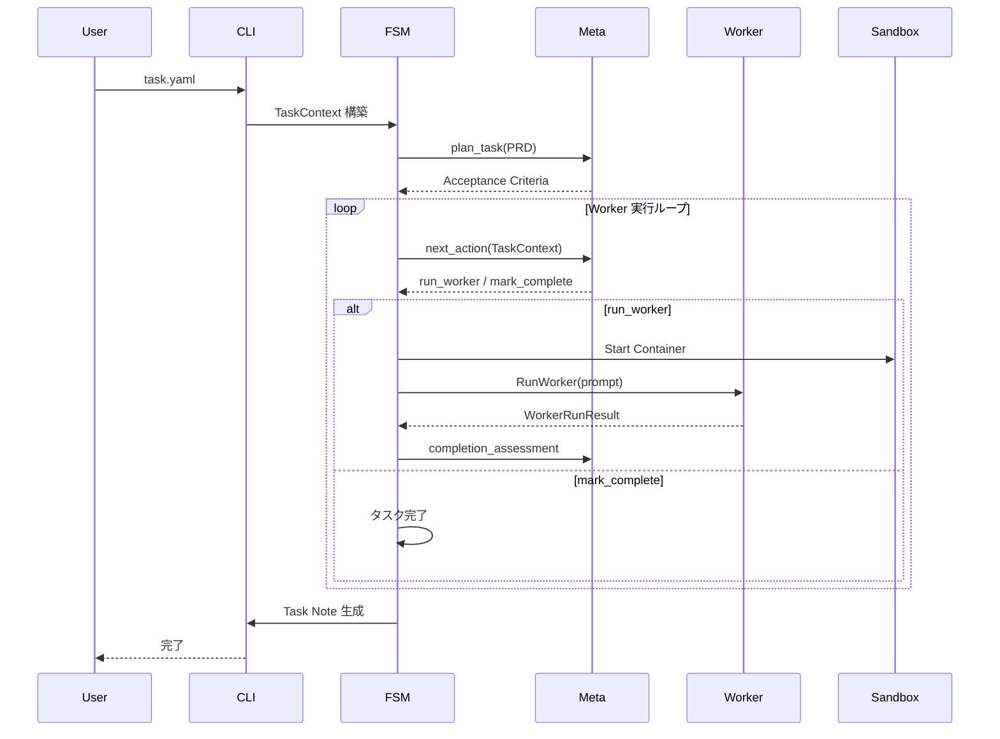

# AgentRunner システムアーキテクチャ

最終更新: 2025-11-22  
バージョン: 1.0

## 概要

AgentRunner は、AI ベースの Worker エージェント（例：Codex CLI）を管理し、タスクを自律的に実行するために設計されたメタエージェントおよびオーケストレーションレイヤーです。

## 設計ゴール

AgentRunner は以下を目指す実行管理レイヤ／メタエージェント基盤です：

1. **自律実行**: 人間の入力を最小限にしつつ、タスクを自走完了させる
2. **安全性**: Worker エージェントを Docker サンドボックス内で安全かつ再現性高く実行管理する
3. **記憶の継承**: タスク完了後に必要な「記憶」を Markdown として残し、他のエージェント／人間に引き継ぐ

## 設計原則

### 1. 責務の分離

- **Meta-agent（頭脳）**: 計画・判断・評価
- **AgentRunner Core（手足）**: 実行・管理・記録
- **Worker（実行者）**: 実際の開発作業

### 2. 隔離と再現性

- すべての Worker 実行は Docker サンドボックス内で行う
- 1 タスク = 1 サンドボックス
- 環境変数と認証情報の自動マウント

### 3. 記憶の永続化

- 実行中の状態はメモリ上で管理
- タスク完了後は Markdown として永続化
- 構造化された指示は YAML、記憶は Markdown

## コンポーネント構成

### 全体構成図


### コンポーネント詳細

#### 1. Client

| コンポーネント | 説明                           |
| -------------- | ------------------------------ |
| **開発者**     | Task YAML を作成し、CLI を実行 |
| **CI**         | 自動化されたタスク実行         |

#### 2. AgentRunner Core

| コンポーネント       | 責務                                                                      |
| -------------------- | ------------------------------------------------------------------------- |
| **CLI Layer**        | stdin から YAML を読み込み、Core を起動                                   |
| **Task FSM**         | タスク状態を管理する状態機械                                              |
| **Meta Client**      | Meta-agent（LLM）との YAML 通信。モデル ID はプロバイダのものを直接使用。 |
| **Worker Executor**  | Worker CLI の実行管理                                                     |
| **Sandbox Manager**  | Docker サンドボックスの管理                                               |
| **Task Note Writer** | Markdown ノートの生成                                                     |

#### 3. Meta-agent (LLM)

| コンポーネント | 責務                                               |
| -------------- | -------------------------------------------------- |
| **Planner**    | PRD から Acceptance Criteria を設計                |
| **Controller** | 次のアクション（run_worker / mark_complete）を決定 |
| **Evaluator**  | Worker の結果と AC を比較して完了可否を判断        |

#### 4. Execution Sandbox (Docker)

| コンポーネント | 責務                                 |
| -------------- | ------------------------------------ |
| **Container**  | タスク単位の隔離環境                 |
| **Worker CLI** | 実際の開発作業（coding, git, tests） |

## AgentToolProvider Architecture (CLI Integration)

### 目的

Codex / Gemini / Claude Code / Cursor など複数のエージェント CLI を安全に切り替えつつ、共通の実行パイプラインで扱います。
Worker 実行と Meta 生成の両方で同じ抽象を再利用し、特定 CLI に縛られない実行面を確保しています。

### 抽象レイヤと責務

- **ProviderConfig**: kind, cliPath, model, flags, extraEnv, toolSpecific を保持。
- **Request**: 呼び出し時に上書きしたい情報を集約（prompt/mode/env/flags 等）。
- **ExecPlan**: 実行直前の最終形（command/args/env/workdir）。
- **Registry**: kind→factory を登録・解決。

### 実行フロー

1. Meta.NextAction が `WorkerCall` を返す。
2. Orchestrator/Core で `Executor.RunWorkerCall` を呼び出し、`agenttools.Build()` で `ExecPlan` を生成。
3. `Sandbox.Exec` (Worker) または `agenttools.Execute` (Meta) で実行。

### サンドボックス方針（絶対ルール）

**Docker コンテナが外部サンドボックスとして機能するため、CLI エージェントツール内部のサンドボックスは無効化し、最大限の権限を与えます。**

詳細は [サンドボックス方針](sandbox-policy.md) を参照。

### 実装状態（2025-12-17 更新）

- **CodexProvider** (`internal/agenttools/codex.go`):
  - Codex CLI 0.65.0 対応。exec モードのみサポート（chat サブコマンドは存在しない）。
  - Docker 内実行: `--dangerously-bypass-approvals-and-sandbox` でサンドボックス・承認を無効化。
  - フラグ体系: `-C`（作業ディレクトリ）、`--json`（JSONL 出力）、`-m`（モデル）、`-c`（設定オーバーライド）。
  - デフォルト値: モデル `gpt-5.2-codex`（Worker 用）/ `gpt-5.2`（Meta 用）、思考の深さ `medium`。
  - **注意**: IDE の Meta-agent はデフォルト `openai-chat` ですが、`OPENAI_API_KEY` 未設定かつ `codex` が利用可能な場合は `codex-cli` に自動フォールバックします（`app.go` の `newMetaClientFromConfig()` 参照）。
  - stdin 対応: PROMPT に `-` を指定して stdin から読み取り。
  - **ToolSpecific オプション**: `docker_mode`（Docker 内実行フラグ制御）、`json_output`（JSON 出力制御）
- **Execute ヘルパー** (`internal/agenttools/exec.go`):
  - `agenttools.Execute(ctx, plan)` でホスト上で直接 ExecPlan を実行。
  - Meta-agent の CLI 呼び出しで使用。
- **ClaudeProvider** (`internal/agenttools/claude.go`):
  - `claude --model <id> -p <prompt>`（stdin 時は `-p -`）で単発実行。
  - デフォルトモデル: `claude-haiku-4-5-20251001`（`internal/agenttools/claude.go`）。
- **GeminiProvider** (`internal/agenttools/gemini.go`):
  - Gemini CLI 向けの ExecPlan 生成を実装（運用は `docs/guides/gemini-cli.md` を参照）。
- **CursorProvider** (`internal/agenttools/cursor.go`):
  - Cursor CLI 向けの ExecPlan 生成を実装。
- **WorkerCall 拡張** (`internal/meta/protocol.go`):
  - model, temperature, max_tokens, reasoning_effort, cli_path, flags, env, tool_specific, workdir, use_stdin を追加。
- **Worker 実行経路** (`internal/worker/executor.go`):
  - WorkerCall を `agenttools.Request` に変換し、`agenttools.Build()` で ExecPlan を生成。
  - ExecPlan を受けて Sandbox.Exec を実行。env は複数ソースをマージ。
- **Meta-agent CLI 実行** (`internal/meta/cli_provider.go`):
  - `agenttools` パッケージを使用してフラグ構築ロジックを統一。
  - `docker_mode: false` でホスト上直接実行、`json_output: false` で YAML 出力。

### モデル設定

| 用途                     | モデル ID       | 設定箇所                       |
| ------------------------ | --------------- | ------------------------------ |
| Meta-agent（計画・思考） | `gpt-5.2`       | `internal/meta/client.go`      |
| Worker タスク実行        | `gpt-5.2-codex` | `internal/agenttools/codex.go` |
| Worker タスク実行（高速） | `gpt-5.1-codex-mini`（ショートハンド: `5.1-codex-mini`） | `internal/agenttools/openai_models.go` |
| Worker タスク実行（Claude Code） | `claude-haiku-4-5-20251001` | `internal/agenttools/claude.go` |

参照 URL（モデル/価格）:

- https://platform.openai.com/docs/pricing

### 思考の深さ（reasoning effort）

| レベル   | 用途                           |
| -------- | ------------------------------ |
| `low`    | 単純なタスク                   |
| `medium` | 通常のタスク（**デフォルト**） |
| `high`   | 複雑なタスク・リトライ時       |

設定方法: `-c reasoning_effort=medium`

### 設計上のポイント

- **サンドボックス方針の一貫性**: 全 CLI ツールで Docker が外部サンドボックスとして機能し、CLI 内部のサンドボックスは無効化。
- **拡張優先**: 共通化は最小限。model や flags は Provider がそのまま解釈できる形で透過させ、ツール固有の挙動を阻害しない。
- **差し替え容易性**: kind ごとの factory 登録のみで新 CLI を差し替え可能。既存呼び出し側は WorkerCall/Request を介すため変更を局所化できる。

### CLI ナレッジ管理

各 CLI ツールの仕様・バージョン情報は `docs/cli-agents/` で管理:

- [CLI エージェント共通ガイド](../cli-agents/README.md)
- [Codex CLI ナレッジ](../cli-agents/codex/CLAUDE.md)
- [Claude Code ナレッジ](../cli-agents/claude-code/CLAUDE.md)

### 統一された実行フロー

```
Worker (Docker 内)                     Meta-agent (ホスト上)
       ↓                                      ↓
agenttools.Build()                    agenttools.Build()
  docker_mode: true (default)           docker_mode: false
  json_output: true (default)           json_output: false
       ↓                                      ↓
  ExecPlan                               ExecPlan
  (with --dangerously-bypass...)         (without Docker flags)
       ↓                                      ↓
  Sandbox.Exec()                      agenttools.Execute()
```

### 今後の実装方針

- CLI ごとの運用ガイド（インストール/認証/制約）の充実（`docs/cli-agents/` / `docs/guides/`）。
- ExecPlan 出力の JSON をパースして WorkerRunResult.Summary を改善（codex --json を活用）。

#### 5. External Outputs

| コンポーネント | 説明                   |
| -------------- | ---------------------- |
| **Repository** | コード変更の永続化     |
| **Task Notes** | 実行履歴と記憶の永続化 |

## 役割分担

### Meta-agent（オーケストレータ / 頭脳）

**責務**:

- どのタイミングで Worker を動かすか
- どんなプロンプトで何をさせるか
- 完了したとみなしてよいか

**入力**: PRD、TaskContext  
**出力**: Acceptance Criteria、Worker 指示、完了評価

### AgentRunner Core（実行基盤 / 手足）

**責務**:

- Docker サンドボックスの準備
- Worker CLI の spawn
- ログと終了コードの取得
- TaskContext の更新
- Markdown ノートの生成

**入力**: Task YAML  
**出力**: Task Note、リポジトリ変更

### Worker（実行者）

**責務**:

- 実際の開発作業（coding, git, tests, build）
- サンドボックス内での安全な実行

**入力**: Meta からの指示（prompt）  
**出力**: コード変更、実行ログ

## データフロー

### タスク実行フロー



### データ変換

| フェーズ | 入力         | 処理                        | 出力                |
| -------- | ------------ | --------------------------- | ------------------- |
| **計画** | PRD テキスト | Meta: plan_task             | Acceptance Criteria |
| **判断** | TaskContext  | Meta: next_action           | Worker 指示         |
| **実行** | Worker 指示  | Worker CLI                  | コード変更、ログ    |
| **評価** | TaskContext  | Meta: completion_assessment | 完了評価            |
| **記録** | TaskContext  | Task Note Writer            | Markdown            |

## 通信プロトコル

### YAML プロトコル

Meta-agent ↔ Core ↔ Worker の通信は YAML を使用します。

**制約**:

- 単一ドキュメント（`---` は 1 つまで）
- インデント: 半角スペース 2 個
- アンカー／エイリアス不使用

**共通構造**:

```yaml
type: <message_type>
version: 1
payload:
  # 実データ
```

詳細は [Meta プロトコル仕様](../specifications/meta-protocol.md) を参照。

## サンドボックス設計

### Docker サンドボックス

**原則**: 1 タスク = 1 サンドボックス

**マウント**:

- ホストの `task.repo` → `/workspace/project`
- `~/.codex/auth.json` → `/root/.codex/auth.json` (read-only)

**環境変数**:

- `runner.worker.env` の値をコンテナ内に注入
- `env:` プレフィックスでホスト環境変数を参照

**ライフサイクル**:

1. タスク開始時: コンテナ起動
2. Worker 実行時: `docker exec` で実行
3. タスク完了時: コンテナ停止・削除

詳細は [Worker インターフェース仕様](../specifications/worker-interface.md) を参照。

## 状態管理

### TaskContext

実行中のタスク状態をメモリ上で保持します。

**主要フィールド**:

- タスクメタ情報（ID, Title, RepoPath）
- PRD テキスト
- Acceptance Criteria
- Meta 呼び出し履歴
- Worker 実行履歴
- テスト結果

詳細は [コア仕様](../specifications/core-specification.md) を参照。

### Task Note

タスク完了後、TaskContext から Markdown を生成します。

**出力パス**: `<repo>/.agent-runner/task-<task_id>.md`

**用途**:

- 実行履歴の記録
- 他のエージェントへのコンテキスト提供
- 人間によるレビュー

## 拡張性

バックログのタスク（複数 Worker、永続化レイヤー、Web UI など）は `ISSUE.md`（Deferred）に集約し、このドキュメントからは削除する（重複/不整合の防止）。

## 設計上の制約

### v1 制約

- Meta: OpenAI Chat API のみ
- Worker: Codex CLI のみ
- サンドボックス: Docker のみ
- 永続化: Markdown ファイルのみ

### 技術的制約

- Docker が必須
- Go 1.23 以上
- OpenAI API キーが必要

## 参考ドキュメント

- [コア仕様](../specifications/core-specification.md)
- [Meta プロトコル仕様](../specifications/meta-protocol.md)
- [Worker インターフェース仕様](../specifications/worker-interface.md)
- [実装ガイド](implementation-guide.md)
- [データフロー設計](data-flow.md)
