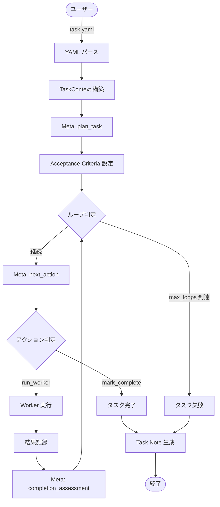
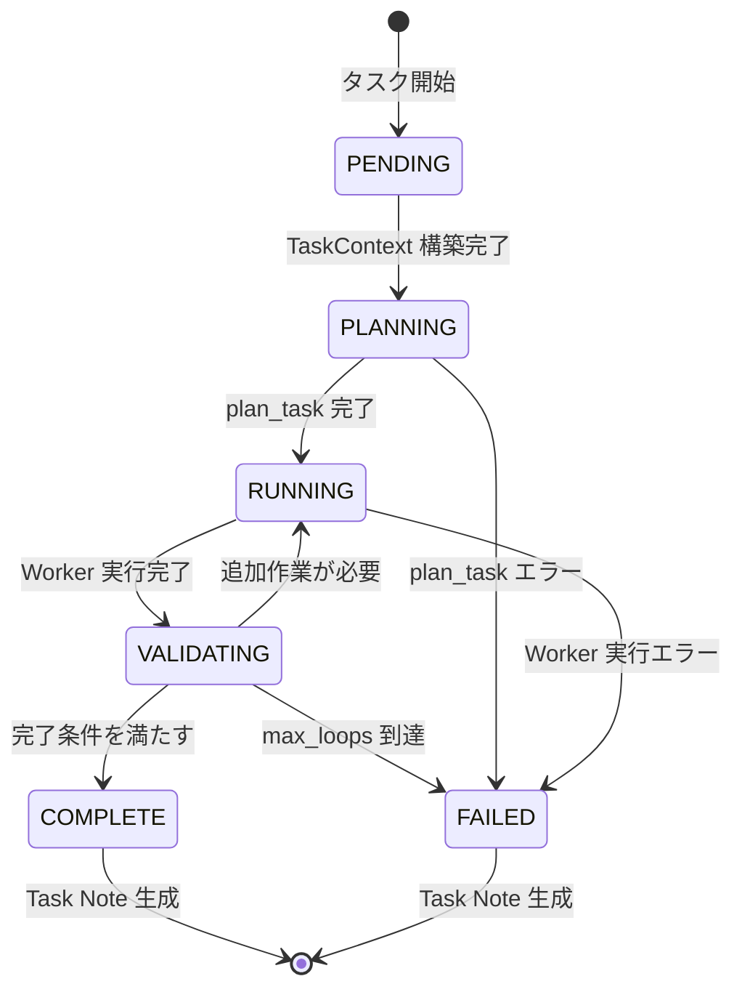
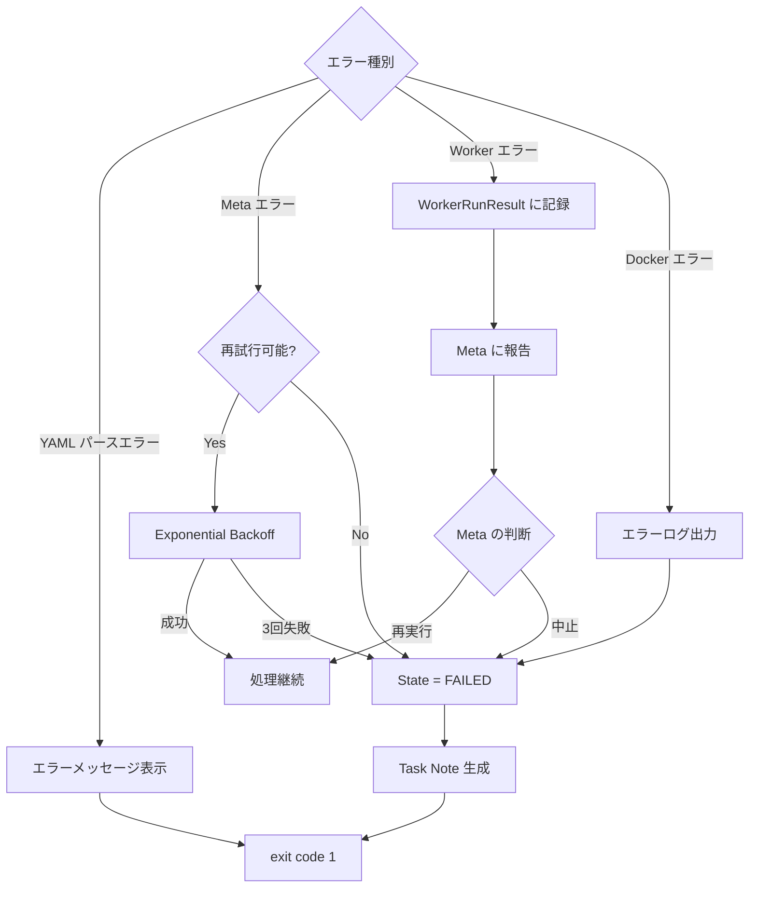

# AgentRunner データフロー設計

最終更新: 2025-11-22

## 概要

本ドキュメントは AgentRunner のデータフローと状態遷移を説明します。タスク実行の全体フロー、状態遷移、データ変換を詳細に記述します。

## タスク実行フロー

### 全体フロー



### 詳細シーケンス

```mermaid
sequenceDiagram
    participant User
    participant CLI
    participant Core
    participant Meta
    participant Worker
    participant Docker
    participant Note

    User->>CLI: task.yaml
    CLI->>Core: YAML パース
    Core->>Core: TaskContext 構築
    Core->>Core: State = PENDING

    Note over Core: PENDING → PLANNING
    Core->>Meta: plan_task(PRD)
    Meta-->>Core: Acceptance Criteria
    Core->>Core: State = PLANNING → RUNNING

    loop Worker 実行ループ (max_loops まで)
        Core->>Meta: next_action(TaskContext)
        Meta-->>Core: decision

        alt action = run_worker
            Core->>Core: State = RUNNING
            Core->>Docker: Start Container (初回のみ)
            Docker-->>Core: Container ID
            Core->>Worker: RunWorker(prompt)
            Worker->>Docker: docker exec
            Docker-->>Worker: stdout/stderr
            Worker-->>Core: WorkerRunResult
            Core->>Core: State = RUNNING → VALIDATING
            Core->>Meta: completion_assessment
            Meta-->>Core: 評価結果

            alt 追加作業が必要
                Core->>Core: State = VALIDATING → RUNNING
            else 完了
                Core->>Core: State = VALIDATING → COMPLETE
            end
        else action = mark_complete
            Core->>Core: State = COMPLETE
        end
    end

    Core->>Docker: Stop Container
    Core->>Note: WriteTaskNote(TaskContext)
    Note-->>Core: Task Note 生成完了
    Core-->>CLI: 実行結果
    CLI-->>User: 完了
```

## 状態遷移

### FSM 状態定義

```go
type TaskState string

const (
    StatePending    TaskState = "PENDING"
    StatePlanning   TaskState = "PLANNING"
    StateRunning    TaskState = "RUNNING"
    StateValidating TaskState = "VALIDATING"
    StateComplete   TaskState = "COMPLETE"
    StateFailed     TaskState = "FAILED"
)
```

### 状態遷移図



### 状態遷移ルール

| 現在の状態 | イベント              | 次の状態   | 条件                    |
| ---------- | --------------------- | ---------- | ----------------------- |
| PENDING    | TaskContext 構築完了  | PLANNING   | -                       |
| PLANNING   | plan_task 成功        | RUNNING    | -                       |
| PLANNING   | plan_task 失敗        | FAILED     | -                       |
| RUNNING    | Worker 実行完了       | VALIDATING | -                       |
| RUNNING    | Worker 実行失敗       | FAILED     | -                       |
| VALIDATING | Meta が追加作業を指示 | RUNNING    | ループ回数 < max_loops  |
| VALIDATING | Meta が完了を判定     | COMPLETE   | -                       |
| VALIDATING | max_loops 到達        | FAILED     | ループ回数 >= max_loops |

### ループ制御

```go
func (r *Runner) Run(ctx context.Context) error {
    tc := r.buildTaskContext()
    loopCount := 0
    maxLoops := r.Config.Runner.Meta.MaxLoops // デフォルト: 5

    for tc.State != StateComplete && tc.State != StateFailed {
        switch tc.State {
        case StateValidating:
            assessment, err := r.Meta.CompletionAssessment(ctx, tc)
            if err != nil {
                tc.State = StateFailed
                return err
            }

            if assessment.AllCriteriaSatisfied {
                tc.State = StateComplete
            } else {
                loopCount++
                if loopCount >= maxLoops {
                    tc.State = StateFailed
                    return errors.New("max loops exceeded")
                }
                tc.State = StateRunning
            }
        }
    }

    return nil
}
```

## データ変換

### 入力データ

#### Task YAML

```yaml
version: 1
task:
  id: "TASK-123"
  title: "Implement API"
  repo: "."
  prd:
    path: "./docs/prd.md"
runner:
  meta:
    kind: "openai-chat"
    model: "gpt-5.1"
    max_loops: 5
  worker:
    kind: "codex-cli"
```

### 中間データ

#### TaskContext

```go
type TaskContext struct {
    ID        string        // "TASK-123"
    Title     string        // "Implement API"
    RepoPath  string        // "/absolute/path/to/repo"
    State     TaskState     // PENDING → PLANNING → ...

    PRDText            string                // PRD ファイルの内容
    AcceptanceCriteria []AcceptanceCriterion // Meta から取得
    MetaCalls          []MetaCallLog         // Meta 呼び出し履歴
    WorkerRuns         []WorkerRunResult     // Worker 実行履歴

    StartedAt  time.Time
    FinishedAt time.Time
}
```

#### Meta プロトコル

**plan_task レスポンス**:

```yaml
type: plan_task
acceptance_criteria:
  - id: "AC-1"
    description: "API が 200 を返すこと"
```

**next_action レスポンス**:

```yaml
type: next_action
decision:
  action: "run_worker"
  reason: "実装が必要"
worker_call:
  worker_type: "codex-cli"
  mode: "exec"
  prompt: "API を実装してください"
```

#### Worker 実行結果

```go
type WorkerRunResult struct {
    ID          string    // "run-001"
    StartedAt   time.Time
    FinishedAt  time.Time
    ExitCode    int       // 0
    RawOutput   string    // stdout/stderr
    Summary     string    // "API 実装完了"
    Error       error     // nil
}
```

### 出力データ

#### Task Note (Markdown)

```markdown
# Task Note - TASK-123 - Implement API

- Task ID: TASK-123
- Title: Implement API
- Started At: 2025-11-22T10:00:00Z
- Finished At: 2025-11-22T10:30:00Z
- State: COMPLETE

---

## 1. 概要

API 実装タスクが完了しました。

---

## 2. PRD 概要

...

---

## 3. 受け入れ条件 (Acceptance Criteria)

- [x] AC-1: API が 200 を返すこと

---

## 4. 実行ログ (Meta / Worker)

### 4.1 Meta Calls

...

### 4.2 Worker Runs

...
```

## エラーフロー

### エラー種別と処理



### エラーハンドリング戦略

| エラー種別                     | 処理                 | 再試行      | 最終状態            |
| ------------------------------ | -------------------- | ----------- | ------------------- |
| **YAML パースエラー**          | エラーメッセージ表示 | なし        | FAILED              |
| **Meta API エラー (5xx, 429)** | Exponential Backoff  | 最大 3 回   | FAILED (3 回失敗後) |
| **Meta API エラー (4xx)**      | エラーメッセージ表示 | なし        | FAILED              |
| **Worker 実行エラー**          | Meta に報告          | Meta の判断 | Meta の判断に従う   |
| **Docker エラー**              | エラーログ出力       | なし        | FAILED              |
| **タイムアウト**               | Worker 強制終了      | なし        | FAILED              |

## パフォーマンス最適化

### コンテナライフサイクル最適化

**従来の方法**:

```
Worker 実行 1: コンテナ起動 (2s) + 実行 (30s) + 停止 (1s) = 33s
Worker 実行 2: コンテナ起動 (2s) + 実行 (30s) + 停止 (1s) = 33s
合計: 66s
```

**最適化後**:

```
タスク開始: コンテナ起動 (2s)
Worker 実行 1: 実行 (30s)
Worker 実行 2: 実行 (30s)
タスク終了: コンテナ停止 (1s)
合計: 63s → 約 5% 削減
```

**効果**: 複数回の Worker 実行で 5-10 倍の高速化

### データ転送最適化

- **ストリーミング**: Worker の stdout/stderr をリアルタイムで取得
- **バッファリング**: 大きな出力は適切にバッファリング
- **圧縮**: 将来的に Task Note を圧縮して保存

## 参考ドキュメント

- [アーキテクチャ](architecture.md)
- [実装ガイド](implementation-guide.md)
- [コア仕様](../specifications/core-specification.md)
- [Meta プロトコル仕様](../specifications/meta-protocol.md)
- [Worker インターフェース仕様](../specifications/worker-interface.md)
