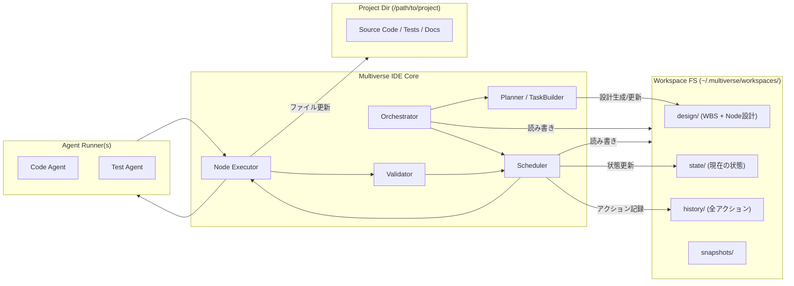
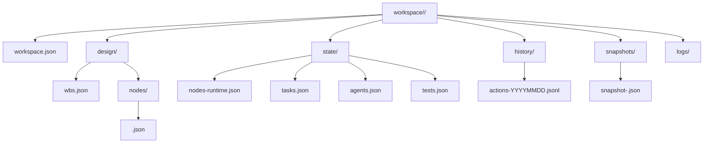
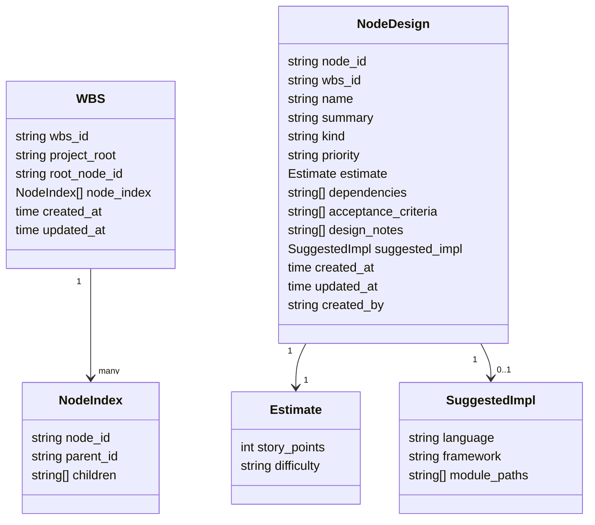
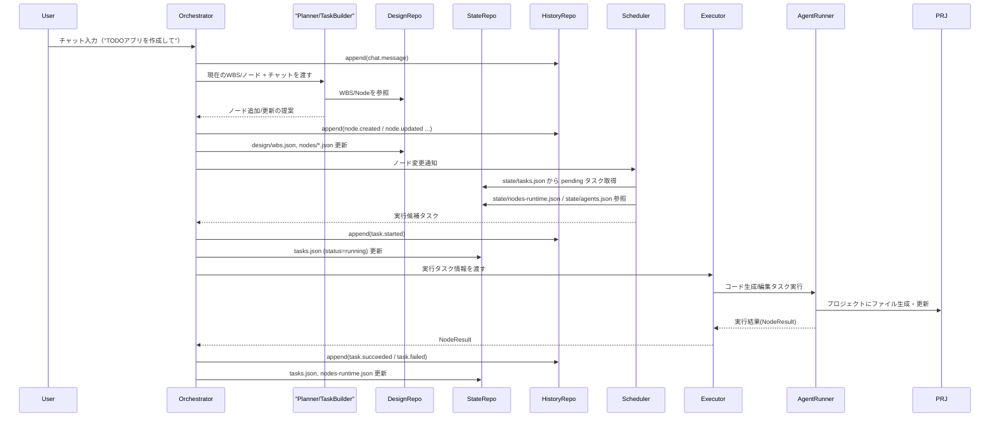
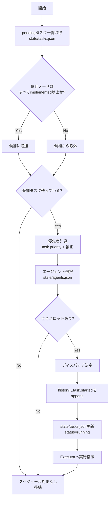
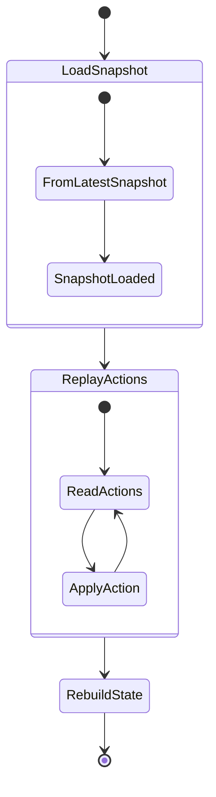
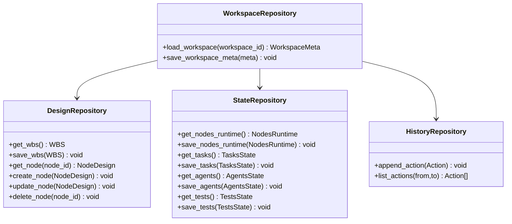

# Multiverse IDE Core Persistence & Execution Architecture

（WBS + ノード群中心のタスクスケジューラ設計書）

---

## 1. 目的とスコープ

本ドキュメントの目的は、Multiverse IDE における以下の要素を一体として定義すること。

- チャット入力 → 実行計画（WBS + ノード群）→ タスク生成 → エージェント実行 → 検証 → 状態更新
- その全過程で生成される **設計情報・状態情報・履歴情報・コード生成物** の永続化方式
- これらを用いて、**同じ設計（WBS + ノード群）から何度でも実装を再現できる**状態を保証すること

本書は **UI には一切依存せず**、ファイル構成・データモデル・フローのみを扱う。

---

## 2. 全体アーキテクチャ概要

IDE の中核となるコンポーネントと、ワークスペース／プロジェクト／エージェントの関係を示す。



---

## 3. 永続化ポリシー

### 3.1 基本原則

1. **生成物（コード・テスト・ドキュメント）**

   - 保存先: プロジェクトディレクトリ（例: `/path/to/project`）
   - IDE は「どのノード／タスクがどのファイル群を生成・更新したか」をパスで紐付ける。

2. **設計情報（WBS + ノード群）**

   - 保存先: `~/.multiverse/workspaces/<workspace-id>/design/`
   - ここが IDE における「設計の真実」であり、**再生成可能性の源泉**。

3. **状態情報（現在の IDE ワークスペース状態）**

   - 保存先: `~/.multiverse/workspaces/<workspace-id>/state/`
   - ノードの進捗・タスクキュー・エージェント状況・テスト結果など。

4. **履歴情報（アクションログ）**

   - 保存先: `~/.multiverse/workspaces/<workspace-id>/history/`
   - append-only（追記のみ）。全ての変更操作の起点は必ずここに 1 レコードが残る。

5. **状態変更の順序（疑似トランザクション）**

```text
1. アクションを構築（メモリ上）
2. history にアクションを書き込む（append）
3. state/design の該当ファイルを atomic に書き換える
   - 失敗時: `history_failed` または `state_save_failed` アクションを history に追記し、不整合を記録する。
4. 必要であればエージェント実行などの外部作用を開始する
```

---

## 4. ワークスペースディレクトリ構成

```text
~/.multiverse/workspaces/<workspace-id>/
  workspace.json              # ワークスペースメタ情報
  design/
    wbs.json                  # WBS ルート定義（ノードツリー）
    nodes/
      <node-id>.json          # 各ノードの設計定義
  state/
    nodes-runtime.json        # ノードごとの現在の実装・検証状態
    tasks.json                # タスクキュー・スケジューラ状態
    agents.json               # エージェント状態
    tests.json                # 最新テスト結果
  history/
    actions-YYYYMMDD.jsonl    # アクションログ（1行1 JSON）
  snapshots/
    snapshot-<timestamp>.json # 任意タイミングの state スナップショット
  logs/                       # 任意の内部ログ（実装依存）
    scheduler.log
    agents.log
```

これを Mermaid で俯瞰する:



---

## 5. データモデル設計

### 5.1 設計情報（WBS + ノード）

#### 5.1.1 WBS ルート (`design/wbs.json`)

役割: 全ノードの親子関係（WBS 階層構造）を表現。

```jsonc
{
  "wbs_id": "wbs-0001",
  "project_root": "/absolute/path/to/project",
  "created_at": "2025-12-11T07:00:00Z",
  "updated_at": "2025-12-11T07:00:00Z",
  "root_node_id": "node-root",
  "node_index": [
    {
      "node_id": "node-root",
      "parent_id": null,
      "children": ["node-backend", "node-frontend"]
    }
  ]
}
```

#### 5.1.2 ノード設計 (`design/nodes/<node-id>.json`)

```jsonc
{
  "node_id": "node-auth",
  "wbs_id": "wbs-0001",
  "name": "認証機能の実装",
  "summary": "IDE ログイン用の認証 API とトークン管理を実装する",
  "kind": "feature",
  "priority": "high",
  "estimate": {
    "story_points": 5,
    "difficulty": "medium"
  },
  "dependencies": ["node-api-design"],
  "acceptance_criteria": [
    "OAuth2 によるログインが成功すること",
    "失敗時のエラーコードとメッセージが定義されていること"
  ],
  "design_notes": ["トークンは短命アクセストークン + リフレッシュトークン方針"],
  "suggested_impl": {
    "language": "go",
    "framework": "gin",
    "module_paths": ["cmd/api/main.go", "internal/auth/"]
  },
  "created_at": "2025-12-11T07:01:00Z",
  "updated_at": "2025-12-11T07:01:00Z",
  "created_by": "agent:planner"
}
```

#### 5.1.3 設計モデルの関係 (Mermaid classDiagram)



---

### 5.2 状態情報 (`state/`)

#### 5.2.1 ノード実行状態 (`state/nodes-runtime.json`)

```jsonc
{
  "nodes": [
    {
      "node_id": "node-auth",
      "status": "implemented", // planned / in_progress / implemented / verified / blocked / obsolete
      "implementation": {
        "files": ["internal/auth/service.go", "internal/auth/handler.go"],
        "last_modified_at": "2025-12-11T08:00:00Z",
        "last_modified_by": "agent:codex"
      },
      "verification": {
        "status": "passed", // not_tested / passed / failed / flaky
        "last_test_task_id": "task-1235",
        "last_test_at": "2025-12-11T08:10:00Z"
      },
      "notes": [
        {
          "at": "2025-12-11T08:05:00Z",
          "by": "agent:codex",
          "text": "トークンの有効期限を 15 分に設定"
        }
      ]
    }
  ]
}
```

#### 5.2.2 タスク状態 (`state/tasks.json`)

```jsonc
{
  "tasks": [
    {
      "task_id": "task-1234",
      "node_id": "node-auth",
      "kind": "implementation", // planning / implementation / test / refactor / analysis ...
      "status": "PENDING", // PENDING / READY / RUNNING / SUCCEEDED / FAILED / CANCELED / SKIPPED / BLOCKED / RETRY_WAIT
      "created_at": "2025-12-11T07:05:00Z",
      "updated_at": "2025-12-11T07:05:00Z",
      "scheduled_by": "scheduler",
      "assigned_agent": "agent:codex",
      "priority": 100,
      "inputs": {
        "goal": "node-auth を acceptance_criteria を満たすよう実装・テストすること",
        "attempt_count": 0,
        "runner_max_loops": 5,
        "runner_worker_kind": "codex-cli",
        "constraints": [
          "既存 API 構成を変更しないこと",
          "ユニットテストを追加すること"
        ]
      },
      "outputs": {
        "status": "unknown",
        "artifacts": {}
      }
    }
  ],
  "queue_meta": {
    "last_scheduled_at": "2025-12-11T07:05:00Z",
    "next_task_id_seq": 1235
  }
}
```

**inputs の予約キー（実装準拠）**:

- `attempt_count`: 試行回数（`ExecutionOrchestrator` が開始時にインクリメント）。
- `next_retry_at`: 次回リトライ予定時刻（`RETRY_WAIT` 時に設定）。
- `runner_max_loops`: Executor が生成する TaskConfig YAML の `runner.max_loops` の上書き。
- `runner_worker_kind`: Executor が生成する TaskConfig YAML の `runner.worker.kind` の上書き。

#### 5.2.3 エージェント状態 (`state/agents.json`)

```jsonc
{
  "agents": [
    {
      "agent_id": "agent:codex",
      "kind": "code",
      "max_parallel": 2,
      "running_tasks": ["task-1234"],
      "capabilities": ["go", "typescript", "test", "refactor"]
    }
  ]
}
```

#### 5.2.4 テスト状態 (`state/tests.json`)

```jsonc
{
  "node_tests": [
    {
      "node_id": "node-auth",
      "last_result": {
        "status": "passed",
        "test_task_id": "task-1235",
        "coverage": {
          "lines": 0.78,
          "branches": 0.65
        },
        "summary": "認証成功/失敗パターンを網羅"
      }
    }
  ]
}
```

---

### 5.3 履歴情報 (`history/actions-YYYYMMDD.jsonl`)

1 行 1 JSON アクション:

```jsonc
{"id":"act-0001","at":"2025-12-11T07:00:00Z","kind":"workspace.created","workspace_id":"ws-abc","payload":{"project_root":"/path/to/project"}}
{"id":"act-0002","at":"2025-12-11T07:01:00Z","kind":"node.created","workspace_id":"ws-abc","node_id":"node-auth","by":"agent:planner"}
{"id":"act-0003","at":"2025-12-11T07:05:00Z","kind":"task.created","workspace_id":"ws-abc","task_id":"task-1234","node_id":"node-auth","kind_detail":"implementation"}
{"id":"act-0004","at":"2025-12-11T07:06:00Z","kind":"task.started","workspace_id":"ws-abc","task_id":"task-1234","agent_id":"agent:codex"}
{"id":"act-0005","at":"2025-12-11T08:00:00Z","kind":"task.succeeded","workspace_id":"ws-abc","task_id":"task-1234","artifacts":{"files":["internal/auth/service.go"]}}
{"id":"act-0006","at":"2025-12-11T08:01:00Z","kind":"node.status_updated","workspace_id":"ws-abc","node_id":"node-auth","from":"planned","to":"implemented"}
{"id":"act-0007","at":"2025-12-11T08:10:00Z","kind":"test.run","workspace_id":"ws-abc","task_id":"task-1235","node_id":"node-auth","result":"passed"}
```

---

## 6. 実行フロー設計

### 6.1 チャット入力からタスク実行までのシーケンス



---

### 6.2 スケジューラのタスク選択フロー



---

## 7. 再現性・リカバリ設計

### 7.1 状態再構築



- 最新スナップショット (`snapshots/*.json`) をロード。
- スナップショット以降の `history/actions-*.jsonl` を時系列に適用。
- `design/`・`state/` を復元。

### 7.2 クラッシュ・途中終了時の取扱い

- `task.started` まで記録されていて `task.succeeded/failed` が無いタスクは、再起動時に **不明状態** として扱い、再実行候補に載せる（実装ポリシーで「再スケジュール」か「手動介入待ち」かは決める）。

---

## 8. リポジトリ層インタフェース（実装指針）

### 8.1 概念インタフェース



### 8.2 ファイル書き込みポリシー

- 全ての JSON 書き込みは以下の手順で行う:
  1. `<file>.tmp` に書き出し
  2. `fsync` 相当で flush
  3. `rename(<file>.tmp, <file>)`（atomic rename）

---

## 9. MVP スコープ（実装開始に向けた最小セット）

実装の第一歩として、以下を「MVP」とする案:

1. `design/wbs.json` + `design/nodes/*.json` による WBS / ノード設計の永続化
2. `state/nodes-runtime.json` / `state/tasks.json` / `state/agents.json` の最小実装
3. `history/actions-*.jsonl` によるアクション記録
4. 単一エージェント・単一タスク種別（implementation）のみを対象としたスケジューラ
5. スナップショット無し（`state/` をそのままロード）での状態復元

この上に、テスト統合・RePlan・複数エージェント等を段階的に載せる。
