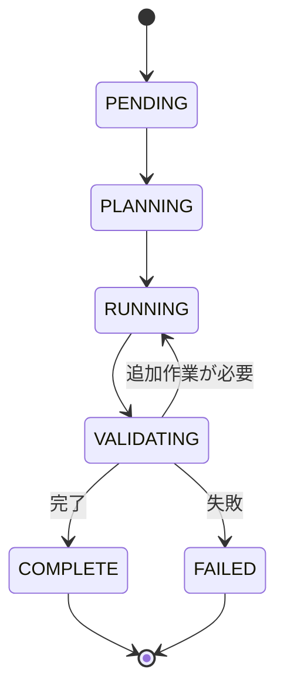

# AgentRunner コア仕様

最終更新: 2025-11-22

## 概要

本ドキュメントは AgentRunner のコア仕様を定義します。CLI インターフェース、YAML スキーマ、TaskContext、タスク状態機械（FSM）、Task Note フォーマットを含みます。

## 1. CLI インターフェース

### 1.1 コマンド

```bash
agent-runner < task.yaml
```

### 1.2 入力

- **stdin**: Task YAML ファイル（1 枚）
- **コマンドラインオプション**: v1 では未サポート

### 1.3 出力

- **stdout**: 実行ログ（人間が読む用の簡易ログ）
- **ファイル**: Task Note (`<repo>/.agent-runner/task-<task_id>.md`)
- **exit code**:
  - `0`: 成功
  - `1`: 失敗

## 2. Task YAML スキーマ

### 2.1 全体構造

```yaml
version: 1

task:
  id: "TASK-123" # 任意。未指定なら自動採番
  title: "ユーザ登録 API の実装" # 任意
  repo: "." # 任意。作業対象リポジトリのパス

  prd:
    path: "./docs/TASK-123.md" # PRD をファイルから読む場合
    # text: |                       # または PRD 本文を直接埋め込む場合
    #   ここに PRD 本文...

  test:
    command: "npm test" # 任意。自動テストコマンド
    # cwd: "./"                     # 任意。テスト実行ディレクトリ

runner:
  meta:
    kind: "openai-chat" # v1 は固定想定
    model: "gpt-4o" # 任意。未指定ならデフォルトモデル
    # system_prompt: |              # 任意。Meta 用 system prompt を上書き
    max_loops: 5 # 任意。最大ループ回数（デフォルト: 5）

  worker:
    kind: "codex-cli" # v1 は "codex-cli" 固定
    # docker_image: ...             # 任意。デフォルトイメージを上書き
    # max_run_time_sec: 1800        # 任意。1 回の Worker 実行タイムアウト
    # env:
    #   CODEX_API_KEY: "env:CODEX_API_KEY"  # "env:" 接頭辞でホスト環境変数を参照
```

### 2.2 必須フィールド

- `version`: 値は `1`
- `task.prd`: `path` または `text` のいずれか

### 2.3 デフォルト補完ルール

| フィールド                       | デフォルト値                 |
| -------------------------------- | ---------------------------- |
| `task.id`                        | UUID 自動生成                |
| `task.title`                     | `task.id` と同じ             |
| `task.repo`                      | `"."` (カレントディレクトリ) |
| `task.test`                      | 未設定（テスト自動実行なし） |
| `runner.meta.kind`               | `"openai-chat"`              |
| `runner.meta.model`              | 環境変数またはデフォルト     |
| `runner.meta.max_loops`          | `5`                          |
| `runner.worker.kind`             | `"codex-cli"`                |
| `runner.worker.docker_image`     | デフォルトイメージ           |
| `runner.worker.max_run_time_sec` | `1800` (30 分)               |

### 2.4 環境変数参照

`env:` プレフィックスを使用してホスト環境変数を参照できます。

```yaml
runner:
  worker:
    env:
      CODEX_API_KEY: "env:CODEX_API_KEY" # ホストの $CODEX_API_KEY を参照
      CUSTOM_VAR: "literal-value" # リテラル値
```

## 3. TaskContext

### 3.1 構造

TaskContext は実行中のタスク状態を保持します。

```go
type TaskContext struct {
    ID        string        // task.id
    Title     string        // task.title
    RepoPath  string        // task.repo の絶対パス
    State     TaskState     // FSM の現状態

    PRDText   string        // PRD 本文

    AcceptanceCriteria []AcceptanceCriterion // Meta plan_task の結果
    MetaCalls          []MetaCallLog         // Meta 呼び出し履歴
    WorkerRuns         []WorkerRunResult     // Worker 実行履歴

    TestConfig *TestSpec   // task.test
    TestResult *TestResult // 実行した場合

    StartedAt  time.Time
    FinishedAt time.Time
}
```

### 3.2 AcceptanceCriterion

```go
type AcceptanceCriterion struct {
    ID          string
    Description string
    Passed      bool
}
```

### 3.3 WorkerRunResult

```go
type WorkerRunResult struct {
    ID          string
    StartedAt   time.Time
    FinishedAt  time.Time
    ExitCode    int
    RawOutput   string
    Summary     string
    Error       error
}
```

## 4. タスク状態機械（FSM）

### 4.1 状態定義

```go
type TaskState string

const (
    StatePending    TaskState = "PENDING"
    StatePlanning   TaskState = "PLANNING"
    StateRunning    TaskState = "RUNNING"
    StateValidating TaskState = "VALIDATING"
    StateComplete   TaskState = "COMPLETE"
    StateFailed     TaskState = "FAILED"
)
```

### 4.2 状態遷移



### 4.3 遷移ルール

| 現在の状態 | 次の状態   | 条件                              |
| ---------- | ---------- | --------------------------------- |
| PENDING    | PLANNING   | タスク開始                        |
| PLANNING   | RUNNING    | Meta が plan_task を完了          |
| RUNNING    | VALIDATING | Worker 実行完了                   |
| VALIDATING | RUNNING    | Meta が追加作業を指示             |
| VALIDATING | COMPLETE   | Meta が完了を判定                 |
| VALIDATING | FAILED     | 致命的エラーまたは max_loops 到達 |

### 4.4 ループ制御

`runner.meta.max_loops` で最大ループ回数を制御します。

- デフォルト: 5 回
- VALIDATING → RUNNING の遷移回数がこの値を超えると FAILED に遷移

## 5. Task Note フォーマット

### 5.1 出力パス

```
<repo>/.agent-runner/task-<task_id>.md
```

### 5.2 テンプレート

```markdown
# Task Note - {{ .ID }} {{ if .Title }}- {{ .Title }}{{ end }}

- Task ID: {{ .ID }}
- Title: {{ .Title }}
- Started At: {{ .StartedAt }}
- Finished At: {{ .FinishedAt }}
- State: {{ .State }}

---

## 1. 概要

{{ .Summary }}

---

## 2. PRD 概要

{{ .PRDSummary }}

<details>
<summary>PRD 原文</summary>

\`\`\`text
{{ .PRDText }}
\`\`\`

</details>

---

## 3. 受け入れ条件 (Acceptance Criteria)

{{ range .AcceptanceCriteria }}

- [{{ if .Passed }}x{{ else }} {{ end }}] {{ .ID }}: {{ .Description }}
  {{ end }}

---

## 4. 実行ログ (Meta / Worker)

### 4.1 Meta Calls

{{ range .MetaCalls }}

#### {{ .Type }} at {{ .Timestamp }}

\`\`\`yaml
{{ .RequestYAML }}
\`\`\`

\`\`\`yaml
{{ .ResponseYAML }}
\`\`\`
{{ end }}

### 4.2 Worker Runs

{{ range .WorkerRuns }}

#### Run {{ .ID }} (ExitCode={{ .ExitCode }}) at {{ .StartedAt }} - {{ .FinishedAt }}

\`\`\`text
{{ .RawOutput }}
\`\`\`
{{ end }}

---

## 5. テスト結果

{{ if .TestResult }}

- Command: \`{{ .TestResult.Command }}\`
- ExitCode: {{ .TestResult.ExitCode }}
- Summary: {{ .TestResult.Summary }}

\`\`\`text
{{ .TestResult.RawOutput }}
\`\`\`
{{ else }}
テストは自動実行されませんでした。
{{ end }}

---

## 6. メモ / 残課題

{{ .Notes }}
```

### 5.3 実装

Go の `text/template` を使用してテンプレートを展開します。

## 6. 実装状況

### 6.1 実装済み機能

- ✅ CLI インターフェース（stdin YAML 読み込み）
- ✅ Task YAML パース
- ✅ デフォルト補完ロジック
- ✅ TaskContext 構築
- ✅ FSM 実装
- ✅ ループ制御（max_loops）
- ✅ Task Note 生成
- ✅ 環境変数参照（`env:` プレフィックス）

### 6.2 制約事項

- v1 ではコマンドラインオプションは未サポート
- Worker 種別は `codex-cli` のみ
- Meta 種別は `openai-chat` のみ
