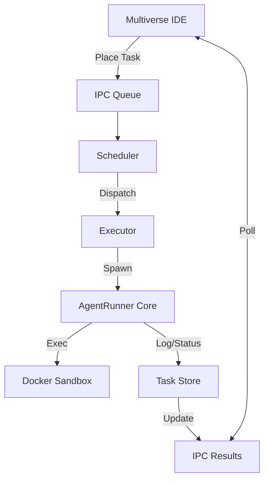

# Multiverse Orchestrator 仕様書

## 概要

Multiverse Orchestrator は、`multiverse` エコシステムにおけるタスク実行の中枢を担うコンポーネントです。ユーザー（IDE）からのタスク実行リクエストを受け付け、適切な Worker プールと AgentRunner Core を使用してタスクを自律的に実行します。

## アーキテクチャ

Orchestrator は以下の要素で構成されます。

1.  **Task Scheduler**: タスクの優先順位と Worker プールの空き状況を管理し、実行キューを処理します。
2.  **Task Executor**: 実際にタスクを実行するためのサブプロセス（`agent-runner`）を管理します。
3.  **Task Store**: タスクのメタデータ、実行履歴（Attempt）、ログを永続化・管理します。
4.  **IPC Interface**: IDE や他のツールとの通信を行うためのファイルベースのインターフェースです。

## コンポーネント詳細

### 1. Executor (`internal/orchestrator/executor.go`)

`Executor` は、単一のタスク実行（Attempt）を管理する責任を持ちます。

- **役割**:

  - 新しい Attempt ID (UUID) の発行
  - `agent-runner` プロセスの起動 (`os/exec`)
  - Task YAML の動的生成と標準入力への流し込み
  - プロセスの終了待機と終了ステータス（成功/失敗）の判定
  - 実行結果（Attempt Status, Error Summary）の `TaskStore` への保存

- **動作フロー**:
  1.  `ExecuteTask(ctx, task)` が呼ばれる。
  2.  `PENDING` -> `RUNNING` へステータス更新。
  3.  `agent-runner` 向けの設定 YAML をメモリ上で生成。
  4.  `agent-runner` プロセスを起動。
  5.  プロセス終了後、Exit Code と出力に基づき `SUCCEEDED` / `FAILED` を判定。
  6.  Task と Attempt の最終状態を保存。

### 2. Task Store (`internal/orchestrator/task_store.go`)

ファイルシステムベースのデータストアです。

- **パス**: `$HOME/.multiverse/workspaces/<workspace-id>/`
- **保存データ**:
  - `tasks/<task-id>.jsonl`: タスクのメタデータ履歴
  - `attempts/<attempt-id>.json`: 実行試行の詳細

## IPC (Inter-Process Communication)

v0.1 ではファイルシステムベースの単純な IPC を採用しています。

### Queue (IDE -> Orchestrator)

- パス: `ipc/queue/<pool-id>/<job-id>.json`
- Orchestrator はこのディレクトリを監視（ポーリング）し、新規ファイルを検知してタスクを開始します。

### Results (Orchestrator -> IDE)

- パス: `ipc/results/<job-id>.json`
- タスク完了時、Orchestrator はここに結果を出力します。IDE はこれを読み取って完了通知などを行います。
- **注意**: 実際の詳細なステータスは `Task Store` （`tasks/` ディレクトリ）を参照するのが正とされます。

## 今後の拡張

- **WebSocket**: リアルタイムなログストリーミングと状態通知のために導入予定。
- **Database**: タスク履歴の検索性向上のため、SQLite などの埋め込み DB への移行を検討。
- **Multi-Node**: リモートの強力なマシンで Worker を動かすための分散実行プロトコル。

## 実装詳細 (v0.x Current)

現在の `internal/orchestrator` 実装における詳細仕様です。

### 1. Execution State Machine

`ExecutionOrchestrator` は以下の状態を持ちます。

- **IDLE**: 停止状態。タスク処理を行いません。
- **RUNNING**: 稼働状態。キューをポーリングし、タスクを実行します。
- **PAUSED**: 一時停止状態。実行中のタスクは継続しますが、新規タスクの開始を保留します。

### 2. Reliability & Recovery

タスク失敗時、`RetryPolicy` に基づき以下の判断を行います。

- **Retry**: 一時的なエラーと判断した場合、Exponential Backoff を適用してタスクを `RETRY_WAIT` 状態にし、将来の再実行をスケジュールします。
- **Backlog**: リトライ上限到達や致命的なエラーの場合、タスクをバックログ (`BacklogStore`) に移動し、人間の介入を待ちます。

### 3. Force Stop

`Stop()` メソッドにより、オーケストレーターを即座に停止できます。

- 実行中のタスクがある場合、Context Cancellation により `agent-runner` プロセスを強制終了します。
- Docker コンテナなどのリソースは `agent-runner` のクリーンアップ処理により停止されます。

### 4. Executor の制約

現在の `Executor` は簡易実装であり、以下の制限があります。

- `agent-runner` への入力 YAML はコード内で生成されており、`max_loops: 5`, `worker.cli: "codex"` 等の値がハードコードされています。
