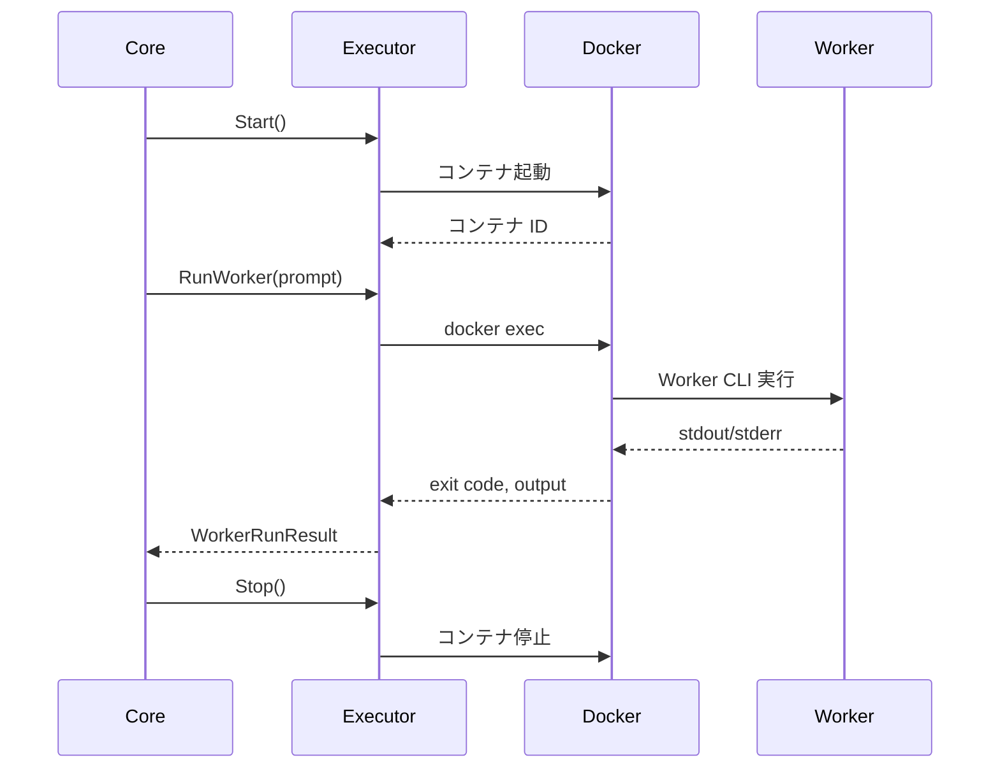

# Worker インターフェース仕様

最終更新: 2025-11-22

## 概要

本ドキュメントは Worker 実行と Docker サンドボックス環境の仕様を定義します。Worker は Meta-agent の指示に従って実際の開発作業を行います。

## 1. Worker の役割

Worker Executor は以下の責務を持ちます：

1. **実行**: Meta の `worker_call` に従い、Worker CLI を実行
2. **隔離**: Docker サンドボックス内で安全に実行
3. **結果収集**: 実行結果（exit code, stdout/stderr）を Core に返す

## 2. Worker 種別

### 2.1 v1 サポート Worker

v1 では `codex-cli` のみをサポートします。

| Worker 種別 | 説明                               | Docker イメージ             |
| ----------- | ---------------------------------- | --------------------------- |
| `codex-cli` | Codex CLI コーディングエージェント | `agent-runner-codex:latest` |

### 2.2 将来拡張

将来的に以下の Worker をサポート予定：

- `cursor-cli`
- `claude-code-cli`

## 3. Worker 実行インターフェース

### 3.1 実行フロー



### 3.2 コンテナライフサイクル最適化

v1 実装では、パフォーマンス最適化のため、以下のライフサイクル管理を採用しています：

| フェーズ          | 処理                                  | メソッド                     |
| ----------------- | ------------------------------------- | ---------------------------- |
| **タスク開始時**  | 1 回だけコンテナを起動                | `WorkerExecutor.Start()`     |
| **Worker 実行時** | 既存コンテナ内で `docker exec` を実行 | `WorkerExecutor.RunWorker()` |
| **タスク完了時**  | コンテナを停止                        | `WorkerExecutor.Stop()`      |

**効果**: Worker 実行ごとにコンテナを起動・停止する場合と比較して、5-10 倍の高速化を実現。

### 3.3 実行結果フォーマット

```go
type WorkerRunResult struct {
    ID          string    // ラン毎の ID（UUID）
    StartedAt   time.Time // 実行開始時刻
    FinishedAt  time.Time // 実行終了時刻
    ExitCode    int       // 終了コード
    RawOutput   string    // stdout/stderr の結合
    Summary     string    // 実行サマリ（オプション）
    Error       error     // 実行エラー（起動失敗など）
}
```

## 4. Docker サンドボックス仕様

### 4.1 Docker イメージ

| 項目                   | 設定                                                    |
| ---------------------- | ------------------------------------------------------- |
| **デフォルトイメージ** | `agent-runner-codex:latest`                             |
| **カスタマイズ**       | Task YAML の `runner.worker.docker_image` で上書き可能  |
| **自動 Pull**          | イメージが存在しない場合、自動的に `docker pull` を実行 |

### 4.2 コンテナ内パス

| パス                     | 用途               | マウント元                    |
| ------------------------ | ------------------ | ----------------------------- |
| `/workspace/project`     | プロジェクトルート | ホストの `task.repo`          |
| `/root/.codex/auth.json` | Codex 認証情報     | ホストの `~/.codex/auth.json` |

### 4.3 マウント仕様

#### 4.3.1 プロジェクトマウント

```bash
-v <host_repo_path>:/workspace/project
```

- **モード**: read-write
- **WorkingDir**: `/workspace/project`

#### 4.3.2 Codex 認証マウント（自動）

v1 実装では、以下の順序で Codex 認証情報を自動的に検出・設定します：

1. `~/.codex/auth.json` が存在する場合:

   ```bash
   -v ~/.codex/auth.json:/root/.codex/auth.json:ro
   ```

2. `~/.codex/auth.json` が存在しない場合:
   ```bash
   -e CODEX_API_KEY=$CODEX_API_KEY
   ```

### 4.4 環境変数

#### 4.4.1 環境変数の注入

Task YAML で環境変数を指定できます：

```yaml
runner:
  worker:
    env:
      CODEX_API_KEY: "env:CODEX_API_KEY" # ホスト環境変数を参照
      CUSTOM_VAR: "literal-value" # リテラル値
```

#### 4.4.2 `env:` プレフィックス

`env:` プレフィックスを使用すると、ホストの環境変数を参照できます：

| Task YAML の値        | 実際の値                       |
| --------------------- | ------------------------------ |
| `"env:CODEX_API_KEY"` | ホストの `$CODEX_API_KEY` の値 |
| `"literal-value"`     | `"literal-value"` そのまま     |

### 4.5 コンテナ起動オプション

```bash
docker run \
  --name agent-runner-<task_id> \
  -v <repo_path>:/workspace/project \
  -v ~/.codex/auth.json:/root/.codex/auth.json:ro \
  -e CODEX_API_KEY=<value> \
  -w /workspace/project \
  --rm \
  agent-runner-codex:latest \
  tail -f /dev/null
```

**オプション説明**:

- `--name`: コンテナ名（タスク ID ベース）
- `-v`: ボリュームマウント
- `-e`: 環境変数
- `-w`: 作業ディレクトリ
- `--rm`: 停止時に自動削除
- `tail -f /dev/null`: Keep Alive コマンド

## 5. Worker 実行

### 5.1 Codex CLI 実行

```bash
docker exec <container_id> codex exec \
  --sandbox workspace-write \
  --json \
  --cwd /workspace/project \
  "<Meta から渡された prompt>"
```

### 5.2 タイムアウト

| 項目                        | デフォルト       | カスタマイズ                                  |
| --------------------------- | ---------------- | --------------------------------------------- |
| **Worker 実行タイムアウト** | 1800 秒（30 分） | Task YAML の `runner.worker.max_run_time_sec` |

タイムアウトに達した場合、Worker 実行は強制終了され、エラーとして扱われます。

### 5.3 エラーハンドリング

| エラー種別                | 処理                                           |
| ------------------------- | ---------------------------------------------- |
| **コンテナ起動失敗**      | タスクを FAILED に遷移                         |
| **Worker 実行失敗**       | WorkerRunResult に記録、Meta に報告            |
| **タイムアウト**          | Worker を強制終了、エラーとして記録            |
| **Docker デーモン未起動** | エラーメッセージを表示、タスクを FAILED に遷移 |

## 6. 実装インターフェース

### 6.1 WorkerExecutor インターフェース

```go
type WorkerExecutor interface {
    // タスク開始時にコンテナを起動
    Start(ctx context.Context) error

    // Worker を実行
    RunWorker(ctx context.Context, prompt string) (*WorkerRunResult, error)

    // タスク完了時にコンテナを停止
    Stop(ctx context.Context) error
}
```

### 6.2 SandboxManager インターフェース

```go
type SandboxManager interface {
    // コンテナを起動し、ID を返す
    StartContainer(ctx context.Context, image string, repoPath string, env map[string]string) (string, error)

    // コンテナ内でコマンドを実行
    Exec(ctx context.Context, containerID string, cmd []string) (int, string, error)

    // コンテナを停止・削除
    StopContainer(ctx context.Context, containerID string) error
}
```

## 7. 実装状況

### 7.1 実装済み機能

- ✅ Codex CLI Worker
- ✅ Docker サンドボックス管理
- ✅ コンテナライフサイクル最適化
- ✅ ImagePull 自動実行
- ✅ Codex 認証自動マウント
- ✅ 環境変数注入（`env:` プレフィックス）
- ✅ タイムアウト制御
- ✅ エラーハンドリング

### 7.2 制約事項

- v1 では `codex-cli` のみサポート
- Docker が必須（他のコンテナランタイムは未サポート）
- Windows での動作は未検証

### 7.3 パフォーマンス

| 項目                 | 測定値                      |
| -------------------- | --------------------------- |
| **コンテナ起動時間** | 約 2-3 秒                   |
| **Worker 実行時間**  | タスク依存（通常 10-60 秒） |
| **コンテナ停止時間** | 約 1 秒                     |

**最適化効果**: コンテナ再利用により、複数回の Worker 実行で 5-10 倍の高速化を実現。
